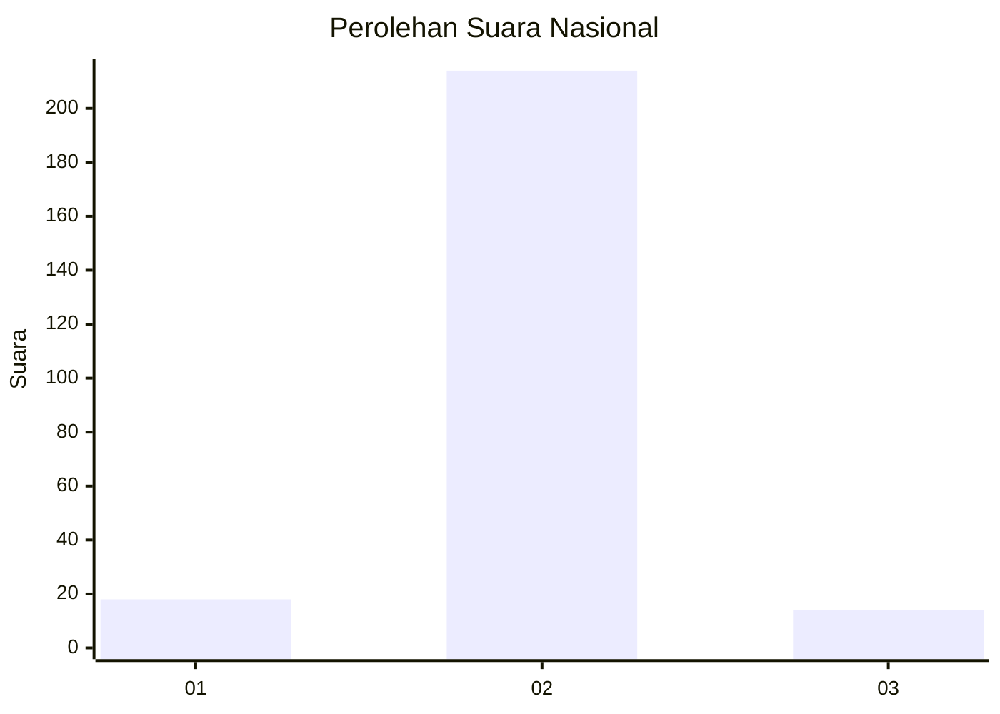
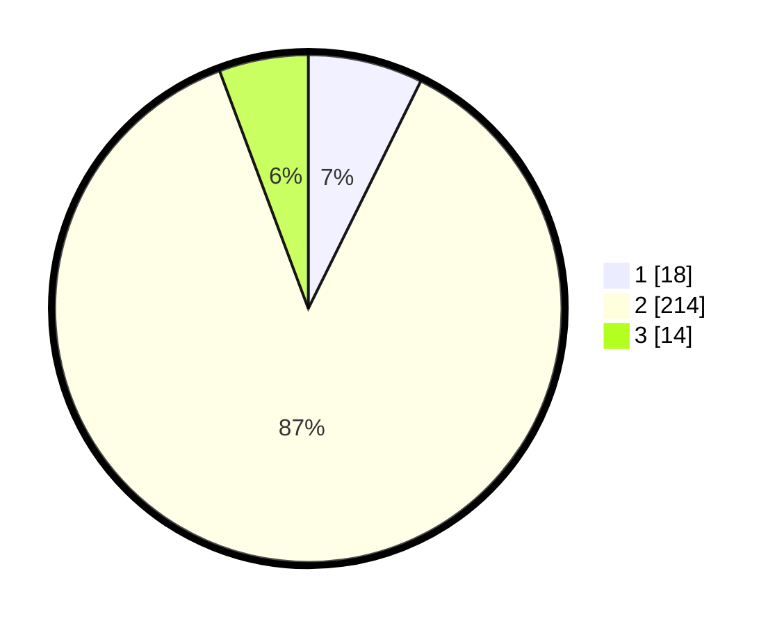

# Hasil

## Grafik

## Tabel

| No. | Nama Paslon    | Suara | Suara (raw) | Persentase |
|:--- |:-------------- | -----:| -----------:| ----------:|
| 1   | ANIES MUHAIMIN | 18    | [18][p-1]   | 7,32       |
| 2   | PRABOWO GIBRAN | 214   | [214][p-2]  | 86,99      |
| 3   | GANJAR MAHFUD  | 14    | [14][p-3]   | 5,69       |

[p-1]: https://github.com/gigit-pemilu/pemilu-2024/blob/main/pilpres/hitung-suara/sub/62-kalimantan-tengah/sub/06-katingan/sub/11-tasik-payawan/sub/2007-luwuk-kanan/sub/002-tps/sub/paslon-1.txt
[p-2]: https://github.com/gigit-pemilu/pemilu-2024/blob/main/pilpres/hitung-suara/sub/62-kalimantan-tengah/sub/06-katingan/sub/11-tasik-payawan/sub/2007-luwuk-kanan/sub/002-tps/sub/paslon-2.txt
[p-3]: https://github.com/gigit-pemilu/pemilu-2024/blob/main/pilpres/hitung-suara/sub/62-kalimantan-tengah/sub/06-katingan/sub/11-tasik-payawan/sub/2007-luwuk-kanan/sub/002-tps/sub/paslon-3.txt

## Foto C Plano

https://sirekap-obj-formc.kpu.go.id/2dc3/pemilu/ppwp/62/06/11/20/07/6206112007002-20240226-222309--f3571878-eb43-49a9-a364-42bd78581574.jpg

https://sirekap-obj-formc.kpu.go.id/2dc3/pemilu/ppwp/62/06/11/20/07/6206112007002-20240226-222402--5ce32aed-8bc3-4856-aaa3-d2d06f711418.jpg

https://sirekap-obj-formc.kpu.go.id/2dc3/pemilu/ppwp/62/06/11/20/07/6206112007002-20240226-222454--97928923-d110-4e0f-af8c-40791aaea88e.jpg

## Metadata

| Key        | Value               |
| ---------- | ------------------- |
| Time Stamp | 2024-02-28 19:00:00 |

