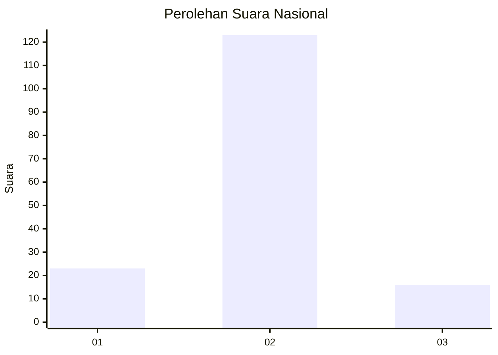
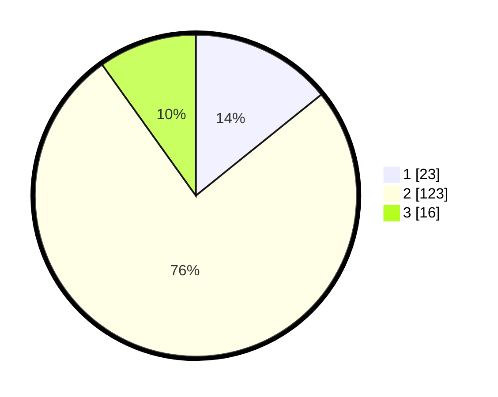

# Hasil

## Grafik

## Tabel

| No. | Nama Paslon    | Suara | Suara (raw) | Persentase |
|:--- |:-------------- | -----:| -----------:| ----------:|
| 1   | ANIES MUHAIMIN | 23    | [23][p-1]   | 14,20      |
| 2   | PRABOWO GIBRAN | 123   | [123][p-2]  | 75,93      |
| 3   | GANJAR MAHFUD  | 16    | [16][p-3]   | 9,88       |

[p-1]: https://github.com/gigit-pemilu/pemilu-2024/blob/main/pilpres/hitung-suara/sub/62-kalimantan-tengah/sub/06-katingan/sub/13-bukit-raya/sub/2001-tumbang-gaei/sub/001-tps/sub/paslon-1.txt
[p-2]: https://github.com/gigit-pemilu/pemilu-2024/blob/main/pilpres/hitung-suara/sub/62-kalimantan-tengah/sub/06-katingan/sub/13-bukit-raya/sub/2001-tumbang-gaei/sub/001-tps/sub/paslon-2.txt
[p-3]: https://github.com/gigit-pemilu/pemilu-2024/blob/main/pilpres/hitung-suara/sub/62-kalimantan-tengah/sub/06-katingan/sub/13-bukit-raya/sub/2001-tumbang-gaei/sub/001-tps/sub/paslon-3.txt

## Foto C Plano

https://sirekap-obj-formc.kpu.go.id/ebf3/pemilu/ppwp/62/06/13/20/01/6206132001001-20240226-121818--b1785aa4-213c-452d-a853-c336df0c789b.jpg

https://sirekap-obj-formc.kpu.go.id/ebf3/pemilu/ppwp/62/06/13/20/01/6206132001001-20240214-155231--19ac5e05-f195-4df4-b7cd-ba6c394dc03b.jpg

https://sirekap-obj-formc.kpu.go.id/ebf3/pemilu/ppwp/62/06/13/20/01/6206132001001-20240214-155808--386b901a-45a9-46a1-95bd-4a857b57203b.jpg

## Metadata

| Key        | Value               |
| ---------- | ------------------- |
| Time Stamp | 2024-02-26 13:00:00 |

