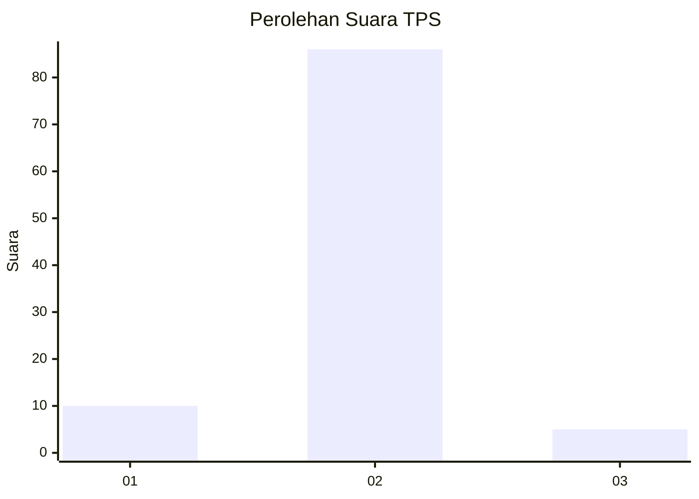
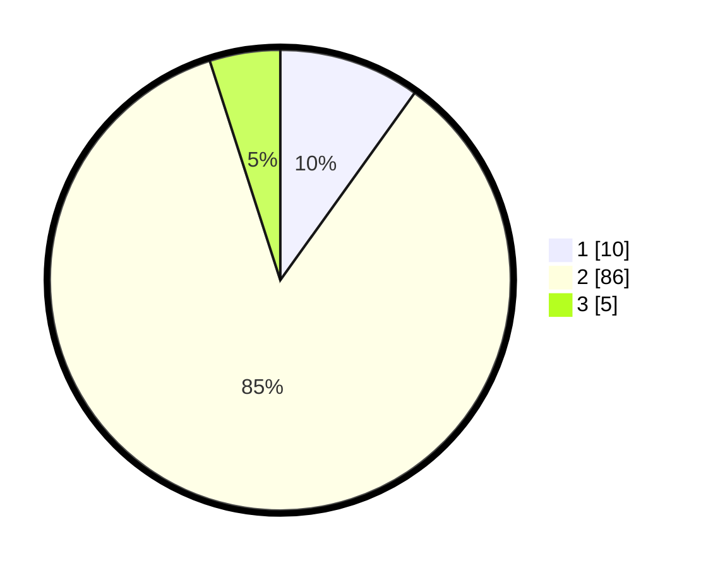

# Hasil

## Grafik

## Tabel

| No. | Nama Paslon    | Suara | Suara (raw) | Persentase |
|:--- |:-------------- | -----:| -----------:| ----------:|
| 1   | ANIES MUHAIMIN | 10    | [10][p-1]   | 9,90       |
| 2   | PRABOWO GIBRAN | 86    | [86][p-2]   | 85,15      |
| 3   | GANJAR MAHFUD  | 5     | [5][p-3]    | 4,95       |

[p-1]: https://github.com/gigit-pemilu/pemilu-2024-62-kalimantan-tengah/blob/main/pilpres/hitung-suara/sub/62-kalimantan-tengah/sub/06-katingan/sub/13-bukit-raya/sub/2002-tumbang-kataei/sub/001-tps/sub/paslon-1.txt
[p-2]: https://github.com/gigit-pemilu/pemilu-2024-62-kalimantan-tengah/blob/main/pilpres/hitung-suara/sub/62-kalimantan-tengah/sub/06-katingan/sub/13-bukit-raya/sub/2002-tumbang-kataei/sub/001-tps/sub/paslon-2.txt
[p-3]: https://github.com/gigit-pemilu/pemilu-2024-62-kalimantan-tengah/blob/main/pilpres/hitung-suara/sub/62-kalimantan-tengah/sub/06-katingan/sub/13-bukit-raya/sub/2002-tumbang-kataei/sub/001-tps/sub/paslon-3.txt

## Foto C Plano

https://sirekap-obj-formc.kpu.go.id/52d5/pemilu/ppwp/62/06/13/20/02/6206132002001-20240226-205424--f04119cd-724c-4e3f-9f09-107057bf01d5.jpg

https://sirekap-obj-formc.kpu.go.id/52d5/pemilu/ppwp/62/06/13/20/02/6206132002001-20240226-210340--80e90e3b-30c8-4e4a-8c53-785c79129cb0.jpg

https://sirekap-obj-formc.kpu.go.id/52d5/pemilu/ppwp/62/06/13/20/02/6206132002001-20240226-210503--54ab845d-ff60-4b5e-973d-191e387700cf.jpg

## Metadata

| Key        | Value               |
| ---------- | ------------------- |
| Time Stamp | 2024-02-27 22:00:00 |

## DATA PEMILIH TETAP

Jumlah pemilih dalam DPT: **119**.
 * L: **64**.
 * P: **55**.

## DATA PENGGUNA HAK PILIH

Jumlah pengguna hak pilih dalam DPT: **108**.
 * L: **56**.
 * P: **52**.

Jumlah pengguna hak pilih dalam DPTb: **3**.
 * L: **0**.
 * P: **3**.

Jumlah pengguna hak pilih dalam DPK: **1**.
 * L: **1**.
 * P: **0**.

Jumlah pengguna hak pilih: **112**.
 * L: **57**.
 * P: **55**.

## JUMLAH SUARA SAH DAN TIDAK SAH

JUMLAH SELURUH SUARA SAH: **101**.

JUMLAH SUARA TIDAK SAH: **11**.

JUMLAH SELURUH SUARA SAH DAN SUARA TIDAK SAH: **112**.

