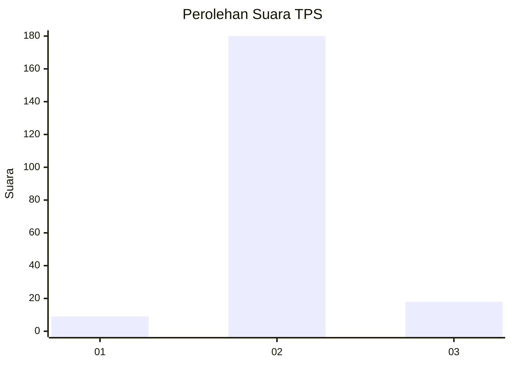
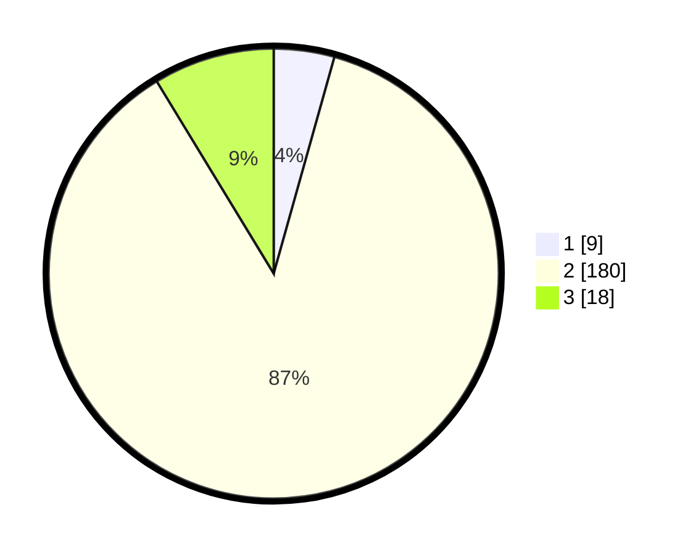

# Hasil

## Grafik

## Tabel

| No. | Nama Paslon    | Suara | Suara (raw) | Persentase |
|:--- |:-------------- | -----:| -----------:| ----------:|
| 1   | ANIES MUHAIMIN | 9     | [9][p-1]    | 4,35       |
| 2   | PRABOWO GIBRAN | 180   | [180][p-2]  | 86,96      |
| 3   | GANJAR MAHFUD  | 18    | [18][p-3]   | 8,70       |

[p-1]: https://github.com/gigit-pemilu/pemilu-2024-62-kalimantan-tengah/blob/main/pilpres/hitung-suara/sub/62-kalimantan-tengah/sub/06-katingan/sub/13-bukit-raya/sub/2003-tumbang-karuei/sub/001-tps/sub/paslon-1.txt
[p-2]: https://github.com/gigit-pemilu/pemilu-2024-62-kalimantan-tengah/blob/main/pilpres/hitung-suara/sub/62-kalimantan-tengah/sub/06-katingan/sub/13-bukit-raya/sub/2003-tumbang-karuei/sub/001-tps/sub/paslon-2.txt
[p-3]: https://github.com/gigit-pemilu/pemilu-2024-62-kalimantan-tengah/blob/main/pilpres/hitung-suara/sub/62-kalimantan-tengah/sub/06-katingan/sub/13-bukit-raya/sub/2003-tumbang-karuei/sub/001-tps/sub/paslon-3.txt

## Foto C Plano

https://sirekap-obj-formc.kpu.go.id/f745/pemilu/ppwp/62/06/13/20/03/6206132003001-20240226-214203--41cf6ed8-e7f4-4782-b511-194e6b4f2a3b.jpg

https://sirekap-obj-formc.kpu.go.id/f745/pemilu/ppwp/62/06/13/20/03/6206132003001-20240226-214346--415660ed-564d-4c0a-ac5d-81b1c9c5f6de.jpg

https://sirekap-obj-formc.kpu.go.id/f745/pemilu/ppwp/62/06/13/20/03/6206132003001-20240226-214432--5f28ee1a-6934-42e5-9698-d39832148c4e.jpg

## Metadata

| Key        | Value               |
| ---------- | ------------------- |
| Time Stamp | 2024-02-27 22:00:00 |

