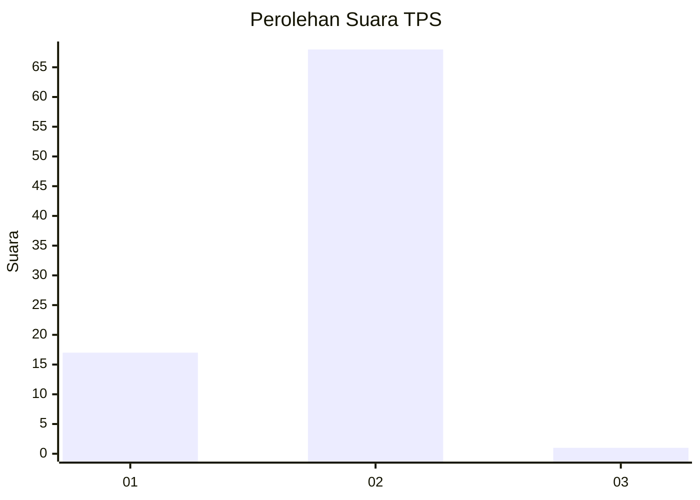
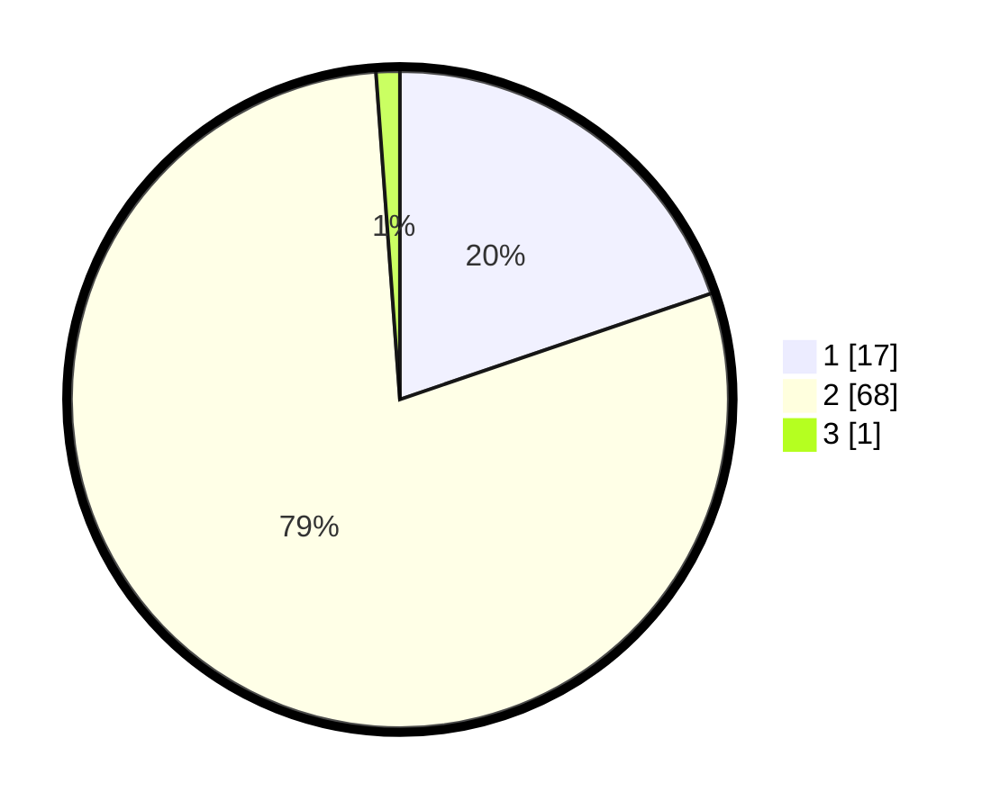

# Hasil

## Grafik

## Tabel

| No. | Nama Paslon    | Suara | Suara (raw) | Persentase |
|:--- |:-------------- | -----:| -----------:| ----------:|
| 1   | ANIES MUHAIMIN | 17    | [17][p-1]   | 19,77      |
| 2   | PRABOWO GIBRAN | 68    | [68][p-2]   | 79,07      |
| 3   | GANJAR MAHFUD  | 1     | [1][p-3]    | 1,16       |

[p-1]: https://github.com/gigit-pemilu/pemilu-2024-62-kalimantan-tengah/blob/main/pilpres/hitung-suara/sub/62-kalimantan-tengah/sub/07-seruyan/sub/01-seruyan-hilir/sub/2008-muara-dua/sub/003-tps/sub/paslon-1.txt
[p-2]: https://github.com/gigit-pemilu/pemilu-2024-62-kalimantan-tengah/blob/main/pilpres/hitung-suara/sub/62-kalimantan-tengah/sub/07-seruyan/sub/01-seruyan-hilir/sub/2008-muara-dua/sub/003-tps/sub/paslon-2.txt
[p-3]: https://github.com/gigit-pemilu/pemilu-2024-62-kalimantan-tengah/blob/main/pilpres/hitung-suara/sub/62-kalimantan-tengah/sub/07-seruyan/sub/01-seruyan-hilir/sub/2008-muara-dua/sub/003-tps/sub/paslon-3.txt

## Foto C Plano

https://sirekap-obj-formc.kpu.go.id/810c/pemilu/ppwp/62/07/01/20/08/6207012008003-20240217-145833--afbee9d5-e9d0-4681-b40b-c3a4a1406730.jpg

https://sirekap-obj-formc.kpu.go.id/810c/pemilu/ppwp/62/07/01/20/08/6207012008003-20240217-145912--adc0e9b5-5618-459e-af2a-2e3788a008cd.jpg

https://sirekap-obj-formc.kpu.go.id/810c/pemilu/ppwp/62/07/01/20/08/6207012008003-20240217-145942--3650ca63-4901-433d-ad5a-45b96c3bce17.jpg

## Metadata

| Key        | Value               |
| ---------- | ------------------- |
| Time Stamp | 2024-02-19 16:00:00 |

## DATA PEMILIH TETAP

Jumlah pemilih dalam DPT: **110**.
 * L: **58**.
 * P: **52**.

## DATA PENGGUNA HAK PILIH

Jumlah pengguna hak pilih dalam DPT: **33**.
 * L: **45**.
 * P: **32**.

Jumlah pengguna hak pilih dalam DPTb: **0**.
 * L: **0**.
 * P: **8**.

Jumlah pengguna hak pilih dalam DPK: **16**.
 * L: **8**.
 * P: **7**.

Jumlah pengguna hak pilih: **87**.
 * L: **853**.
 * P: **834**.

## JUMLAH SUARA SAH DAN TIDAK SAH

JUMLAH SELURUH SUARA SAH: **86**.

JUMLAH SUARA TIDAK SAH: **1**.

JUMLAH SELURUH SUARA SAH DAN SUARA TIDAK SAH: **87**.

