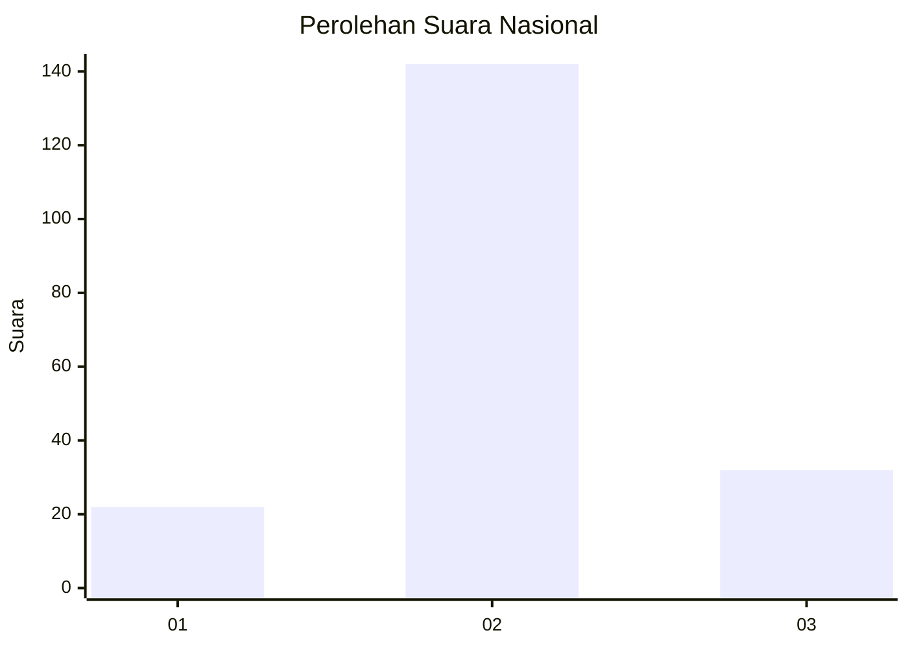
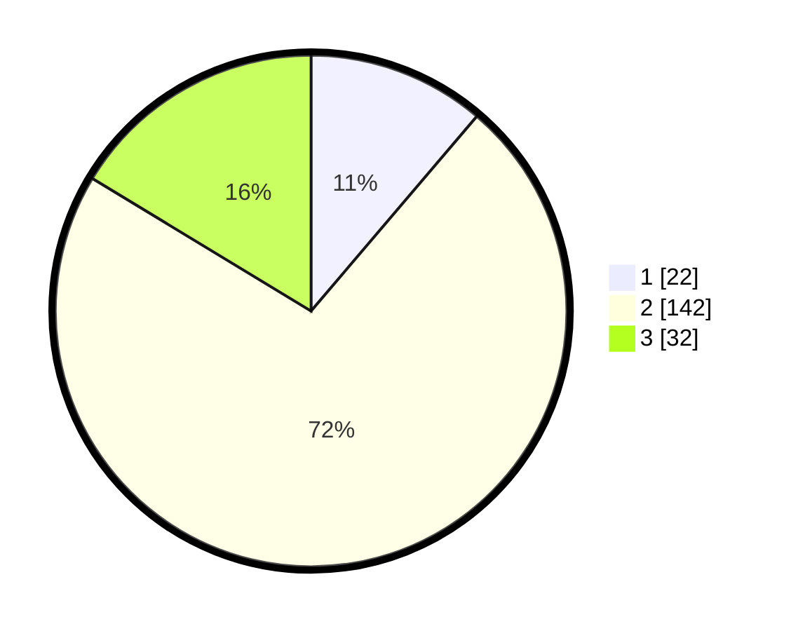

# Hasil

## Grafik

## Tabel

| No. | Nama Paslon    | Suara | Suara (raw) | Persentase |
|:--- |:-------------- | -----:| -----------:| ----------:|
| 1   | ANIES MUHAIMIN | 22    | [22][p-1]   | 11,22      |
| 2   | PRABOWO GIBRAN | 142   | [142][p-2]  | 72,45      |
| 3   | GANJAR MAHFUD  | 32    | [32][p-3]   | 16,33      |

[p-1]: https://github.com/gigit-pemilu/pemilu-2024/blob/main/pilpres/hitung-suara/sub/62-kalimantan-tengah/sub/07-seruyan/sub/01-seruyan-hilir/sub/2009-jahitan/sub/001-tps/sub/paslon-1.txt
[p-2]: https://github.com/gigit-pemilu/pemilu-2024/blob/main/pilpres/hitung-suara/sub/62-kalimantan-tengah/sub/07-seruyan/sub/01-seruyan-hilir/sub/2009-jahitan/sub/001-tps/sub/paslon-2.txt
[p-3]: https://github.com/gigit-pemilu/pemilu-2024/blob/main/pilpres/hitung-suara/sub/62-kalimantan-tengah/sub/07-seruyan/sub/01-seruyan-hilir/sub/2009-jahitan/sub/001-tps/sub/paslon-3.txt

## Foto C Plano

https://sirekap-obj-formc.kpu.go.id/97aa/pemilu/ppwp/62/07/01/20/09/6207012009001-20240219-085855--1b1b7129-6c6f-48e3-b476-b0d8e62a35d7.jpg

https://sirekap-obj-formc.kpu.go.id/97aa/pemilu/ppwp/62/07/01/20/09/6207012009001-20240219-085941--8e7206c9-d9c1-40ad-8350-c33bd587c84f.jpg

https://sirekap-obj-formc.kpu.go.id/97aa/pemilu/ppwp/62/07/01/20/09/6207012009001-20240219-090246--81653aae-bda4-4481-b7e4-95031a37dee9.jpg

## Metadata

| Key        | Value               |
| ---------- | ------------------- |
| Time Stamp | 2024-02-19 10:00:00 |

## DATA PEMILIH TETAP

Jumlah pemilih dalam DPT: **244**.
 * L: **150**.
 * P: **120**.

## DATA PENGGUNA HAK PILIH

Jumlah pengguna hak pilih dalam DPT: **644**.
 * L: **97**.
 * P: **84**.

Jumlah pengguna hak pilih dalam DPTb: **44**.
 * L: **9**.
 * P: **4**.

Jumlah pengguna hak pilih dalam DPK: **4**.
 * L: **4**.
 * P: **2**.

Jumlah pengguna hak pilih: **204**.
 * L: **110**.
 * P: **94**.

## JUMLAH SUARA SAH DAN TIDAK SAH

JUMLAH SELURUH SUARA SAH: **554**.

JUMLAH SUARA TIDAK SAH: **644**.

JUMLAH SELURUH SUARA SAH DAN SUARA TIDAK SAH: **624**.

