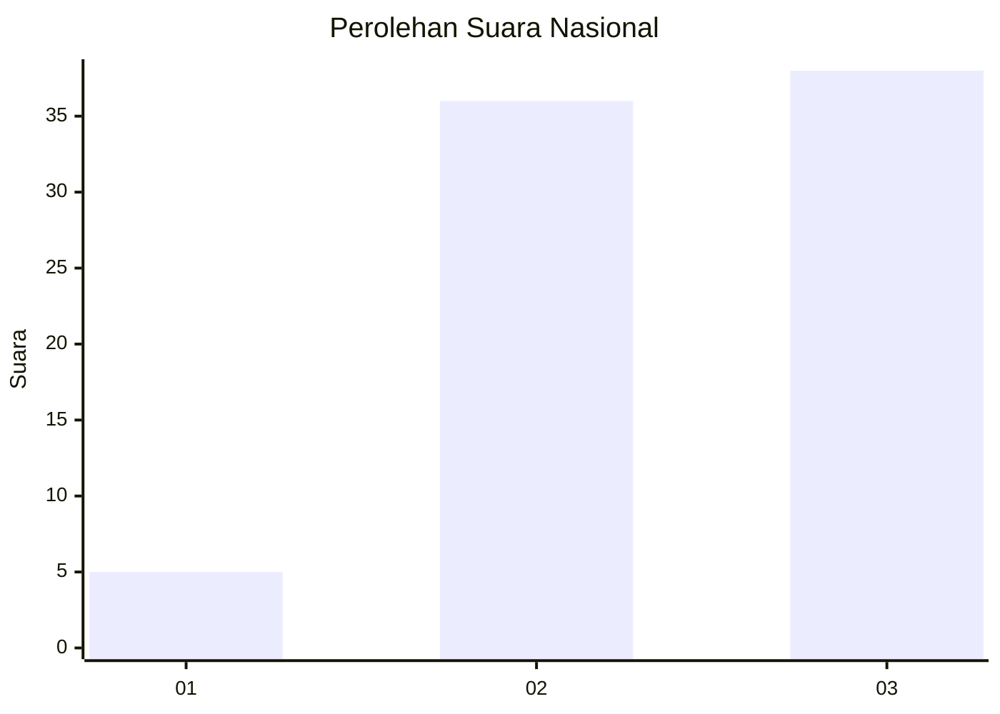
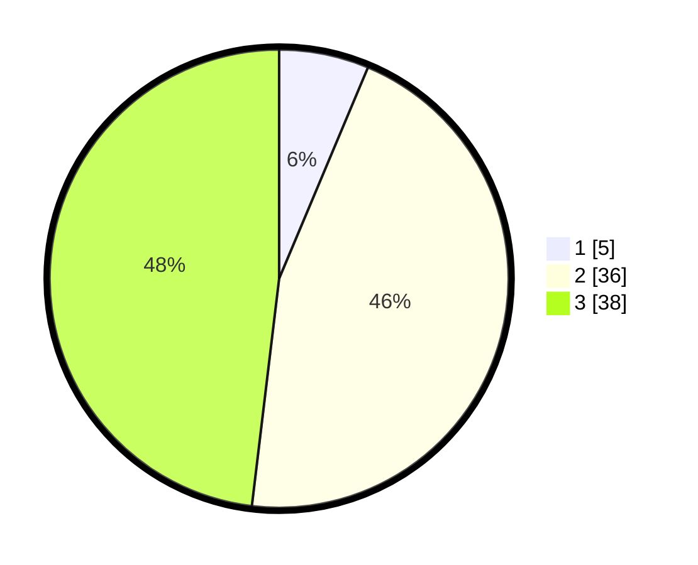

# Hasil

## Grafik

## Tabel

| No. | Nama Paslon    | Suara | Suara (raw) | Persentase |
|:--- |:-------------- | -----:| -----------:| ----------:|
| 1   | ANIES MUHAIMIN | 5     | [5][p-1]    | 6,33       |
| 2   | PRABOWO GIBRAN | 36    | [36][p-2]   | 45,57      |
| 3   | GANJAR MAHFUD  | 38    | [38][p-3]   | 48,10      |

[p-1]: https://github.com/gigit-pemilu/pemilu-2024/blob/main/pilpres/hitung-suara/sub/62-kalimantan-tengah/sub/07-seruyan/sub/01-seruyan-hilir/sub/2016-sungai-undang/sub/008-tps/sub/paslon-1.txt
[p-2]: https://github.com/gigit-pemilu/pemilu-2024/blob/main/pilpres/hitung-suara/sub/62-kalimantan-tengah/sub/07-seruyan/sub/01-seruyan-hilir/sub/2016-sungai-undang/sub/008-tps/sub/paslon-2.txt
[p-3]: https://github.com/gigit-pemilu/pemilu-2024/blob/main/pilpres/hitung-suara/sub/62-kalimantan-tengah/sub/07-seruyan/sub/01-seruyan-hilir/sub/2016-sungai-undang/sub/008-tps/sub/paslon-3.txt

## Foto C Plano

https://sirekap-obj-formc.kpu.go.id/4e70/pemilu/ppwp/62/07/01/20/16/6207012016008-20240218-142927--0ce3e4ec-2c5f-4ee3-bc91-9e9eef592392.jpg

https://sirekap-obj-formc.kpu.go.id/4e70/pemilu/ppwp/62/07/01/20/16/6207012016008-20240218-142801--4d97f8c9-e847-4e62-ba62-e97b9102010a.jpg

https://sirekap-obj-formc.kpu.go.id/4e70/pemilu/ppwp/62/07/01/20/16/6207012016008-20240218-142829--bc25ef02-7b6f-4002-85f6-a4d77197ba98.jpg

## Metadata

| Key        | Value               |
| ---------- | ------------------- |
| Time Stamp | 2024-02-19 17:00:00 |

## DATA PEMILIH TETAP

Jumlah pemilih dalam DPT: **38**.
 * L: **854**.
 * P: **43**.

## DATA PENGGUNA HAK PILIH

Jumlah pengguna hak pilih dalam DPT: **878**.
 * L: **844**.
 * P: **839**.

Jumlah pengguna hak pilih dalam DPTb: **882**.
 * L: **882**.
 * P: **88**.

Jumlah pengguna hak pilih dalam DPK: **884**.
 * L: **84**.
 * P: **888**.

Jumlah pengguna hak pilih: **80**.
 * L: **846**.
 * P: **34**.

## JUMLAH SUARA SAH DAN TIDAK SAH

JUMLAH SELURUH SUARA SAH: **79**.

JUMLAH SUARA TIDAK SAH: **1**.

JUMLAH SELURUH SUARA SAH DAN SUARA TIDAK SAH: **80**.

