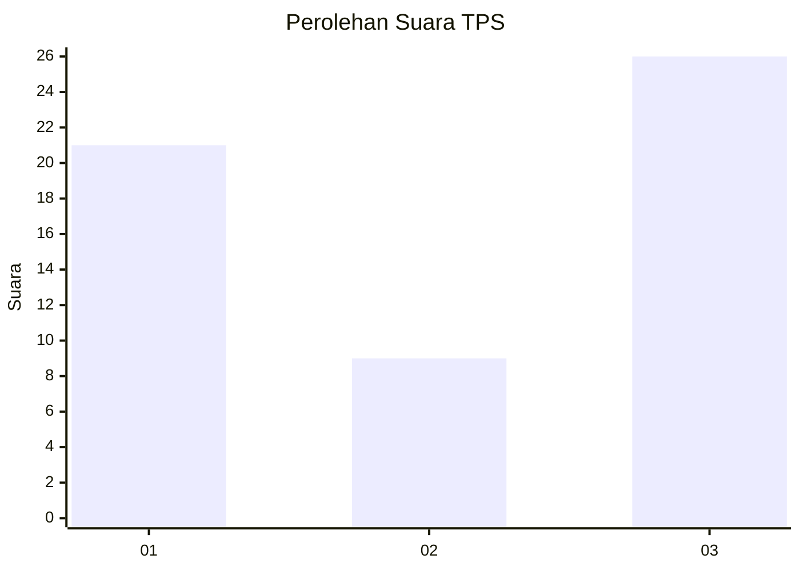
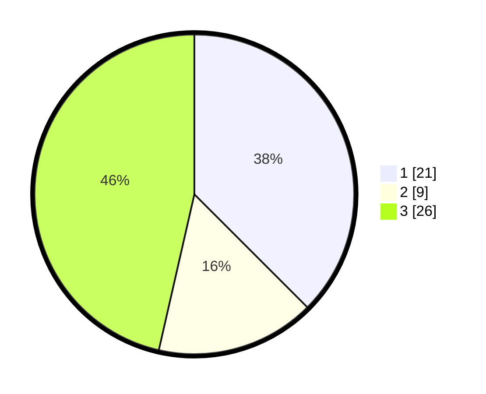

# Hasil

## Grafik

## Tabel

| No. | Nama Paslon    | Suara | Suara (raw) | Persentase |
|:--- |:-------------- | -----:| -----------:| ----------:|
| 1   | ANIES MUHAIMIN | 21    | [21][p-1]   | 37,50      |
| 2   | PRABOWO GIBRAN | 9     | [9][p-2]    | 16,07      |
| 3   | GANJAR MAHFUD  | 26    | [26][p-3]   | 46,43      |

[p-1]: https://github.com/gigit-pemilu/pemilu-2024-62-kalimantan-tengah/blob/main/pilpres/hitung-suara/sub/62-kalimantan-tengah/sub/07-seruyan/sub/02-seruyan-tengah/sub/2008-gantung-pangayuh/sub/002-tps/sub/paslon-1.txt
[p-2]: https://github.com/gigit-pemilu/pemilu-2024-62-kalimantan-tengah/blob/main/pilpres/hitung-suara/sub/62-kalimantan-tengah/sub/07-seruyan/sub/02-seruyan-tengah/sub/2008-gantung-pangayuh/sub/002-tps/sub/paslon-2.txt
[p-3]: https://github.com/gigit-pemilu/pemilu-2024-62-kalimantan-tengah/blob/main/pilpres/hitung-suara/sub/62-kalimantan-tengah/sub/07-seruyan/sub/02-seruyan-tengah/sub/2008-gantung-pangayuh/sub/002-tps/sub/paslon-3.txt

## Foto C Plano

https://sirekap-obj-formc.kpu.go.id/d524/pemilu/ppwp/62/07/02/20/08/6207022008002-20240220-104957--fbf8c73a-c994-4d54-b4ea-3d2745c82cec.jpg

https://sirekap-obj-formc.kpu.go.id/d524/pemilu/ppwp/62/07/02/20/08/6207022008002-20240217-093518--33cf3503-8641-4d43-806c-c76fa433914d.jpg

## Metadata

| Key        | Value               |
| ---------- | ------------------- |
| Time Stamp | 2024-02-20 16:00:00 |

