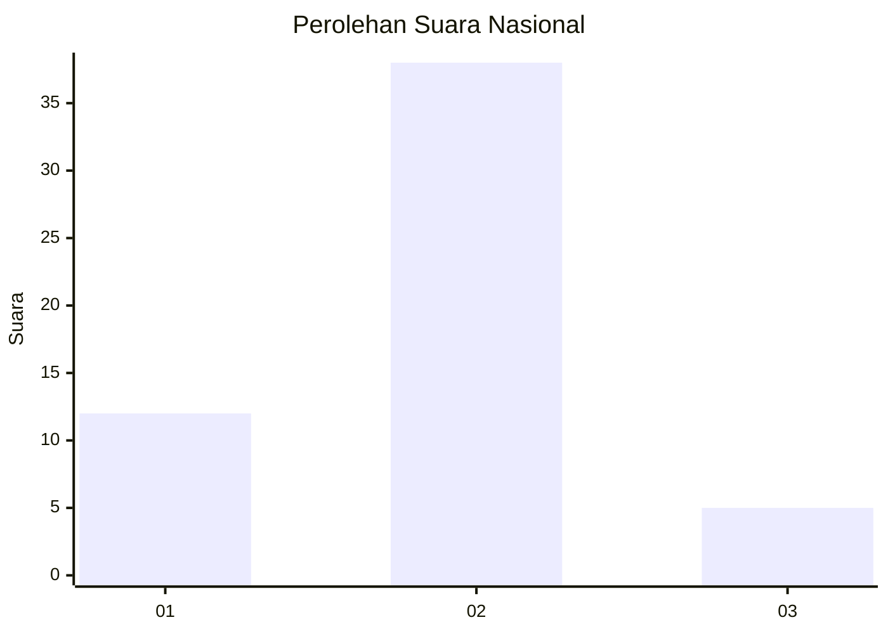

# Hasil

## Grafik

## Tabel

| No. | Nama Paslon    | Suara | Suara (raw) | Persentase |
|:--- |:-------------- | -----:| -----------:| ----------:|
| 1   | ANIES MUHAIMIN | 12    | [12][p-1]   | 21,82      |
| 2   | PRABOWO GIBRAN | 38    | [38][p-2]   | 69,09      |
| 3   | GANJAR MAHFUD  | 5     | [5][p-3]    | 9,09       |

[p-1]: https://github.com/gigit-pemilu/pemilu-2024/blob/main/pilpres/hitung-suara/sub/62-kalimantan-tengah/sub/07-seruyan/sub/04-hanau/sub/2001-tanjung-hanau/sub/004-tps/sub/paslon-1.txt
[p-2]: https://github.com/gigit-pemilu/pemilu-2024/blob/main/pilpres/hitung-suara/sub/62-kalimantan-tengah/sub/07-seruyan/sub/04-hanau/sub/2001-tanjung-hanau/sub/004-tps/sub/paslon-2.txt
[p-3]: https://github.com/gigit-pemilu/pemilu-2024/blob/main/pilpres/hitung-suara/sub/62-kalimantan-tengah/sub/07-seruyan/sub/04-hanau/sub/2001-tanjung-hanau/sub/004-tps/sub/paslon-3.txt

## Foto C Plano

https://sirekap-obj-formc.kpu.go.id/8d04/pemilu/ppwp/62/07/04/20/01/6207042001004-20240217-205059--83ef7fbc-6171-4e69-9b40-9ffd5e5ad857.jpg

https://sirekap-obj-formc.kpu.go.id/8d04/pemilu/ppwp/62/07/04/20/01/6207042001004-20240217-205100--2f916448-1f30-49ee-ae87-2aa614ac00e7.jpg

https://sirekap-obj-formc.kpu.go.id/8d04/pemilu/ppwp/62/07/04/20/01/6207042001004-20240217-205100--ea2bdd3d-45c7-4258-a774-a7aa56443c11.jpg

## Metadata

| Key        | Value               |
| ---------- | ------------------- |
| Time Stamp | 2024-02-19 06:16:00 |

## DATA PEMILIH TETAP

Jumlah pemilih dalam DPT: **58**.
 * L: **32**.
 * P: **26**.

## DATA PENGGUNA HAK PILIH

Jumlah pengguna hak pilih dalam DPT: **43**.
 * L: **25**.
 * P: **18**.

Jumlah pengguna hak pilih dalam DPTb: **1**.
 * L: **0**.
 * P: **1**.

Jumlah pengguna hak pilih dalam DPK: **12**.
 * L: **7**.
 * P: **5**.

Jumlah pengguna hak pilih: **56**.
 * L: **32**.
 * P: **24**.

## JUMLAH SUARA SAH DAN TIDAK SAH

JUMLAH SELURUH SUARA SAH: **55**.

JUMLAH SUARA TIDAK SAH: **1**.

JUMLAH SELURUH SUARA SAH DAN SUARA TIDAK SAH: **56**.

