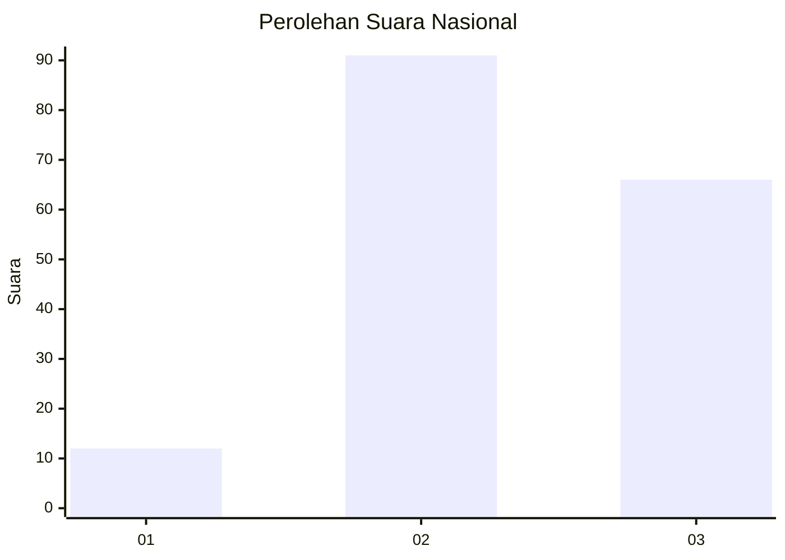
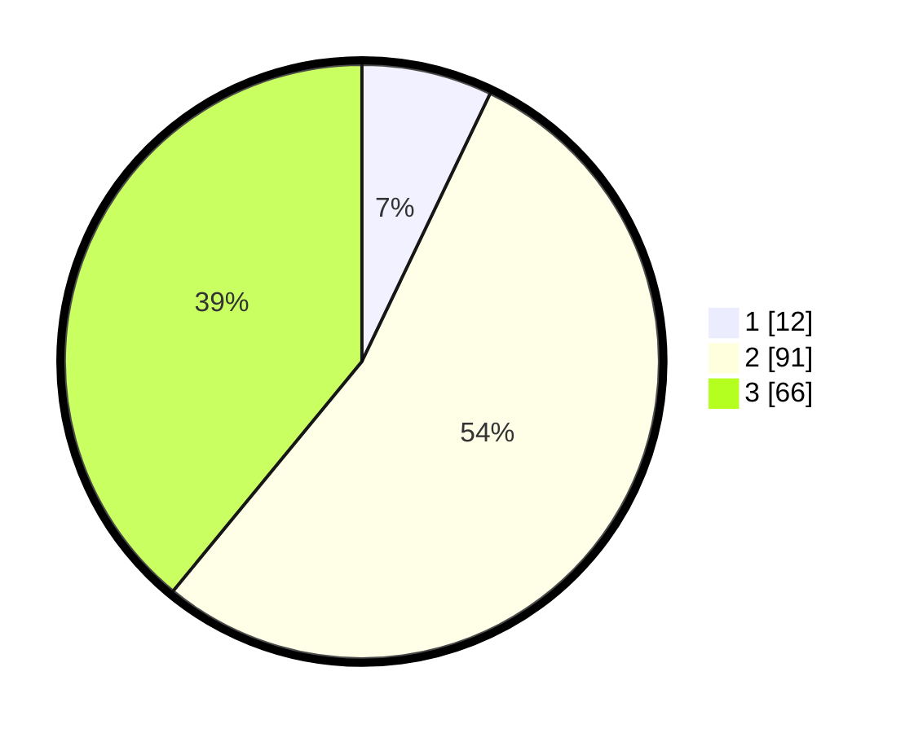

# Hasil

## Grafik

## Tabel

| No. | Nama Paslon    | Suara | Suara (raw) | Persentase |
|:--- |:-------------- | -----:| -----------:| ----------:|
| 1   | ANIES MUHAIMIN | 12    | [12][p-1]   | 7,10       |
| 2   | PRABOWO GIBRAN | 91    | [91][p-2]   | 53,85      |
| 3   | GANJAR MAHFUD  | 66    | [66][p-3]   | 39,05      |

[p-1]: https://github.com/gigit-pemilu/pemilu-2024/blob/main/pilpres/hitung-suara/sub/62-kalimantan-tengah/sub/07-seruyan/sub/04-hanau/sub/2002-parang-batang/sub/004-tps/sub/paslon-1.txt
[p-2]: https://github.com/gigit-pemilu/pemilu-2024/blob/main/pilpres/hitung-suara/sub/62-kalimantan-tengah/sub/07-seruyan/sub/04-hanau/sub/2002-parang-batang/sub/004-tps/sub/paslon-2.txt
[p-3]: https://github.com/gigit-pemilu/pemilu-2024/blob/main/pilpres/hitung-suara/sub/62-kalimantan-tengah/sub/07-seruyan/sub/04-hanau/sub/2002-parang-batang/sub/004-tps/sub/paslon-3.txt

## Foto C Plano

https://sirekap-obj-formc.kpu.go.id/fc3b/pemilu/ppwp/62/07/04/20/02/6207042002004-20240217-212644--26db7c0a-8010-4bb5-96be-6e7c61a8d848.jpg

https://sirekap-obj-formc.kpu.go.id/fc3b/pemilu/ppwp/62/07/04/20/02/6207042002004-20240217-212955--a32c51c3-195c-4179-ad98-0fbd0d2ce06c.jpg

https://sirekap-obj-formc.kpu.go.id/fc3b/pemilu/ppwp/62/07/04/20/02/6207042002004-20240217-213441--c14d8754-4652-443e-9c57-30070b887ff9.jpg

## Metadata

| Key        | Value               |
| ---------- | ------------------- |
| Time Stamp | 2024-02-19 15:00:00 |

## DATA PEMILIH TETAP

Jumlah pemilih dalam DPT: **242**.
 * L: **640**.
 * P: **202**.

## DATA PENGGUNA HAK PILIH

Jumlah pengguna hak pilih dalam DPT: **42**.
 * L: **80**.
 * P: **62**.

Jumlah pengguna hak pilih dalam DPTb: **205**.
 * L: **825**.
 * P: **202**.

Jumlah pengguna hak pilih dalam DPK: **29**.
 * L: **26**.
 * P: **23**.

Jumlah pengguna hak pilih: **136**.
 * L: **600**.
 * P: **36**.

## JUMLAH SUARA SAH DAN TIDAK SAH

JUMLAH SELURUH SUARA SAH: **169**.

JUMLAH SUARA TIDAK SAH: **7**.

JUMLAH SELURUH SUARA SAH DAN SUARA TIDAK SAH: **176**.

