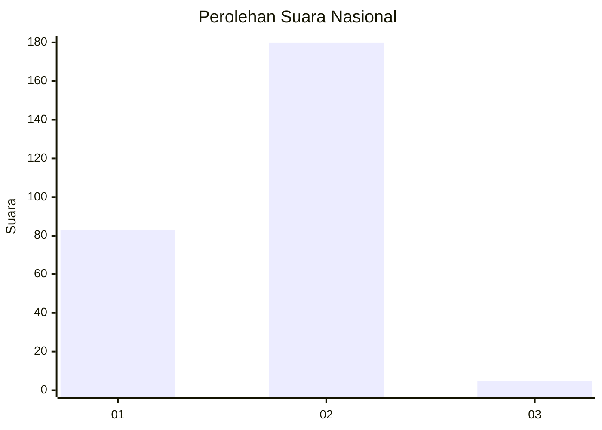
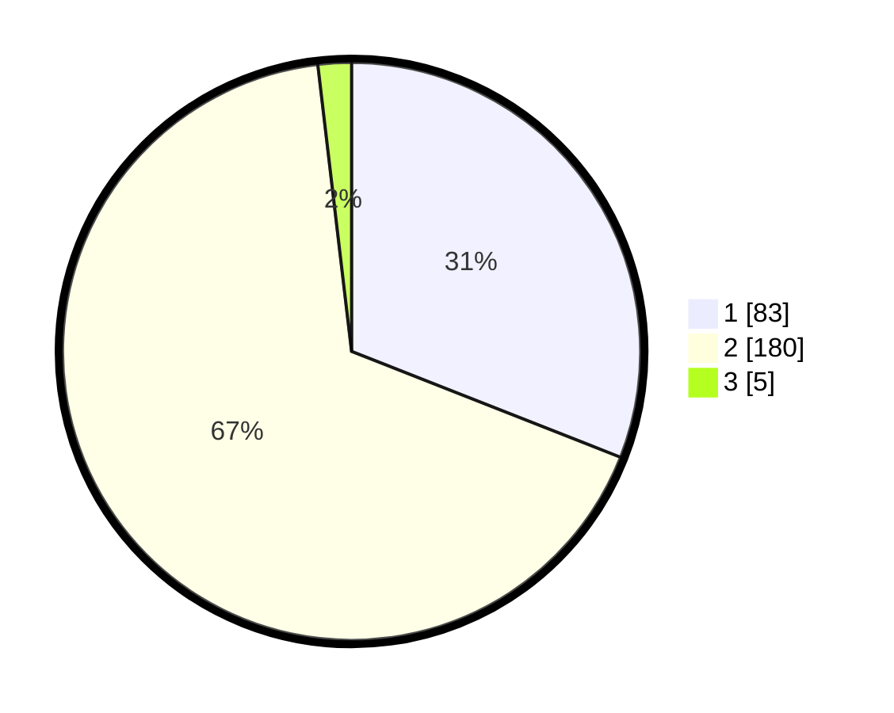

# Hasil

## Grafik

## Tabel

| No. | Nama Paslon    | Suara | Suara (raw) | Persentase |
|:--- |:-------------- | -----:| -----------:| ----------:|
| 1   | ANIES MUHAIMIN | 83    | [83][p-1]   | 30,97      |
| 2   | PRABOWO GIBRAN | 180   | [180][p-2]  | 67,16      |
| 3   | GANJAR MAHFUD  | 5     | [5][p-3]    | 1,87       |

[p-1]: https://github.com/gigit-pemilu/pemilu-2024/blob/main/pilpres/hitung-suara/sub/62-kalimantan-tengah/sub/07-seruyan/sub/04-hanau/sub/2004-pembuang-hulu-i/sub/002-tps/sub/paslon-1.txt
[p-2]: https://github.com/gigit-pemilu/pemilu-2024/blob/main/pilpres/hitung-suara/sub/62-kalimantan-tengah/sub/07-seruyan/sub/04-hanau/sub/2004-pembuang-hulu-i/sub/002-tps/sub/paslon-2.txt
[p-3]: https://github.com/gigit-pemilu/pemilu-2024/blob/main/pilpres/hitung-suara/sub/62-kalimantan-tengah/sub/07-seruyan/sub/04-hanau/sub/2004-pembuang-hulu-i/sub/002-tps/sub/paslon-3.txt

## Foto C Plano

https://sirekap-obj-formc.kpu.go.id/b23b/pemilu/ppwp/62/07/04/20/04/6207042004002-20240215-024156--be12e9a7-a27d-459c-91f8-a501bd049d34.jpg

https://sirekap-obj-formc.kpu.go.id/b23b/pemilu/ppwp/62/07/04/20/04/6207042004002-20240215-024228--6f3822ed-8081-44a1-81dc-0df7d44743a1.jpg

https://sirekap-obj-formc.kpu.go.id/b23b/pemilu/ppwp/62/07/04/20/04/6207042004002-20240215-024305--43e467e6-99c3-4161-afb9-d2527d15f0b6.jpg

## Metadata

| Key        | Value               |
| ---------- | ------------------- |
| Time Stamp | 2024-02-15 21:01:18 |

