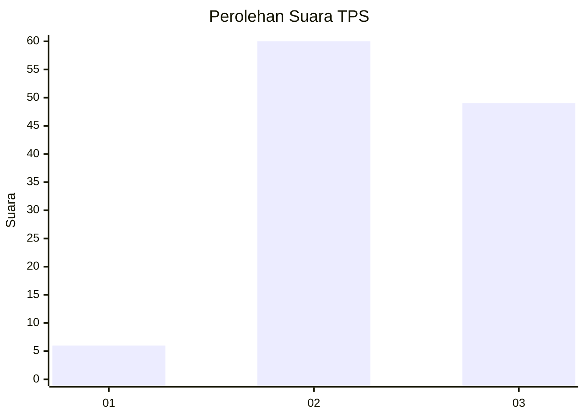
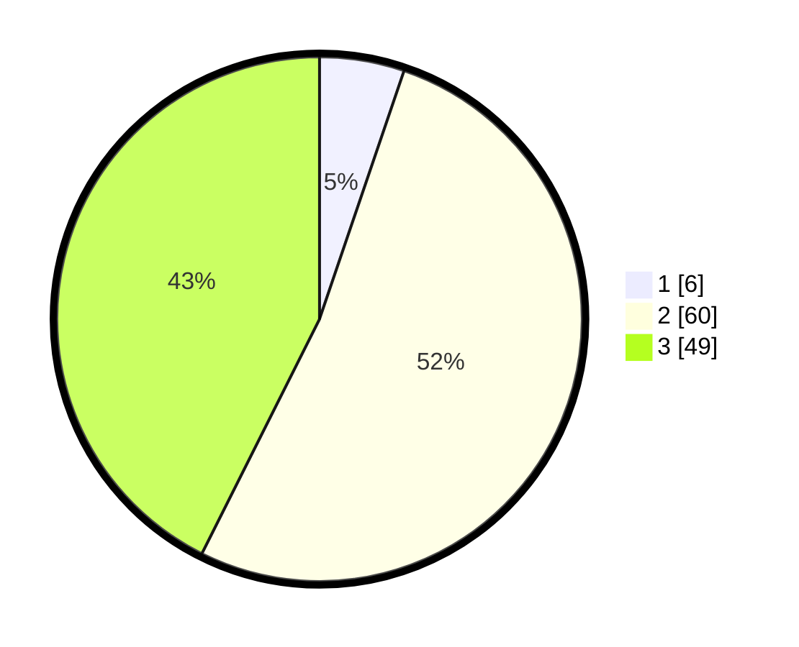

# Hasil

## Grafik

## Tabel

| No. | Nama Paslon    | Suara | Suara (raw) | Persentase |
|:--- |:-------------- | -----:| -----------:| ----------:|
| 1   | ANIES MUHAIMIN | 6     | [6][p-1]    | 5,22       |
| 2   | PRABOWO GIBRAN | 60    | [60][p-2]   | 52,17      |
| 3   | GANJAR MAHFUD  | 49    | [49][p-3]   | 42,61      |

[p-1]: https://github.com/gigit-pemilu/pemilu-2024-62-kalimantan-tengah/blob/main/pilpres/hitung-suara/sub/62-kalimantan-tengah/sub/07-seruyan/sub/09-batu-ampar/sub/2001-sebabi/sub/901-tps/sub/paslon-1.txt
[p-2]: https://github.com/gigit-pemilu/pemilu-2024-62-kalimantan-tengah/blob/main/pilpres/hitung-suara/sub/62-kalimantan-tengah/sub/07-seruyan/sub/09-batu-ampar/sub/2001-sebabi/sub/901-tps/sub/paslon-2.txt
[p-3]: https://github.com/gigit-pemilu/pemilu-2024-62-kalimantan-tengah/blob/main/pilpres/hitung-suara/sub/62-kalimantan-tengah/sub/07-seruyan/sub/09-batu-ampar/sub/2001-sebabi/sub/901-tps/sub/paslon-3.txt

## Foto C Plano

https://sirekap-obj-formc.kpu.go.id/293a/pemilu/ppwp/62/07/09/20/01/6207092001901-20240214-193113--d1d29a4a-bf3e-4122-af8f-7cd2cf5d41bc.jpg

https://sirekap-obj-formc.kpu.go.id/293a/pemilu/ppwp/62/07/09/20/01/6207092001901-20240214-193703--fb1b26e2-115e-475f-a447-696b333143e8.jpg

https://sirekap-obj-formc.kpu.go.id/293a/pemilu/ppwp/62/07/09/20/01/6207092001901-20240215-102717--ead8af86-afa9-4c9b-9577-14b953607ce0.jpg

## Metadata

| Key        | Value               |
| ---------- | ------------------- |
| Time Stamp | 2024-02-15 22:00:27 |

