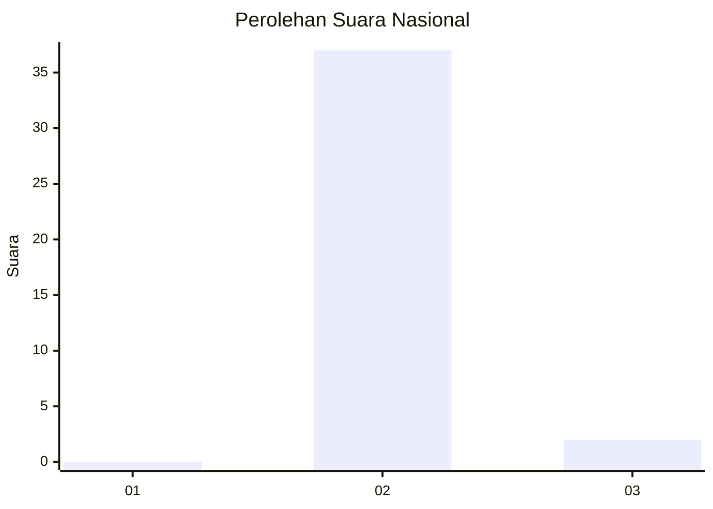
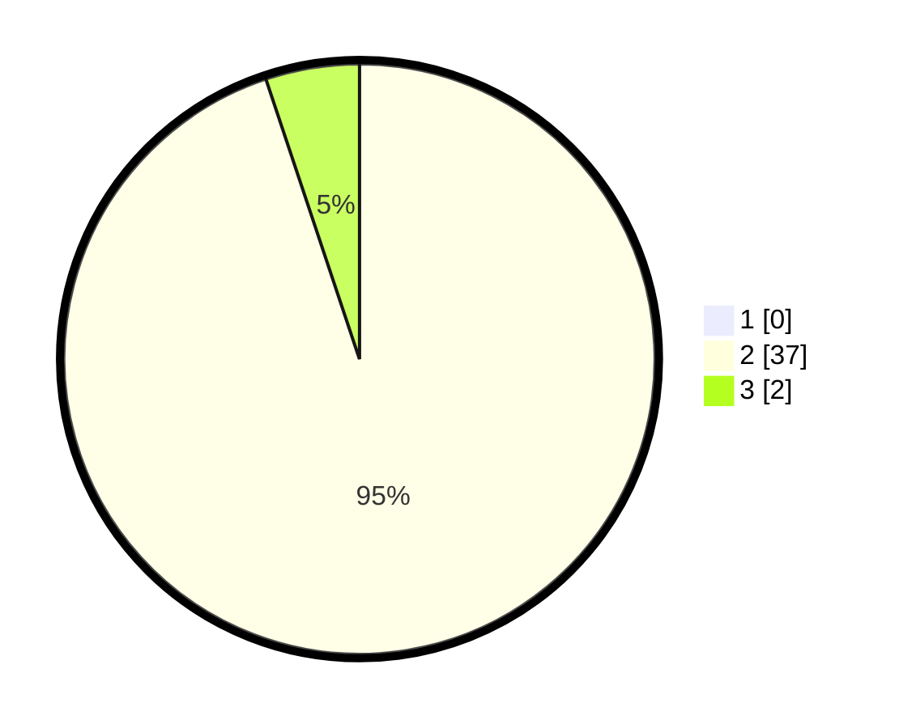

# Hasil

## Grafik

## Tabel

| No. | Nama Paslon    | Suara | Suara (raw) | Persentase |
|:--- |:-------------- | -----:| -----------:| ----------:|
| 1   | ANIES MUHAIMIN | 0     | [0][p-1]    | 0,00       |
| 2   | PRABOWO GIBRAN | 37    | [37][p-2]   | 94,87      |
| 3   | GANJAR MAHFUD  | 2     | [2][p-3]    | 5,13       |

[p-1]: https://github.com/gigit-pemilu/pemilu-2024/blob/main/pilpres/hitung-suara/sub/62-kalimantan-tengah/sub/07-seruyan/sub/10-suling-tambun/sub/2003-tumbang-hentas/sub/001-tps/sub/paslon-1.txt
[p-2]: https://github.com/gigit-pemilu/pemilu-2024/blob/main/pilpres/hitung-suara/sub/62-kalimantan-tengah/sub/07-seruyan/sub/10-suling-tambun/sub/2003-tumbang-hentas/sub/001-tps/sub/paslon-2.txt
[p-3]: https://github.com/gigit-pemilu/pemilu-2024/blob/main/pilpres/hitung-suara/sub/62-kalimantan-tengah/sub/07-seruyan/sub/10-suling-tambun/sub/2003-tumbang-hentas/sub/001-tps/sub/paslon-3.txt

## Foto C Plano

https://sirekap-obj-formc.kpu.go.id/dc31/pemilu/ppwp/62/07/10/20/03/6207102003001-20240218-102958--78bc481b-a102-429c-991a-35df3867efe8.jpg

https://sirekap-obj-formc.kpu.go.id/dc31/pemilu/ppwp/62/07/10/20/03/6207102003001-20240218-102959--7336f142-b0a3-4f83-8730-9a25da18ad51.jpg

https://sirekap-obj-formc.kpu.go.id/dc31/pemilu/ppwp/62/07/10/20/03/6207102003001-20240218-102958--847825f5-bbaf-4bb9-92fe-6d2d498eedeb.jpg

## Metadata

| Key        | Value               |
| ---------- | ------------------- |
| Time Stamp | 2024-02-19 06:16:00 |

## DATA PEMILIH TETAP

Jumlah pemilih dalam DPT: **39**.
 * L: **16**.
 * P: **23**.

## DATA PENGGUNA HAK PILIH

Jumlah pengguna hak pilih dalam DPT: **38**.
 * L: **16**.
 * P: **22**.

Jumlah pengguna hak pilih dalam DPTb: **0**.
 * L: **0**.
 * P: **0**.

Jumlah pengguna hak pilih dalam DPK: **1**.
 * L: **1**.
 * P: **0**.

Jumlah pengguna hak pilih: **39**.
 * L: **17**.
 * P: **22**.

## JUMLAH SUARA SAH DAN TIDAK SAH

JUMLAH SELURUH SUARA SAH: **39**.

JUMLAH SUARA TIDAK SAH: **0**.

JUMLAH SELURUH SUARA SAH DAN SUARA TIDAK SAH: **39**.

