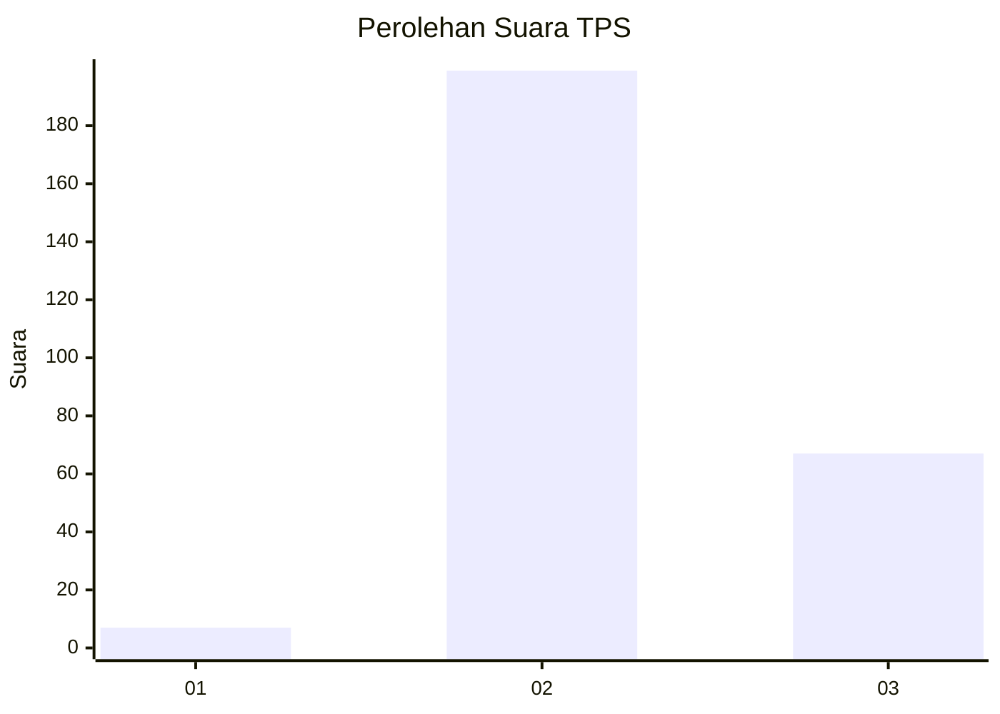
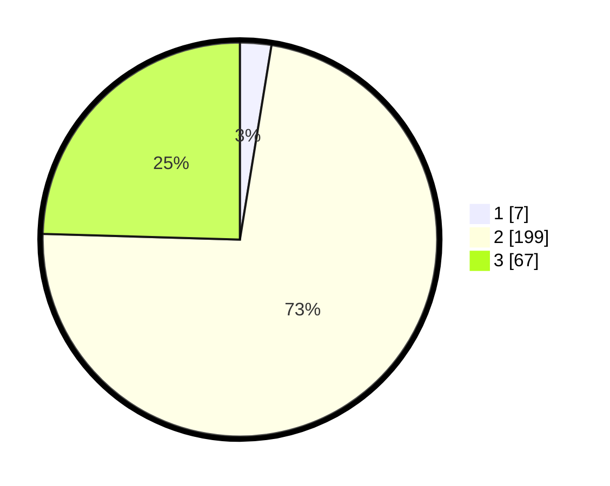

# Hasil

## Grafik

## Tabel

| No. | Nama Paslon    | Suara | Suara (raw) | Persentase |
|:--- |:-------------- | -----:| -----------:| ----------:|
| 1   | ANIES MUHAIMIN | 7     | [7][p-1]    | 2,56       |
| 2   | PRABOWO GIBRAN | 199   | [199][p-2]  | 72,89      |
| 3   | GANJAR MAHFUD  | 67    | [67][p-3]   | 24,54      |

[p-1]: https://github.com/gigit-pemilu/pemilu-2024-62-kalimantan-tengah/blob/main/pilpres/hitung-suara/sub/62-kalimantan-tengah/sub/08-sukamara/sub/03-balai-riam/sub/2001-jihing/sub/003-tps/sub/paslon-1.txt
[p-2]: https://github.com/gigit-pemilu/pemilu-2024-62-kalimantan-tengah/blob/main/pilpres/hitung-suara/sub/62-kalimantan-tengah/sub/08-sukamara/sub/03-balai-riam/sub/2001-jihing/sub/003-tps/sub/paslon-2.txt
[p-3]: https://github.com/gigit-pemilu/pemilu-2024-62-kalimantan-tengah/blob/main/pilpres/hitung-suara/sub/62-kalimantan-tengah/sub/08-sukamara/sub/03-balai-riam/sub/2001-jihing/sub/003-tps/sub/paslon-3.txt

## Foto C Plano

https://sirekap-obj-formc.kpu.go.id/58d7/pemilu/ppwp/62/08/03/20/01/6208032001003-20240217-003835--bae65597-b8e8-4bda-89f0-fe9c2dbf1fba.jpg

https://sirekap-obj-formc.kpu.go.id/58d7/pemilu/ppwp/62/08/03/20/01/6208032001003-20240217-002426--2da70525-67d6-477a-9013-232c38d370d8.jpg

https://sirekap-obj-formc.kpu.go.id/58d7/pemilu/ppwp/62/08/03/20/01/6208032001003-20240217-001848--308214b8-52e1-4a4f-adb2-0a780fe28eb1.jpg

## Metadata

| Key        | Value               |
| ---------- | ------------------- |
| Time Stamp | 2024-02-17 01:00:00 |

## DATA PEMILIH TETAP

Jumlah pemilih dalam DPT: **272**.
 * L: **148**.
 * P: **124**.

## DATA PENGGUNA HAK PILIH

Jumlah pengguna hak pilih dalam DPT: **258**.
 * L: **145**.
 * P: **113**.

Jumlah pengguna hak pilih dalam DPTb: **14**.
 * L: **8**.
 * P: **6**.

Jumlah pengguna hak pilih dalam DPK: **6**.
 * L: **4**.
 * P: **2**.

Jumlah pengguna hak pilih: **278**.
 * L: **157**.
 * P: **121**.

## JUMLAH SUARA SAH DAN TIDAK SAH

JUMLAH SELURUH SUARA SAH: **273**.

JUMLAH SUARA TIDAK SAH: **5**.

JUMLAH SELURUH SUARA SAH DAN SUARA TIDAK SAH: **278**.

