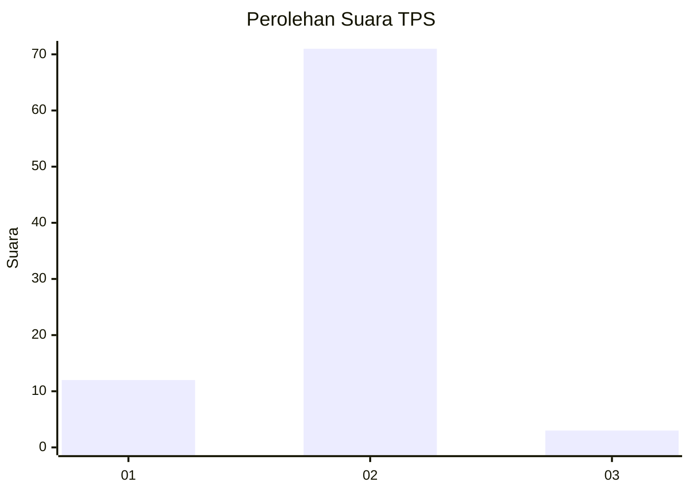
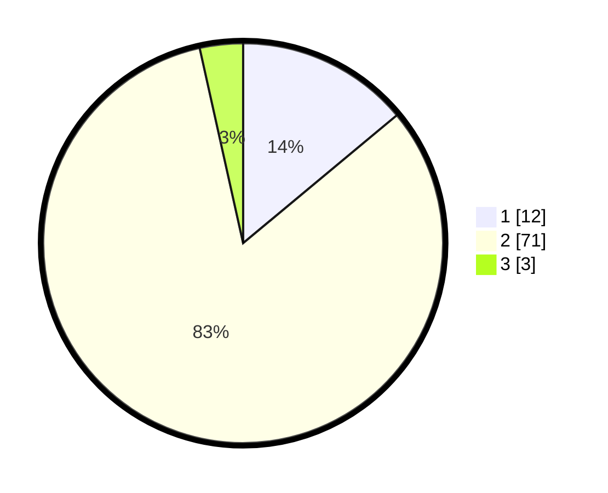

# Hasil

## Grafik

## Tabel

| No. | Nama Paslon    | Suara | Suara (raw) | Persentase |
|:--- |:-------------- | -----:| -----------:| ----------:|
| 1   | ANIES MUHAIMIN | 12    | [12][p-1]   | 13,95      |
| 2   | PRABOWO GIBRAN | 71    | [71][p-2]   | 82,56      |
| 3   | GANJAR MAHFUD  | 3     | [3][p-3]    | 3,49       |

[p-1]: https://github.com/gigit-pemilu/pemilu-2024-62-kalimantan-tengah/blob/main/pilpres/hitung-suara/sub/62-kalimantan-tengah/sub/08-sukamara/sub/04-pantai-lunci/sub/2002-sungai-tabuk/sub/001-tps/sub/paslon-1.txt
[p-2]: https://github.com/gigit-pemilu/pemilu-2024-62-kalimantan-tengah/blob/main/pilpres/hitung-suara/sub/62-kalimantan-tengah/sub/08-sukamara/sub/04-pantai-lunci/sub/2002-sungai-tabuk/sub/001-tps/sub/paslon-2.txt
[p-3]: https://github.com/gigit-pemilu/pemilu-2024-62-kalimantan-tengah/blob/main/pilpres/hitung-suara/sub/62-kalimantan-tengah/sub/08-sukamara/sub/04-pantai-lunci/sub/2002-sungai-tabuk/sub/001-tps/sub/paslon-3.txt

## Foto C Plano

https://sirekap-obj-formc.kpu.go.id/9dde/pemilu/ppwp/62/08/04/20/02/6208042002001-20240214-140951--2633db79-149e-4c8b-b436-f59e890dbe4c.jpg

https://sirekap-obj-formc.kpu.go.id/9dde/pemilu/ppwp/62/08/04/20/02/6208042002001-20240214-141521--7dba3ec3-63cb-4ef0-be14-53e2f11f225e.jpg

https://sirekap-obj-formc.kpu.go.id/9dde/pemilu/ppwp/62/08/04/20/02/6208042002001-20240214-224359--f236d641-5b8a-4bbb-ad4b-22bcc8ed7ff2.jpg

## Metadata

| Key        | Value               |
| ---------- | ------------------- |
| Time Stamp | 2024-02-15 17:00:25 |

## DATA PEMILIH TETAP

Jumlah pemilih dalam DPT: **91**.
 * L: **46**.
 * P: **45**.

## DATA PENGGUNA HAK PILIH

Jumlah pengguna hak pilih dalam DPT: **82**.
 * L: **39**.
 * P: **43**.

Jumlah pengguna hak pilih dalam DPTb: **4**.
 * L: **3**.
 * P: **1**.

Jumlah pengguna hak pilih dalam DPK: **0**.
 * L: **0**.
 * P: **0**.

Jumlah pengguna hak pilih: **86**.
 * L: **42**.
 * P: **44**.

## JUMLAH SUARA SAH DAN TIDAK SAH

JUMLAH SELURUH SUARA SAH: **86**.

JUMLAH SUARA TIDAK SAH: **0**.

JUMLAH SELURUH SUARA SAH DAN SUARA TIDAK SAH: **86**.

