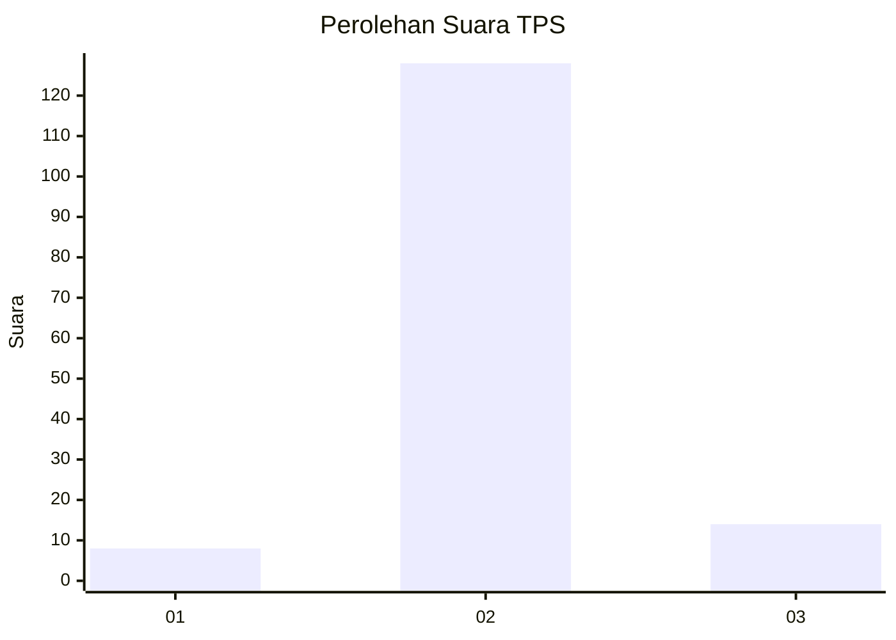
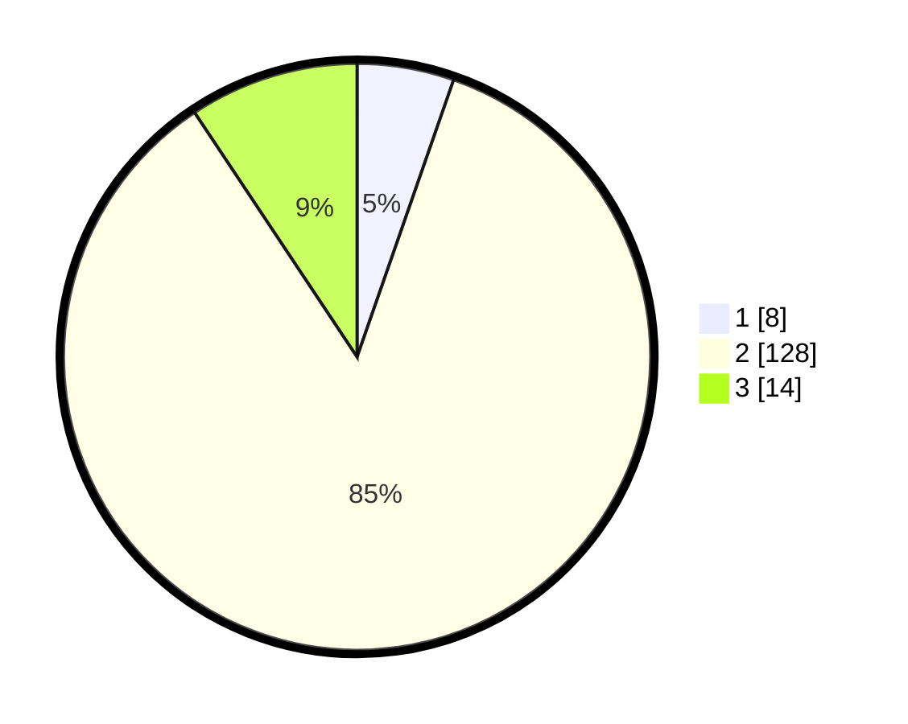

# Hasil

## Grafik

## Tabel

| No. | Nama Paslon    | Suara | Suara (raw) | Persentase |
|:--- |:-------------- | -----:| -----------:| ----------:|
| 1   | ANIES MUHAIMIN | 8     | [8][p-1]    | 5,33       |
| 2   | PRABOWO GIBRAN | 128   | [128][p-2]  | 85,33      |
| 3   | GANJAR MAHFUD  | 14    | [14][p-3]   | 9,33       |

[p-1]: https://github.com/gigit-pemilu/pemilu-2024-62-kalimantan-tengah/blob/main/pilpres/hitung-suara/sub/62-kalimantan-tengah/sub/08-sukamara/sub/05-permata-kecubung/sub/2001-kenawan/sub/001-tps/sub/paslon-1.txt
[p-2]: https://github.com/gigit-pemilu/pemilu-2024-62-kalimantan-tengah/blob/main/pilpres/hitung-suara/sub/62-kalimantan-tengah/sub/08-sukamara/sub/05-permata-kecubung/sub/2001-kenawan/sub/001-tps/sub/paslon-2.txt
[p-3]: https://github.com/gigit-pemilu/pemilu-2024-62-kalimantan-tengah/blob/main/pilpres/hitung-suara/sub/62-kalimantan-tengah/sub/08-sukamara/sub/05-permata-kecubung/sub/2001-kenawan/sub/001-tps/sub/paslon-3.txt

## Foto C Plano

https://sirekap-obj-formc.kpu.go.id/681a/pemilu/ppwp/62/08/05/20/01/6208052001001-20240216-215551--ef61c56b-aef5-41b5-9a1e-de474971ecf5.jpg

https://sirekap-obj-formc.kpu.go.id/681a/pemilu/ppwp/62/08/05/20/01/6208052001001-20240216-221314--7939e652-dcfa-4933-9a9a-27d94ec8f4ec.jpg

https://sirekap-obj-formc.kpu.go.id/681a/pemilu/ppwp/62/08/05/20/01/6208052001001-20240216-221438--ce422e04-6839-47cb-a5de-b9eed6486677.jpg

## Metadata

| Key        | Value               |
| ---------- | ------------------- |
| Time Stamp | 2024-02-19 06:16:00 |

## DATA PEMILIH TETAP

Jumlah pemilih dalam DPT: **553**.
 * L: **2**.
 * P: **557**.

## DATA PENGGUNA HAK PILIH

Jumlah pengguna hak pilih dalam DPT: **233**.
 * L: **0**.
 * P: **170**.

Jumlah pengguna hak pilih dalam DPTb: **320**.
 * L: **2**.
 * P: **396**.

Jumlah pengguna hak pilih dalam DPK: **29**.
 * L: **701**.
 * P: **127**.

Jumlah pengguna hak pilih: **124**.
 * L: **222**.
 * P: **173**.

## JUMLAH SUARA SAH DAN TIDAK SAH

JUMLAH SELURUH SUARA SAH: **150**.

JUMLAH SUARA TIDAK SAH: **8**.

JUMLAH SELURUH SUARA SAH DAN SUARA TIDAK SAH: **158**.

