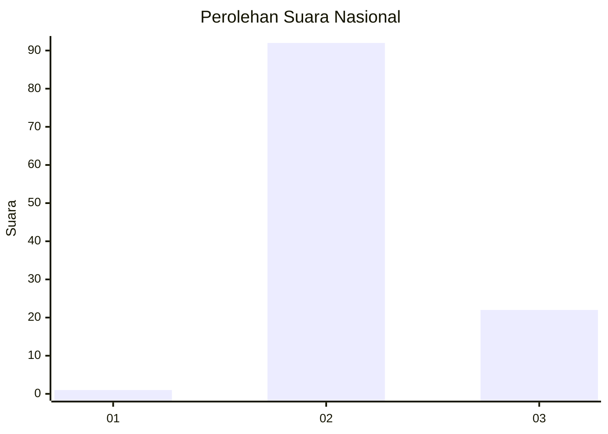
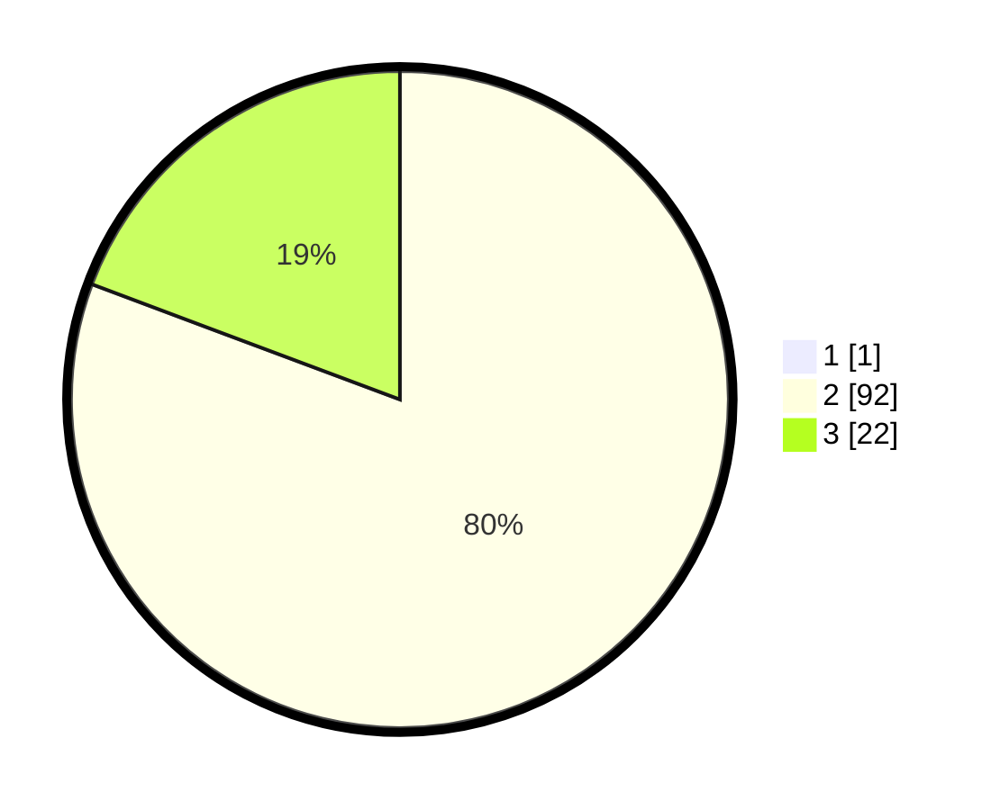

# Hasil

## Grafik

## Tabel

| No. | Nama Paslon    | Suara | Suara (raw) | Persentase |
|:--- |:-------------- | -----:| -----------:| ----------:|
| 1   | ANIES MUHAIMIN | 1     | [1][p-1]    | 0,87       |
| 2   | PRABOWO GIBRAN | 92    | [92][p-2]   | 80,00      |
| 3   | GANJAR MAHFUD  | 22    | [22][p-3]   | 19,13      |

[p-1]: https://github.com/gigit-pemilu/pemilu-2024/blob/main/pilpres/hitung-suara/sub/62-kalimantan-tengah/sub/09-lamandau/sub/01-lamandau/sub/1012-tapin-bini/sub/003-tps/sub/paslon-1.txt
[p-2]: https://github.com/gigit-pemilu/pemilu-2024/blob/main/pilpres/hitung-suara/sub/62-kalimantan-tengah/sub/09-lamandau/sub/01-lamandau/sub/1012-tapin-bini/sub/003-tps/sub/paslon-2.txt
[p-3]: https://github.com/gigit-pemilu/pemilu-2024/blob/main/pilpres/hitung-suara/sub/62-kalimantan-tengah/sub/09-lamandau/sub/01-lamandau/sub/1012-tapin-bini/sub/003-tps/sub/paslon-3.txt

## Foto C Plano

https://sirekap-obj-formc.kpu.go.id/bffc/pemilu/ppwp/62/09/01/10/12/6209011012003-20240221-125307--9dfe86d7-d628-4168-8b00-0172e69e1212.jpg

https://sirekap-obj-formc.kpu.go.id/bffc/pemilu/ppwp/62/09/01/10/12/6209011012003-20240221-125309--9a310e98-1119-42c3-a41d-c4b57e29a732.jpg

https://sirekap-obj-formc.kpu.go.id/bffc/pemilu/ppwp/62/09/01/10/12/6209011012003-20240221-125308--1638ba1e-0e5c-46a9-817e-5ef431d72725.jpg

## Metadata

| Key        | Value               |
| ---------- | ------------------- |
| Time Stamp | 2024-02-22 14:00:00 |

## DATA PEMILIH TETAP

Jumlah pemilih dalam DPT: **252**.
 * L: **147**.
 * P: **105**.

## DATA PENGGUNA HAK PILIH

Jumlah pengguna hak pilih dalam DPT: **95**.
 * L: **52**.
 * P: **43**.

Jumlah pengguna hak pilih dalam DPTb: **4**.
 * L: **3**.
 * P: **1**.

Jumlah pengguna hak pilih dalam DPK: **20**.
 * L: **10**.
 * P: **10**.

Jumlah pengguna hak pilih: **119**.
 * L: **65**.
 * P: **54**.

## JUMLAH SUARA SAH DAN TIDAK SAH

JUMLAH SELURUH SUARA SAH: **115**.

JUMLAH SUARA TIDAK SAH: **4**.

JUMLAH SELURUH SUARA SAH DAN SUARA TIDAK SAH: **119**.

