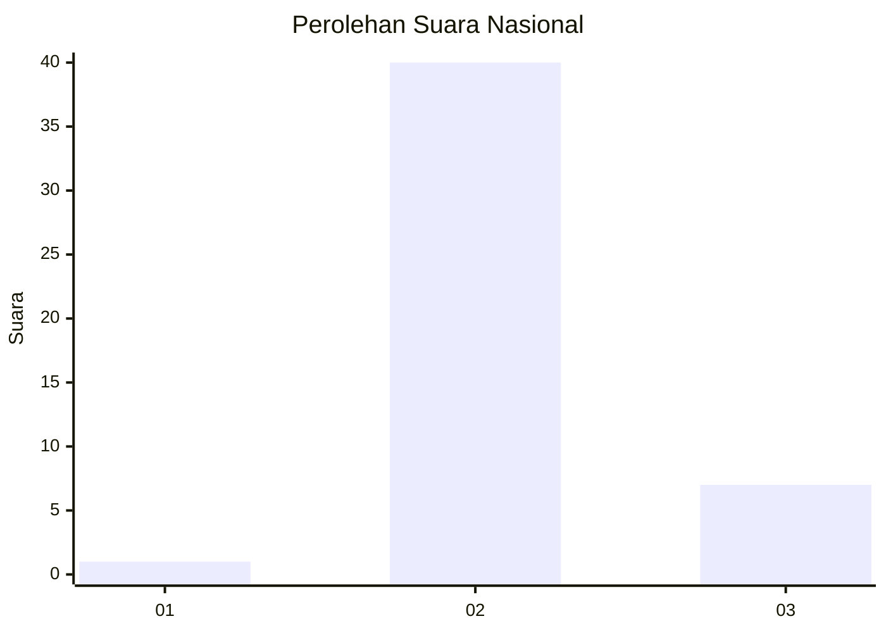
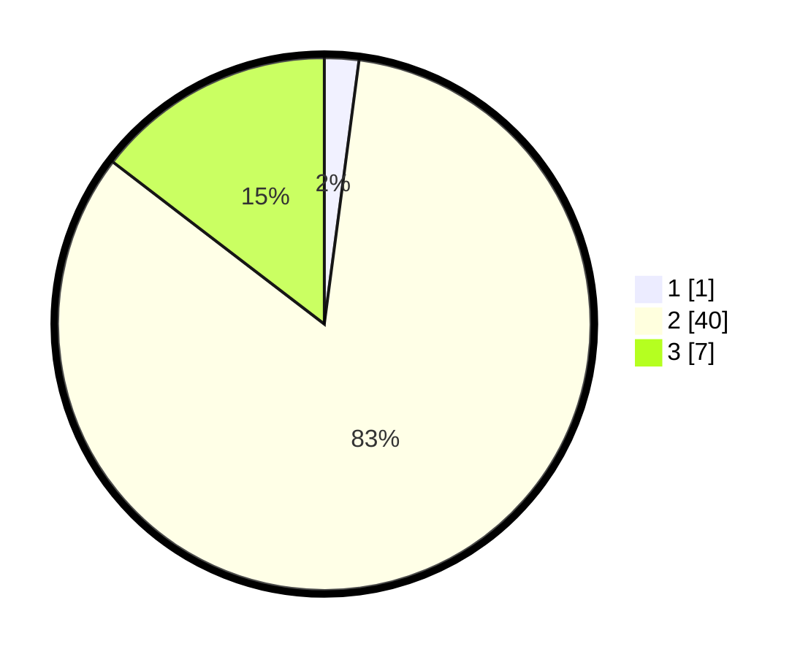

# Hasil

## Grafik

## Tabel

| No. | Nama Paslon    | Suara | Suara (raw) | Persentase |
|:--- |:-------------- | -----:| -----------:| ----------:|
| 1   | ANIES MUHAIMIN | 1     | [1][p-1]    | 2,08       |
| 2   | PRABOWO GIBRAN | 40    | [40][p-2]   | 83,33      |
| 3   | GANJAR MAHFUD  | 7     | [7][p-3]    | 14,58      |

[p-1]: https://github.com/gigit-pemilu/pemilu-2024/blob/main/pilpres/hitung-suara/sub/62-kalimantan-tengah/sub/09-lamandau/sub/01-lamandau/sub/1012-tapin-bini/sub/004-tps/sub/paslon-1.txt
[p-2]: https://github.com/gigit-pemilu/pemilu-2024/blob/main/pilpres/hitung-suara/sub/62-kalimantan-tengah/sub/09-lamandau/sub/01-lamandau/sub/1012-tapin-bini/sub/004-tps/sub/paslon-2.txt
[p-3]: https://github.com/gigit-pemilu/pemilu-2024/blob/main/pilpres/hitung-suara/sub/62-kalimantan-tengah/sub/09-lamandau/sub/01-lamandau/sub/1012-tapin-bini/sub/004-tps/sub/paslon-3.txt

## Foto C Plano

https://sirekap-obj-formc.kpu.go.id/872f/pemilu/ppwp/62/09/01/10/12/6209011012004-20240221-130255--3e092524-bcd9-405b-93ac-6efde61e8a83.jpg

https://sirekap-obj-formc.kpu.go.id/872f/pemilu/ppwp/62/09/01/10/12/6209011012004-20240221-130256--760a4810-0434-494c-a859-dd3ab2e76ed3.jpg

https://sirekap-obj-formc.kpu.go.id/872f/pemilu/ppwp/62/09/01/10/12/6209011012004-20240221-130255--f00266ca-2f57-456d-9bee-5245e759debe.jpg

## Metadata

| Key        | Value               |
| ---------- | ------------------- |
| Time Stamp | 2024-02-22 14:00:00 |

## DATA PEMILIH TETAP

Jumlah pemilih dalam DPT: **47**.
 * L: **23**.
 * P: **24**.

## DATA PENGGUNA HAK PILIH

Jumlah pengguna hak pilih dalam DPT: **38**.
 * L: **20**.
 * P: **18**.

Jumlah pengguna hak pilih dalam DPTb: **0**.
 * L: **0**.
 * P: **0**.

Jumlah pengguna hak pilih dalam DPK: **10**.
 * L: **5**.
 * P: **5**.

Jumlah pengguna hak pilih: **48**.
 * L: **25**.
 * P: **23**.

## JUMLAH SUARA SAH DAN TIDAK SAH

JUMLAH SELURUH SUARA SAH: **48**.

JUMLAH SUARA TIDAK SAH: **0**.

JUMLAH SELURUH SUARA SAH DAN SUARA TIDAK SAH: **48**.

