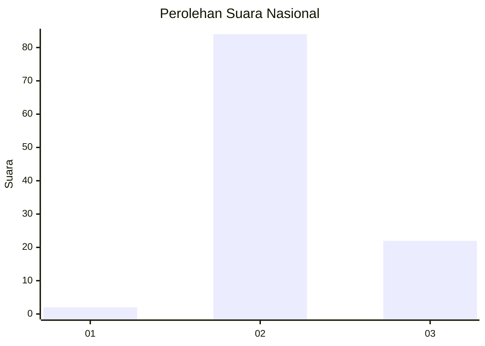

# Hasil

## Grafik

## Tabel

| No. | Nama Paslon    | Suara | Suara (raw) | Persentase |
|:--- |:-------------- | -----:| -----------:| ----------:|
| 1   | ANIES MUHAIMIN | 2     | [2][p-1]    | 1,85       |
| 2   | PRABOWO GIBRAN | 84    | [84][p-2]   | 77,78      |
| 3   | GANJAR MAHFUD  | 22    | [22][p-3]   | 20,37      |

[p-1]: https://github.com/gigit-pemilu/pemilu-2024/blob/main/pilpres/hitung-suara/sub/62-kalimantan-tengah/sub/09-lamandau/sub/03-bulik/sub/2036-bukit-indah/sub/010-tps/sub/paslon-1.txt
[p-2]: https://github.com/gigit-pemilu/pemilu-2024/blob/main/pilpres/hitung-suara/sub/62-kalimantan-tengah/sub/09-lamandau/sub/03-bulik/sub/2036-bukit-indah/sub/010-tps/sub/paslon-2.txt
[p-3]: https://github.com/gigit-pemilu/pemilu-2024/blob/main/pilpres/hitung-suara/sub/62-kalimantan-tengah/sub/09-lamandau/sub/03-bulik/sub/2036-bukit-indah/sub/010-tps/sub/paslon-3.txt

## Foto C Plano

https://sirekap-obj-formc.kpu.go.id/ea0f/pemilu/ppwp/62/09/03/20/36/6209032036010-20240222-094710--2b97737b-d627-4667-ae8c-56bfdc0fd98b.jpg

https://sirekap-obj-formc.kpu.go.id/ea0f/pemilu/ppwp/62/09/03/20/36/6209032036010-20240222-094811--6c9510c3-9a80-4682-8508-777c933d9131.jpg

https://sirekap-obj-formc.kpu.go.id/ea0f/pemilu/ppwp/62/09/03/20/36/6209032036010-20240222-095029--8194746d-5871-49ef-bebb-fe30c8eeca94.jpg

## Metadata

| Key        | Value               |
| ---------- | ------------------- |
| Time Stamp | 2024-02-22 14:00:00 |

