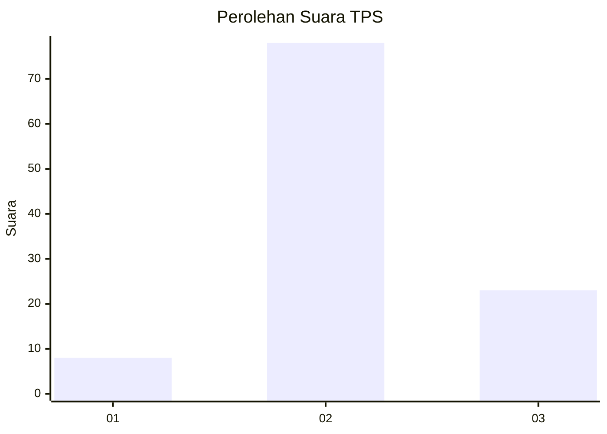
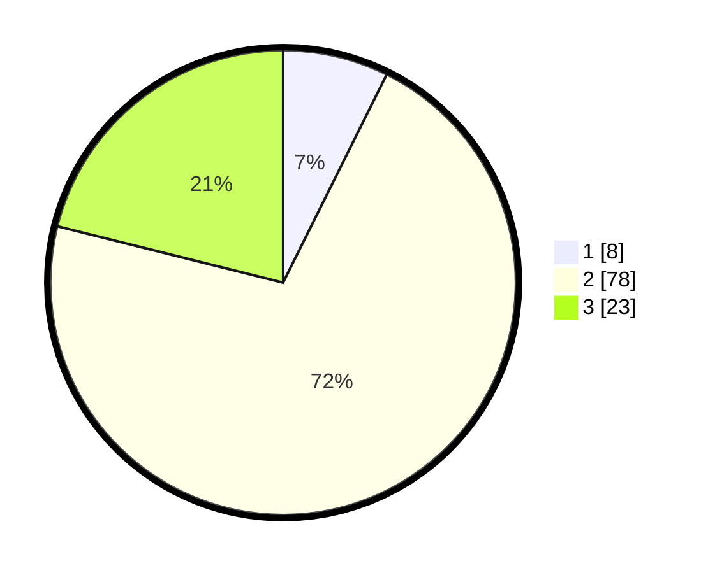

# Hasil

## Grafik

## Tabel

| No. | Nama Paslon    | Suara | Suara (raw) | Persentase |
|:--- |:-------------- | -----:| -----------:| ----------:|
| 1   | ANIES MUHAIMIN | 8     | [8][p-1]    | 7,34       |
| 2   | PRABOWO GIBRAN | 78    | [78][p-2]   | 71,56      |
| 3   | GANJAR MAHFUD  | 23    | [23][p-3]   | 21,10      |

[p-1]: https://github.com/gigit-pemilu/pemilu-2024-62-kalimantan-tengah/blob/main/pilpres/hitung-suara/sub/62-kalimantan-tengah/sub/09-lamandau/sub/03-bulik/sub/2036-bukit-indah/sub/011-tps/sub/paslon-1.txt
[p-2]: https://github.com/gigit-pemilu/pemilu-2024-62-kalimantan-tengah/blob/main/pilpres/hitung-suara/sub/62-kalimantan-tengah/sub/09-lamandau/sub/03-bulik/sub/2036-bukit-indah/sub/011-tps/sub/paslon-2.txt
[p-3]: https://github.com/gigit-pemilu/pemilu-2024-62-kalimantan-tengah/blob/main/pilpres/hitung-suara/sub/62-kalimantan-tengah/sub/09-lamandau/sub/03-bulik/sub/2036-bukit-indah/sub/011-tps/sub/paslon-3.txt

## Foto C Plano

https://sirekap-obj-formc.kpu.go.id/3633/pemilu/ppwp/62/09/03/20/36/6209032036011-20240222-095551--70bede0d-f173-4c5b-9b4b-1cd4af019bb0.jpg

https://sirekap-obj-formc.kpu.go.id/3633/pemilu/ppwp/62/09/03/20/36/6209032036011-20240222-095650--32ec1dc8-715f-42d1-82c3-59a63dbb96a5.jpg

https://sirekap-obj-formc.kpu.go.id/3633/pemilu/ppwp/62/09/03/20/36/6209032036011-20240222-095921--ddb2e132-fe35-4787-8177-149c3f93d3cd.jpg

## Metadata

| Key        | Value               |
| ---------- | ------------------- |
| Time Stamp | 2024-02-22 14:00:00 |

