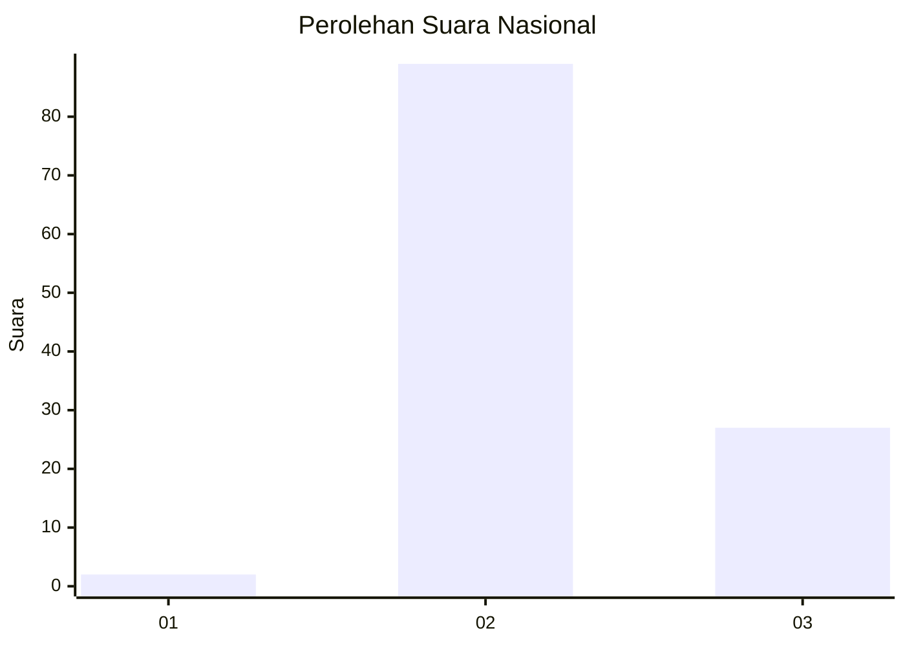
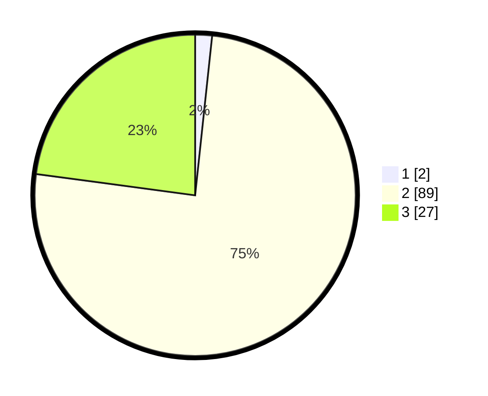

# Hasil

## Grafik

## Tabel

| No. | Nama Paslon    | Suara | Suara (raw) | Persentase |
|:--- |:-------------- | -----:| -----------:| ----------:|
| 1   | ANIES MUHAIMIN | 2     | [2][p-1]    | 1,69       |
| 2   | PRABOWO GIBRAN | 89    | [89][p-2]   | 75,42      |
| 3   | GANJAR MAHFUD  | 27    | [27][p-3]   | 22,88      |

[p-1]: https://github.com/gigit-pemilu/pemilu-2024/blob/main/pilpres/hitung-suara/sub/62-kalimantan-tengah/sub/09-lamandau/sub/03-bulik/sub/2036-bukit-indah/sub/012-tps/sub/paslon-1.txt
[p-2]: https://github.com/gigit-pemilu/pemilu-2024/blob/main/pilpres/hitung-suara/sub/62-kalimantan-tengah/sub/09-lamandau/sub/03-bulik/sub/2036-bukit-indah/sub/012-tps/sub/paslon-2.txt
[p-3]: https://github.com/gigit-pemilu/pemilu-2024/blob/main/pilpres/hitung-suara/sub/62-kalimantan-tengah/sub/09-lamandau/sub/03-bulik/sub/2036-bukit-indah/sub/012-tps/sub/paslon-3.txt

## Foto C Plano

https://sirekap-obj-formc.kpu.go.id/1182/pemilu/ppwp/62/09/03/20/36/6209032036012-20240222-100214--a5286560-739c-4e46-8fcb-f9b5351d9317.jpg

https://sirekap-obj-formc.kpu.go.id/1182/pemilu/ppwp/62/09/03/20/36/6209032036012-20240222-100343--c10e900b-939a-4e21-bc23-f8bb84c60fb8.jpg

https://sirekap-obj-formc.kpu.go.id/1182/pemilu/ppwp/62/09/03/20/36/6209032036012-20240222-100741--4a2cb6a0-1079-4b08-a981-c19db1635eec.jpg

## Metadata

| Key        | Value               |
| ---------- | ------------------- |
| Time Stamp | 2024-02-22 14:00:00 |

