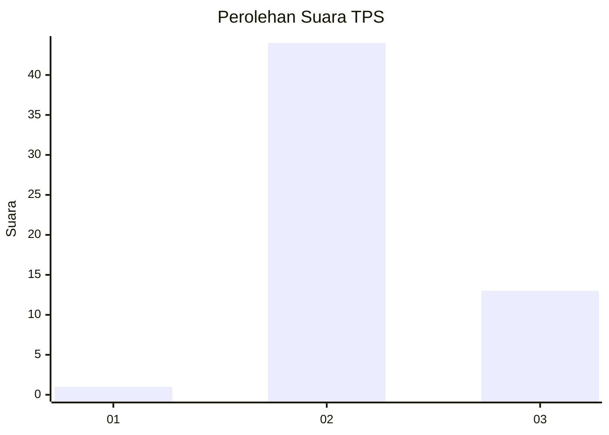
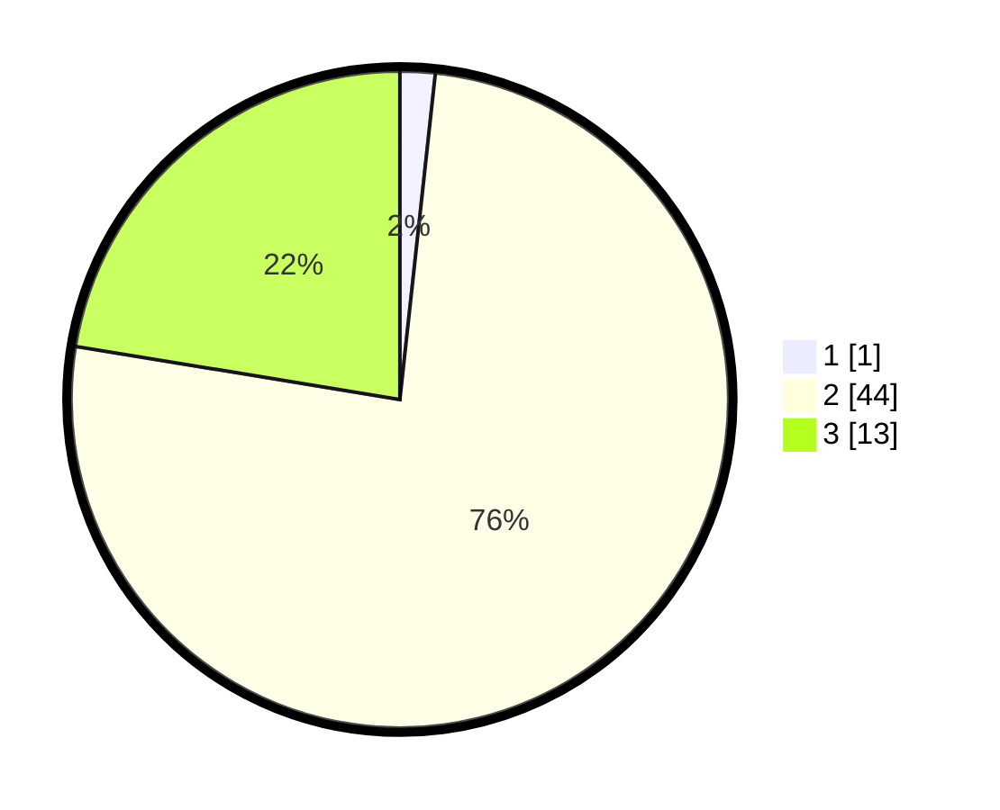

# Hasil

## Grafik

## Tabel

| No. | Nama Paslon    | Suara | Suara (raw) | Persentase |
|:--- |:-------------- | -----:| -----------:| ----------:|
| 1   | ANIES MUHAIMIN | 1     | [1][p-1]    | 1,72       |
| 2   | PRABOWO GIBRAN | 44    | [44][p-2]   | 75,86      |
| 3   | GANJAR MAHFUD  | 13    | [13][p-3]   | 22,41      |

[p-1]: https://github.com/gigit-pemilu/pemilu-2024-62-kalimantan-tengah/blob/main/pilpres/hitung-suara/sub/62-kalimantan-tengah/sub/09-lamandau/sub/03-bulik/sub/2036-bukit-indah/sub/013-tps/sub/paslon-1.txt
[p-2]: https://github.com/gigit-pemilu/pemilu-2024-62-kalimantan-tengah/blob/main/pilpres/hitung-suara/sub/62-kalimantan-tengah/sub/09-lamandau/sub/03-bulik/sub/2036-bukit-indah/sub/013-tps/sub/paslon-2.txt
[p-3]: https://github.com/gigit-pemilu/pemilu-2024-62-kalimantan-tengah/blob/main/pilpres/hitung-suara/sub/62-kalimantan-tengah/sub/09-lamandau/sub/03-bulik/sub/2036-bukit-indah/sub/013-tps/sub/paslon-3.txt

## Foto C Plano

https://sirekap-obj-formc.kpu.go.id/f6c4/pemilu/ppwp/62/09/03/20/36/6209032036013-20240222-101213--445a7c4c-f4e4-4af9-9edd-cdcf0e558e8a.jpg

https://sirekap-obj-formc.kpu.go.id/f6c4/pemilu/ppwp/62/09/03/20/36/6209032036013-20240222-101325--5f7a51bb-c9c6-4c49-ac11-b4f14f07f3b5.jpg

https://sirekap-obj-formc.kpu.go.id/f6c4/pemilu/ppwp/62/09/03/20/36/6209032036013-20240222-101416--c6e6a7fd-a2d2-4260-996f-8769e056d653.jpg

## Metadata

| Key        | Value               |
| ---------- | ------------------- |
| Time Stamp | 2024-02-22 14:00:00 |

