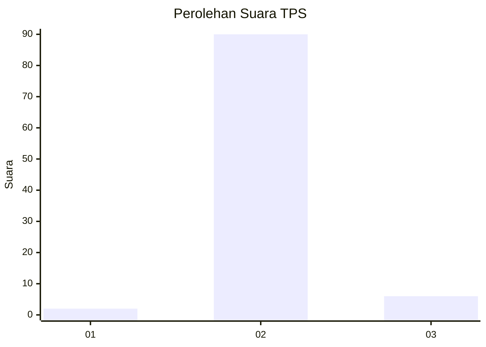
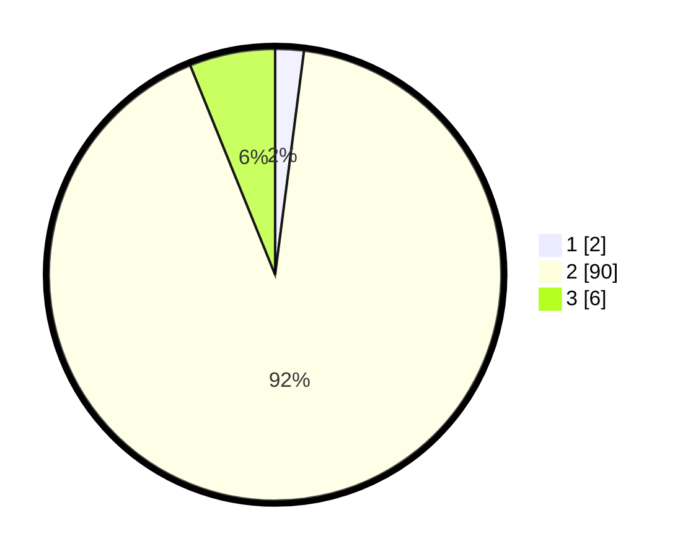

# Hasil

## Grafik

## Tabel

| No. | Nama Paslon    | Suara | Suara (raw) | Persentase |
|:--- |:-------------- | -----:| -----------:| ----------:|
| 1   | ANIES MUHAIMIN | 2     | [2][p-1]    | 2,04       |
| 2   | PRABOWO GIBRAN | 90    | [90][p-2]   | 91,84      |
| 3   | GANJAR MAHFUD  | 6     | [6][p-3]    | 6,12       |

[p-1]: https://github.com/gigit-pemilu/pemilu-2024-62-kalimantan-tengah/blob/main/pilpres/hitung-suara/sub/62-kalimantan-tengah/sub/09-lamandau/sub/04-bulik-timur/sub/2003-nuangan/sub/001-tps/sub/paslon-1.txt
[p-2]: https://github.com/gigit-pemilu/pemilu-2024-62-kalimantan-tengah/blob/main/pilpres/hitung-suara/sub/62-kalimantan-tengah/sub/09-lamandau/sub/04-bulik-timur/sub/2003-nuangan/sub/001-tps/sub/paslon-2.txt
[p-3]: https://github.com/gigit-pemilu/pemilu-2024-62-kalimantan-tengah/blob/main/pilpres/hitung-suara/sub/62-kalimantan-tengah/sub/09-lamandau/sub/04-bulik-timur/sub/2003-nuangan/sub/001-tps/sub/paslon-3.txt

## Foto C Plano

https://sirekap-obj-formc.kpu.go.id/7eb0/pemilu/ppwp/62/09/04/20/03/6209042003001-20240215-204644--9ffce20a-317d-41eb-b521-6388a42631ea.jpg

https://sirekap-obj-formc.kpu.go.id/7eb0/pemilu/ppwp/62/09/04/20/03/6209042003001-20240215-204646--f11c42ab-08e3-470c-a05a-b7f4d2d64672.jpg

https://sirekap-obj-formc.kpu.go.id/7eb0/pemilu/ppwp/62/09/04/20/03/6209042003001-20240215-204644--912e7f03-2da2-48c2-bd2c-6d05c9c1c51e.jpg

## Metadata

| Key        | Value               |
| ---------- | ------------------- |
| Time Stamp | 2024-02-15 21:01:18 |

## DATA PEMILIH TETAP

Jumlah pemilih dalam DPT: **102**.
 * L: **55**.
 * P: **47**.

## DATA PENGGUNA HAK PILIH

Jumlah pengguna hak pilih dalam DPT: **95**.
 * L: **50**.
 * P: **45**.

Jumlah pengguna hak pilih dalam DPTb: **1**.
 * L: **1**.
 * P: **0**.

Jumlah pengguna hak pilih dalam DPK: **5**.
 * L: **3**.
 * P: **2**.

Jumlah pengguna hak pilih: **101**.
 * L: **54**.
 * P: **47**.

## JUMLAH SUARA SAH DAN TIDAK SAH

JUMLAH SELURUH SUARA SAH: **98**.

JUMLAH SUARA TIDAK SAH: **3**.

JUMLAH SELURUH SUARA SAH DAN SUARA TIDAK SAH: **101**.

