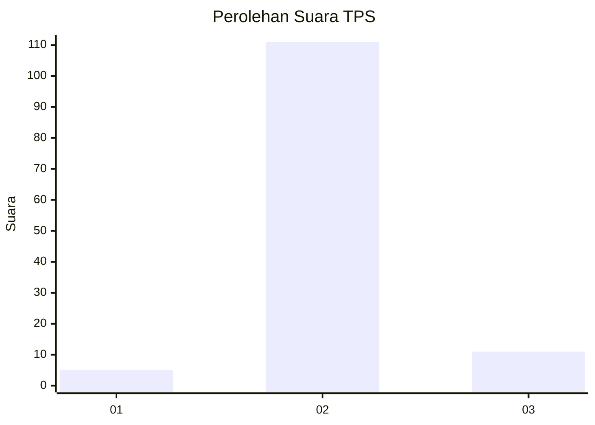
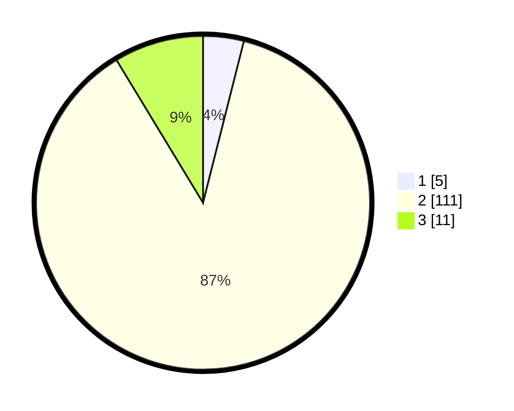

# Hasil

## Grafik

## Tabel

| No. | Nama Paslon    | Suara | Suara (raw) | Persentase |
|:--- |:-------------- | -----:| -----------:| ----------:|
| 1   | ANIES MUHAIMIN | 5     | [5][p-1]    | 3,94       |
| 2   | PRABOWO GIBRAN | 111   | [111][p-2]  | 87,40      |
| 3   | GANJAR MAHFUD  | 11    | [11][p-3]   | 8,66       |

[p-1]: https://github.com/gigit-pemilu/pemilu-2024-62-kalimantan-tengah/blob/main/pilpres/hitung-suara/sub/62-kalimantan-tengah/sub/10-gunung-mas/sub/01-sepang/sub/2002-sepang-kota/sub/006-tps/sub/paslon-1.txt
[p-2]: https://github.com/gigit-pemilu/pemilu-2024-62-kalimantan-tengah/blob/main/pilpres/hitung-suara/sub/62-kalimantan-tengah/sub/10-gunung-mas/sub/01-sepang/sub/2002-sepang-kota/sub/006-tps/sub/paslon-2.txt
[p-3]: https://github.com/gigit-pemilu/pemilu-2024-62-kalimantan-tengah/blob/main/pilpres/hitung-suara/sub/62-kalimantan-tengah/sub/10-gunung-mas/sub/01-sepang/sub/2002-sepang-kota/sub/006-tps/sub/paslon-3.txt

## Foto C Plano

https://sirekap-obj-formc.kpu.go.id/93d2/pemilu/ppwp/62/10/01/20/02/6210012002006-20240214-155430--f10bc45d-cc38-4032-964e-c47406ae1165.jpg

https://sirekap-obj-formc.kpu.go.id/93d2/pemilu/ppwp/62/10/01/20/02/6210012002006-20240214-155809--19add161-9b61-4550-9172-200e5f20d5ef.jpg

## Metadata

| Key        | Value               |
| ---------- | ------------------- |
| Time Stamp | 2024-02-24 22:31:28 |

