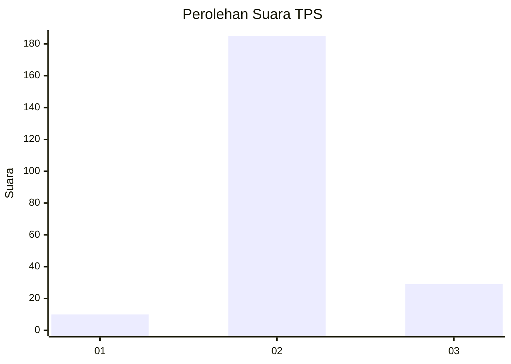
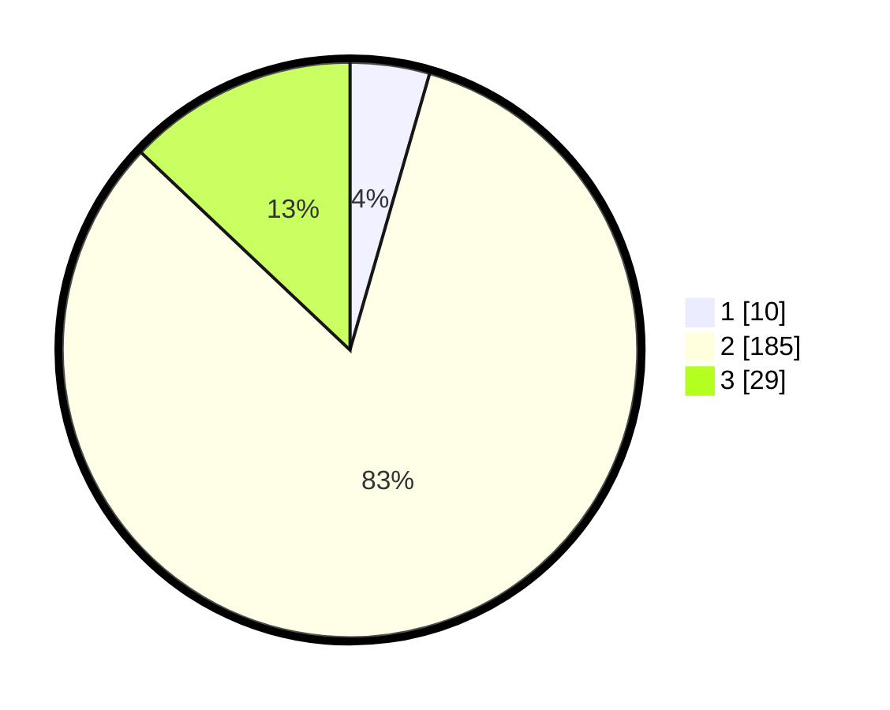

# Hasil

## Grafik

## Tabel

| No. | Nama Paslon    | Suara | Suara (raw) | Persentase |
|:--- |:-------------- | -----:| -----------:| ----------:|
| 1   | ANIES MUHAIMIN | 10    | [10][p-1]   | 4,46       |
| 2   | PRABOWO GIBRAN | 185   | [185][p-2]  | 82,59      |
| 3   | GANJAR MAHFUD  | 29    | [29][p-3]   | 12,95      |

[p-1]: https://github.com/gigit-pemilu/pemilu-2024-62-kalimantan-tengah/blob/main/pilpres/hitung-suara/sub/62-kalimantan-tengah/sub/10-gunung-mas/sub/01-sepang/sub/2004-tanjung-karitak/sub/001-tps/sub/paslon-1.txt
[p-2]: https://github.com/gigit-pemilu/pemilu-2024-62-kalimantan-tengah/blob/main/pilpres/hitung-suara/sub/62-kalimantan-tengah/sub/10-gunung-mas/sub/01-sepang/sub/2004-tanjung-karitak/sub/001-tps/sub/paslon-2.txt
[p-3]: https://github.com/gigit-pemilu/pemilu-2024-62-kalimantan-tengah/blob/main/pilpres/hitung-suara/sub/62-kalimantan-tengah/sub/10-gunung-mas/sub/01-sepang/sub/2004-tanjung-karitak/sub/001-tps/sub/paslon-3.txt

## Foto C Plano

https://sirekap-obj-formc.kpu.go.id/89d6/pemilu/ppwp/62/10/01/20/04/6210012004001-20240214-155922--7811f344-c7f3-42b8-9059-240bda00b6fc.jpg

https://sirekap-obj-formc.kpu.go.id/89d6/pemilu/ppwp/62/10/01/20/04/6210012004001-20240214-160154--2ed7f20c-9408-44df-949b-6b84b6bd752e.jpg

https://sirekap-obj-formc.kpu.go.id/89d6/pemilu/ppwp/62/10/01/20/04/6210012004001-20240214-160128--354327d0-7671-4f01-8daf-7d0f906d943f.jpg

## Metadata

| Key        | Value               |
| ---------- | ------------------- |
| Time Stamp | 2024-02-15 01:47:43 |

