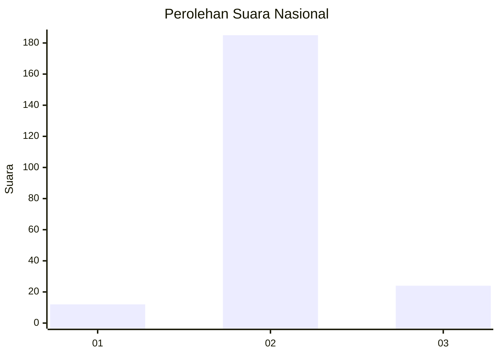
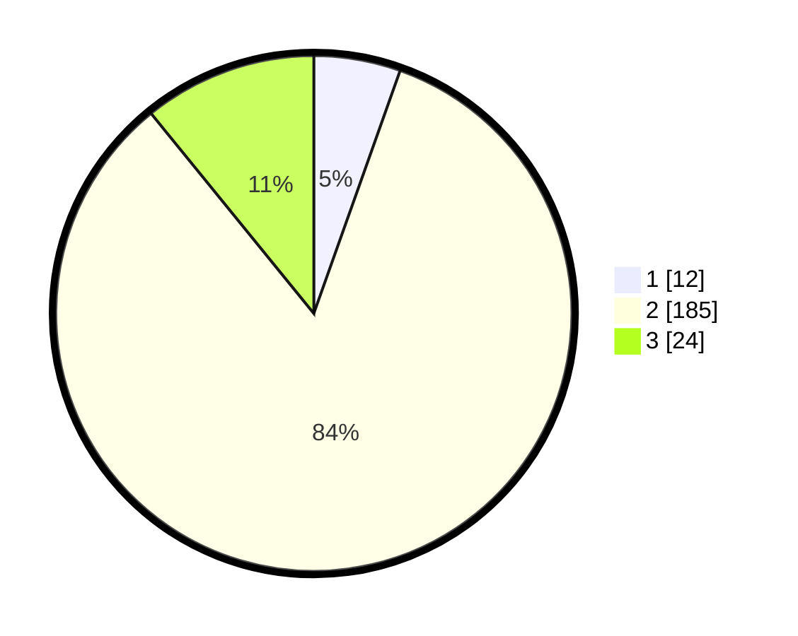

# Hasil

## Grafik

## Tabel

| No. | Nama Paslon    | Suara | Suara (raw) | Persentase |
|:--- |:-------------- | -----:| -----------:| ----------:|
| 1   | ANIES MUHAIMIN | 12    | [12][p-1]   | 5,43       |
| 2   | PRABOWO GIBRAN | 185   | [185][p-2]  | 83,71      |
| 3   | GANJAR MAHFUD  | 24    | [24][p-3]   | 10,86      |

[p-1]: https://github.com/gigit-pemilu/pemilu-2024/blob/main/pilpres/hitung-suara/sub/62-kalimantan-tengah/sub/10-gunung-mas/sub/02-kurun/sub/1001-tampang-tumbang-anjir/sub/001-tps/sub/paslon-1.txt
[p-2]: https://github.com/gigit-pemilu/pemilu-2024/blob/main/pilpres/hitung-suara/sub/62-kalimantan-tengah/sub/10-gunung-mas/sub/02-kurun/sub/1001-tampang-tumbang-anjir/sub/001-tps/sub/paslon-2.txt
[p-3]: https://github.com/gigit-pemilu/pemilu-2024/blob/main/pilpres/hitung-suara/sub/62-kalimantan-tengah/sub/10-gunung-mas/sub/02-kurun/sub/1001-tampang-tumbang-anjir/sub/001-tps/sub/paslon-3.txt

## Foto C Plano

https://sirekap-obj-formc.kpu.go.id/e168/pemilu/ppwp/62/10/02/10/01/6210021001001-20240226-193811--a7a76fc7-81a7-46c2-ba30-be4e3ea25fb3.jpg

https://sirekap-obj-formc.kpu.go.id/e168/pemilu/ppwp/62/10/02/10/01/6210021001001-20240226-193638--d41a7e47-f136-4956-b133-3d81aec797df.jpg

https://sirekap-obj-formc.kpu.go.id/e168/pemilu/ppwp/62/10/02/10/01/6210021001001-20240226-193507--eb2fac5a-a3b5-42bf-ae37-92f8251e078a.jpg

## Metadata

| Key        | Value               |
| ---------- | ------------------- |
| Time Stamp | 2024-02-28 19:00:00 |

