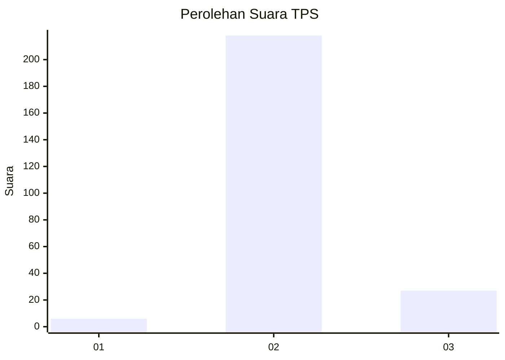
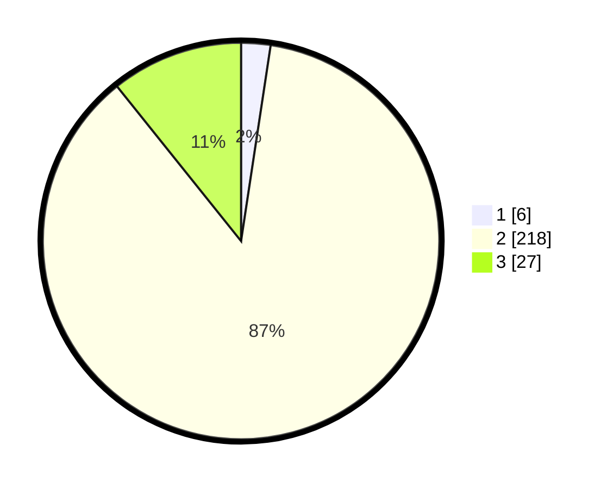

# Hasil

## Grafik

## Tabel

| No. | Nama Paslon    | Suara | Suara (raw) | Persentase |
|:--- |:-------------- | -----:| -----------:| ----------:|
| 1   | ANIES MUHAIMIN | 6     | [6][p-1]    | 2,39       |
| 2   | PRABOWO GIBRAN | 218   | [218][p-2]  | 86,85      |
| 3   | GANJAR MAHFUD  | 27    | [27][p-3]   | 10,76      |

[p-1]: https://github.com/gigit-pemilu/pemilu-2024-62-kalimantan-tengah/blob/main/pilpres/hitung-suara/sub/62-kalimantan-tengah/sub/10-gunung-mas/sub/02-kurun/sub/2010-tumbang-hakau/sub/001-tps/sub/paslon-1.txt
[p-2]: https://github.com/gigit-pemilu/pemilu-2024-62-kalimantan-tengah/blob/main/pilpres/hitung-suara/sub/62-kalimantan-tengah/sub/10-gunung-mas/sub/02-kurun/sub/2010-tumbang-hakau/sub/001-tps/sub/paslon-2.txt
[p-3]: https://github.com/gigit-pemilu/pemilu-2024-62-kalimantan-tengah/blob/main/pilpres/hitung-suara/sub/62-kalimantan-tengah/sub/10-gunung-mas/sub/02-kurun/sub/2010-tumbang-hakau/sub/001-tps/sub/paslon-3.txt

## Foto C Plano

https://sirekap-obj-formc.kpu.go.id/422a/pemilu/ppwp/62/10/02/20/10/6210022010001-20240318-225504--422f45f5-1412-47f2-9b5b-87e5f693ca1c.jpg

https://sirekap-obj-formc.kpu.go.id/422a/pemilu/ppwp/62/10/02/20/10/6210022010001-20240214-184545--d9b8053a-6a4f-41d5-b16d-51b6638327f2.jpg

https://sirekap-obj-formc.kpu.go.id/422a/pemilu/ppwp/62/10/02/20/10/6210022010001-20240214-184710--759409a3-c900-4f0a-842a-863018be49ac.jpg

## Metadata

| Key        | Value               |
| ---------- | ------------------- |
| Time Stamp | 2024-03-18 23:00:00 |

