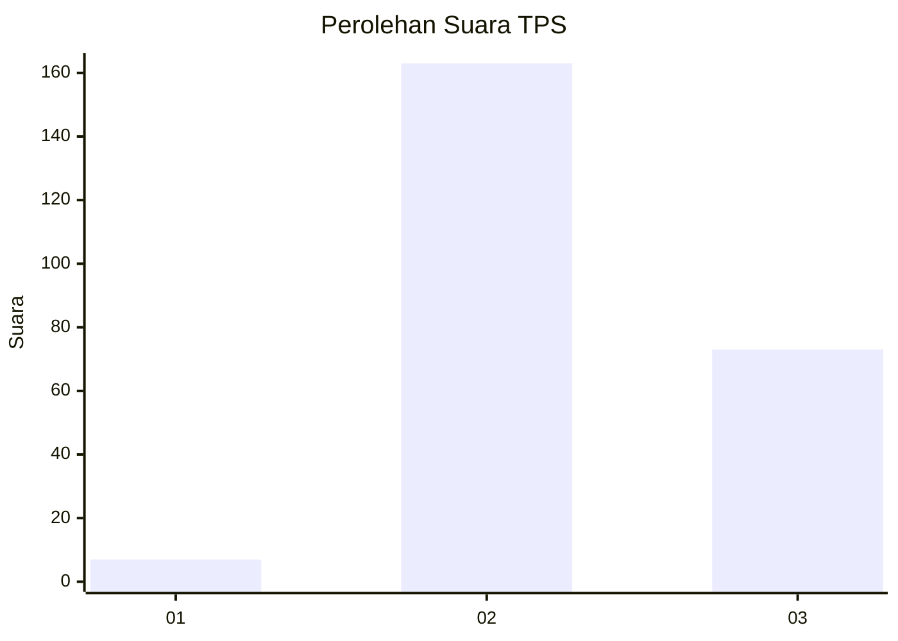

# Hasil

## Grafik

## Tabel

| No. | Nama Paslon    | Suara | Suara (raw) | Persentase |
|:--- |:-------------- | -----:| -----------:| ----------:|
| 1   | ANIES MUHAIMIN | 7     | [7][p-1]    | 2,88       |
| 2   | PRABOWO GIBRAN | 163   | [163][p-2]  | 67,08      |
| 3   | GANJAR MAHFUD  | 73    | [73][p-3]   | 30,04      |

[p-1]: https://github.com/gigit-pemilu/pemilu-2024-62-kalimantan-tengah/blob/main/pilpres/hitung-suara/sub/62-kalimantan-tengah/sub/10-gunung-mas/sub/04-kahayan-hulu-utara/sub/1001-tumbang-miri/sub/001-tps/sub/paslon-1.txt
[p-2]: https://github.com/gigit-pemilu/pemilu-2024-62-kalimantan-tengah/blob/main/pilpres/hitung-suara/sub/62-kalimantan-tengah/sub/10-gunung-mas/sub/04-kahayan-hulu-utara/sub/1001-tumbang-miri/sub/001-tps/sub/paslon-2.txt
[p-3]: https://github.com/gigit-pemilu/pemilu-2024-62-kalimantan-tengah/blob/main/pilpres/hitung-suara/sub/62-kalimantan-tengah/sub/10-gunung-mas/sub/04-kahayan-hulu-utara/sub/1001-tumbang-miri/sub/001-tps/sub/paslon-3.txt

## Foto C Plano

https://sirekap-obj-formc.kpu.go.id/4cd2/pemilu/ppwp/62/10/04/10/01/6210041001001-20240218-121406--33519e11-faeb-490c-bede-63f319885cd7.jpg

https://sirekap-obj-formc.kpu.go.id/4cd2/pemilu/ppwp/62/10/04/10/01/6210041001001-20240217-155606--1efbe8d6-893b-44a7-ace9-add558af0bf0.jpg

https://sirekap-obj-formc.kpu.go.id/4cd2/pemilu/ppwp/62/10/04/10/01/6210041001001-20240217-155746--a2feac6f-58d9-4f99-9208-ab272675d733.jpg

## Metadata

| Key        | Value               |
| ---------- | ------------------- |
| Time Stamp | 2024-02-19 06:16:00 |

