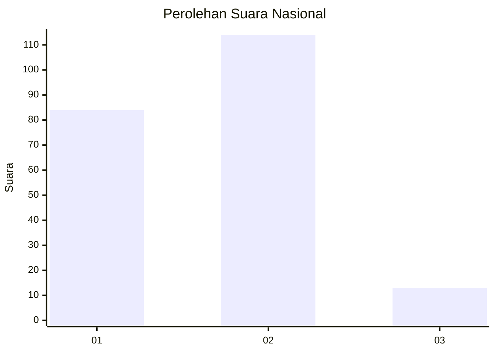

# Hasil

## Grafik

## Tabel

| No. | Nama Paslon    | Suara | Suara (raw) | Persentase |
|:--- |:-------------- | -----:| -----------:| ----------:|
| 1   | ANIES MUHAIMIN | 84    | [84][p-1]   | 39,81      |
| 2   | PRABOWO GIBRAN | 114   | [114][p-2]  | 54,03      |
| 3   | GANJAR MAHFUD  | 13    | [13][p-3]   | 6,16       |

[p-1]: https://github.com/gigit-pemilu/pemilu-2024/blob/main/pilpres/hitung-suara/sub/62-kalimantan-tengah/sub/10-gunung-mas/sub/04-kahayan-hulu-utara/sub/2008-tumbang-pasangon/sub/003-tps/sub/paslon-1.txt
[p-2]: https://github.com/gigit-pemilu/pemilu-2024/blob/main/pilpres/hitung-suara/sub/62-kalimantan-tengah/sub/10-gunung-mas/sub/04-kahayan-hulu-utara/sub/2008-tumbang-pasangon/sub/003-tps/sub/paslon-2.txt
[p-3]: https://github.com/gigit-pemilu/pemilu-2024/blob/main/pilpres/hitung-suara/sub/62-kalimantan-tengah/sub/10-gunung-mas/sub/04-kahayan-hulu-utara/sub/2008-tumbang-pasangon/sub/003-tps/sub/paslon-3.txt

## Foto C Plano

https://sirekap-obj-formc.kpu.go.id/4a65/pemilu/ppwp/62/10/04/20/08/6210042008003-20240217-151901--17cd7641-fc08-4127-b368-e90fd4a9007e.jpg

https://sirekap-obj-formc.kpu.go.id/4a65/pemilu/ppwp/62/10/04/20/08/6210042008003-20240217-152034--e9e56dd0-dcc1-481a-afb4-6e883217ff43.jpg

https://sirekap-obj-formc.kpu.go.id/4a65/pemilu/ppwp/62/10/04/20/08/6210042008003-20240217-152133--1f9f45c7-51c0-4925-a91f-ea947d473e6d.jpg

## Metadata

| Key        | Value               |
| ---------- | ------------------- |
| Time Stamp | 2024-02-17 16:00:02 |

## DATA PEMILIH TETAP

Jumlah pemilih dalam DPT: **123**.
 * L: **95**.
 * P: **56**.

## DATA PENGGUNA HAK PILIH

Jumlah pengguna hak pilih dalam DPT: **141**.
 * L: **875**.
 * P: **865**.

Jumlah pengguna hak pilih dalam DPTb: **777**.
 * L: **887**.
 * P: **773**.

Jumlah pengguna hak pilih dalam DPK: **222**.
 * L: **882**.
 * P: **222**.

Jumlah pengguna hak pilih: **243**.
 * L: **880**.
 * P: **865**.

## JUMLAH SUARA SAH DAN TIDAK SAH

JUMLAH SELURUH SUARA SAH: **129**.

JUMLAH SUARA TIDAK SAH: **89**.

JUMLAH SELURUH SUARA SAH DAN SUARA TIDAK SAH: **948**.

