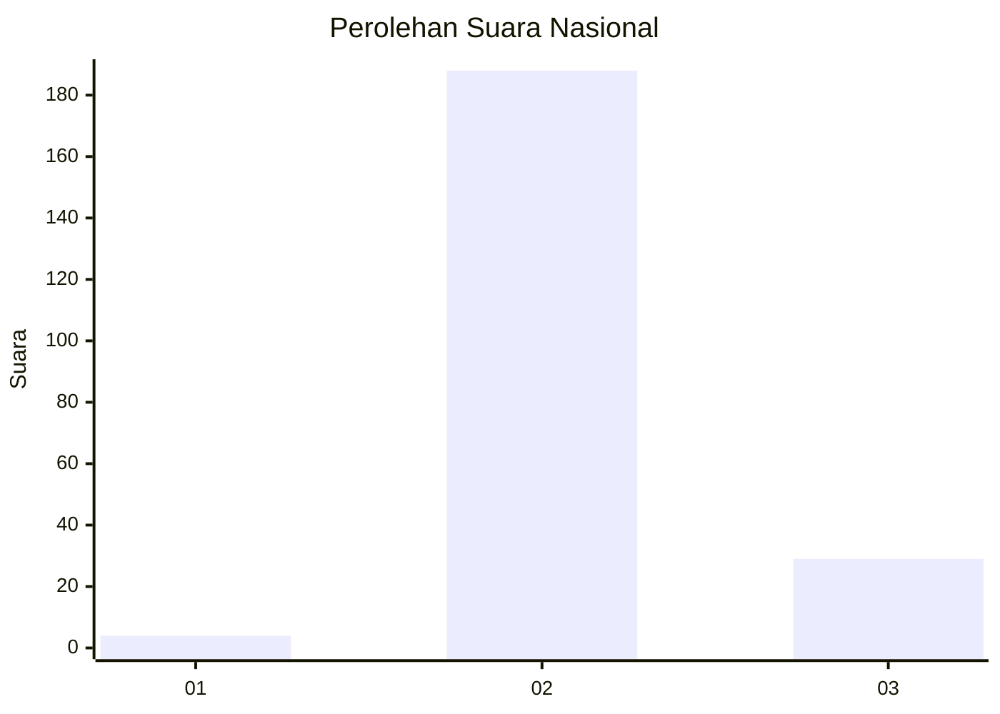
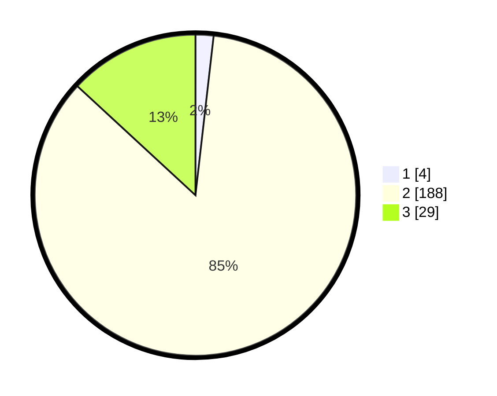

# Hasil

## Grafik

## Tabel

| No. | Nama Paslon    | Suara | Suara (raw) | Persentase |
|:--- |:-------------- | -----:| -----------:| ----------:|
| 1   | ANIES MUHAIMIN | 4     | [4][p-1]    | 1,81       |
| 2   | PRABOWO GIBRAN | 188   | [188][p-2]  | 85,07      |
| 3   | GANJAR MAHFUD  | 29    | [29][p-3]   | 13,12      |

[p-1]: https://github.com/gigit-pemilu/pemilu-2024/blob/main/pilpres/hitung-suara/sub/62-kalimantan-tengah/sub/10-gunung-mas/sub/06-manuhing/sub/1001-tumbang-talaken/sub/002-tps/sub/paslon-1.txt
[p-2]: https://github.com/gigit-pemilu/pemilu-2024/blob/main/pilpres/hitung-suara/sub/62-kalimantan-tengah/sub/10-gunung-mas/sub/06-manuhing/sub/1001-tumbang-talaken/sub/002-tps/sub/paslon-2.txt
[p-3]: https://github.com/gigit-pemilu/pemilu-2024/blob/main/pilpres/hitung-suara/sub/62-kalimantan-tengah/sub/10-gunung-mas/sub/06-manuhing/sub/1001-tumbang-talaken/sub/002-tps/sub/paslon-3.txt

## Foto C Plano

https://sirekap-obj-formc.kpu.go.id/2a89/pemilu/ppwp/62/10/06/10/01/6210061001002-20240215-135441--fb6417b0-272f-4b53-88e7-d4e0f2f27efd.jpg

https://sirekap-obj-formc.kpu.go.id/2a89/pemilu/ppwp/62/10/06/10/01/6210061001002-20240215-015419--57c26f9b-6154-4d8c-b9ce-69c47c2b6a4d.jpg

https://sirekap-obj-formc.kpu.go.id/2a89/pemilu/ppwp/62/10/06/10/01/6210061001002-20240215-015544--32a87e2f-405c-4fbf-be9a-4e6d7db58ccc.jpg

## Metadata

| Key        | Value               |
| ---------- | ------------------- |
| Time Stamp | 2024-02-15 22:30:27 |

