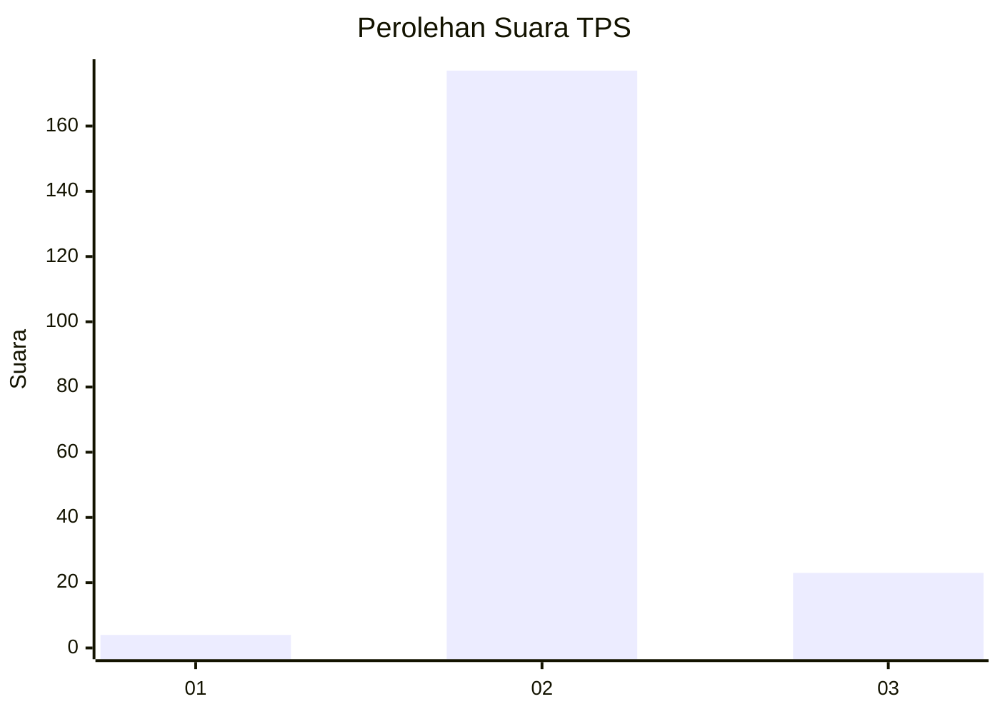
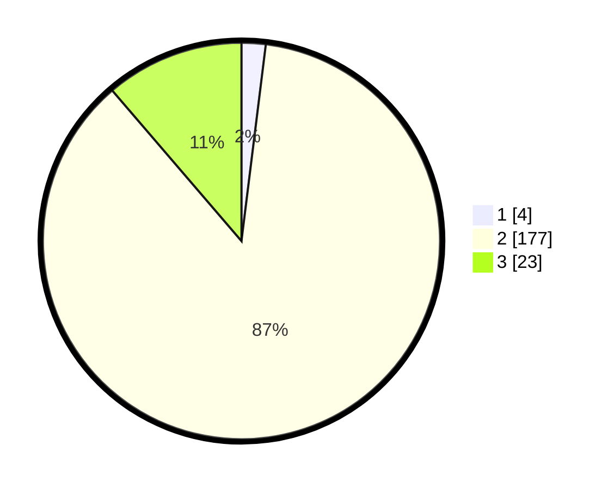

# Hasil

## Grafik

## Tabel

| No. | Nama Paslon    | Suara | Suara (raw) | Persentase |
|:--- |:-------------- | -----:| -----------:| ----------:|
| 1   | ANIES MUHAIMIN | 4     | [4][p-1]    | 1,96       |
| 2   | PRABOWO GIBRAN | 177   | [177][p-2]  | 86,76      |
| 3   | GANJAR MAHFUD  | 23    | [23][p-3]   | 11,27      |

[p-1]: https://github.com/gigit-pemilu/pemilu-2024-62-kalimantan-tengah/blob/main/pilpres/hitung-suara/sub/62-kalimantan-tengah/sub/10-gunung-mas/sub/07-mihing-raya/sub/1005-kampuri/sub/003-tps/sub/paslon-1.txt
[p-2]: https://github.com/gigit-pemilu/pemilu-2024-62-kalimantan-tengah/blob/main/pilpres/hitung-suara/sub/62-kalimantan-tengah/sub/10-gunung-mas/sub/07-mihing-raya/sub/1005-kampuri/sub/003-tps/sub/paslon-2.txt
[p-3]: https://github.com/gigit-pemilu/pemilu-2024-62-kalimantan-tengah/blob/main/pilpres/hitung-suara/sub/62-kalimantan-tengah/sub/10-gunung-mas/sub/07-mihing-raya/sub/1005-kampuri/sub/003-tps/sub/paslon-3.txt

## Foto C Plano

https://sirekap-obj-formc.kpu.go.id/b880/pemilu/ppwp/62/10/07/10/05/6210071005003-20240215-223904--bb0b0a03-386b-4d2c-ab74-f9fa16ef6b13.jpg

https://sirekap-obj-formc.kpu.go.id/b880/pemilu/ppwp/62/10/07/10/05/6210071005003-20240215-062503--3479d59a-e581-4e2f-a108-f59f4083a8e6.jpg

https://sirekap-obj-formc.kpu.go.id/b880/pemilu/ppwp/62/10/07/10/05/6210071005003-20240215-062531--cd1d8dd9-e279-4c18-9e11-9ab98d2300d5.jpg

## Metadata

| Key        | Value               |
| ---------- | ------------------- |
| Time Stamp | 2024-02-21 21:00:04 |

