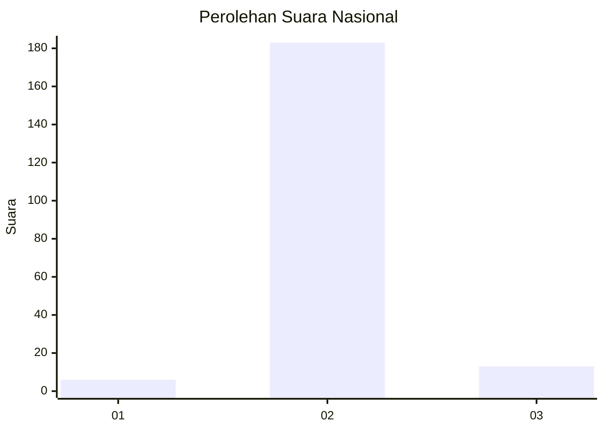
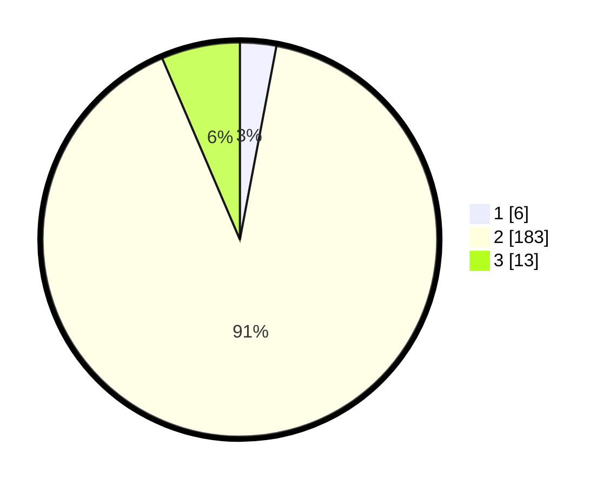

# Hasil

## Grafik

## Tabel

| No. | Nama Paslon    | Suara | Suara (raw) | Persentase |
|:--- |:-------------- | -----:| -----------:| ----------:|
| 1   | ANIES MUHAIMIN | 6     | [6][p-1]    | 2,97       |
| 2   | PRABOWO GIBRAN | 183   | [183][p-2]  | 90,59      |
| 3   | GANJAR MAHFUD  | 13    | [13][p-3]   | 6,44       |

[p-1]: https://github.com/gigit-pemilu/pemilu-2024/blob/main/pilpres/hitung-suara/sub/62-kalimantan-tengah/sub/10-gunung-mas/sub/09-miri-manasa/sub/1003-tumbang-napoi/sub/002-tps/sub/paslon-1.txt
[p-2]: https://github.com/gigit-pemilu/pemilu-2024/blob/main/pilpres/hitung-suara/sub/62-kalimantan-tengah/sub/10-gunung-mas/sub/09-miri-manasa/sub/1003-tumbang-napoi/sub/002-tps/sub/paslon-2.txt
[p-3]: https://github.com/gigit-pemilu/pemilu-2024/blob/main/pilpres/hitung-suara/sub/62-kalimantan-tengah/sub/10-gunung-mas/sub/09-miri-manasa/sub/1003-tumbang-napoi/sub/002-tps/sub/paslon-3.txt

## Foto C Plano

https://sirekap-obj-formc.kpu.go.id/fb4b/pemilu/ppwp/62/10/09/10/03/6210091003002-20240224-175655--61de0b2d-1289-471b-8c93-88a23df84e12.jpg

https://sirekap-obj-formc.kpu.go.id/fb4b/pemilu/ppwp/62/10/09/10/03/6210091003002-20240224-175732--7f465a40-0cd7-4d34-a905-68746a40b736.jpg

https://sirekap-obj-formc.kpu.go.id/fb4b/pemilu/ppwp/62/10/09/10/03/6210091003002-20240224-175807--1dedf470-c14a-4b16-b47b-0967770a6d17.jpg

## Metadata

| Key        | Value               |
| ---------- | ------------------- |
| Time Stamp | 2024-02-25 14:00:00 |

