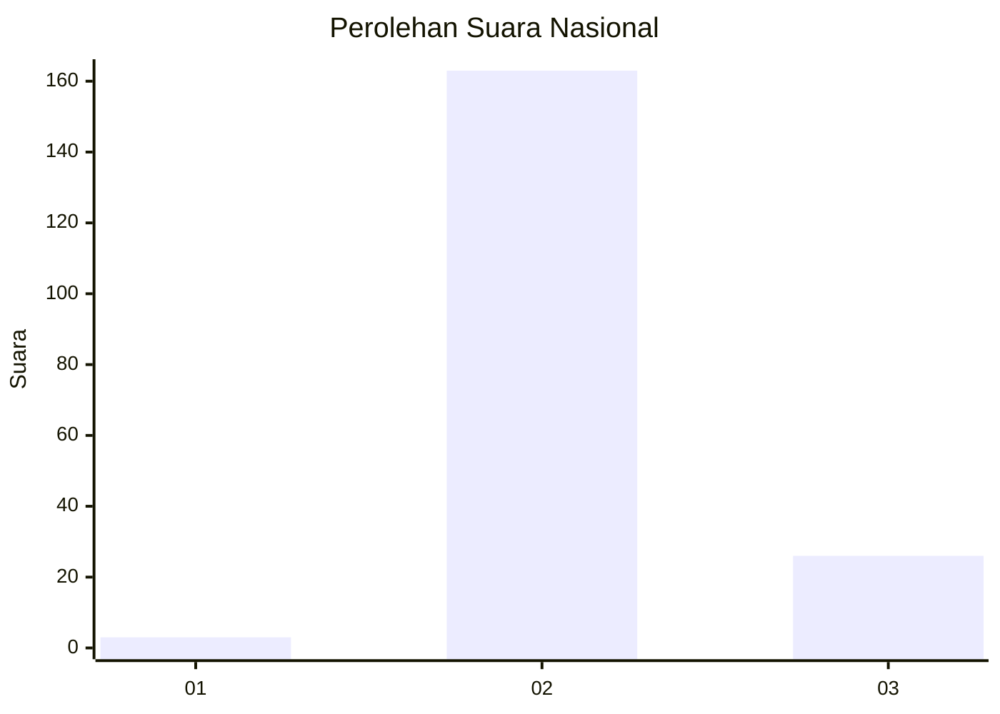
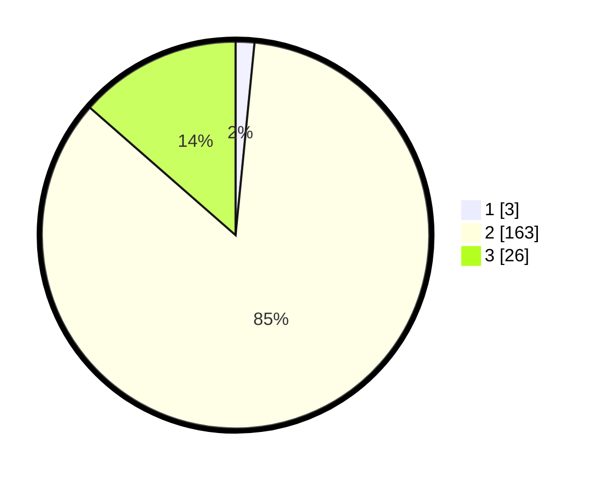

# Hasil

## Grafik

## Tabel

| No. | Nama Paslon    | Suara | Suara (raw) | Persentase |
|:--- |:-------------- | -----:| -----------:| ----------:|
| 1   | ANIES MUHAIMIN | 3     | [3][p-1]    | 1,56       |
| 2   | PRABOWO GIBRAN | 163   | [163][p-2]  | 84,90      |
| 3   | GANJAR MAHFUD  | 26    | [26][p-3]   | 13,54      |

[p-1]: https://github.com/gigit-pemilu/pemilu-2024/blob/main/pilpres/hitung-suara/sub/62-kalimantan-tengah/sub/10-gunung-mas/sub/09-miri-manasa/sub/1003-tumbang-napoi/sub/003-tps/sub/paslon-1.txt
[p-2]: https://github.com/gigit-pemilu/pemilu-2024/blob/main/pilpres/hitung-suara/sub/62-kalimantan-tengah/sub/10-gunung-mas/sub/09-miri-manasa/sub/1003-tumbang-napoi/sub/003-tps/sub/paslon-2.txt
[p-3]: https://github.com/gigit-pemilu/pemilu-2024/blob/main/pilpres/hitung-suara/sub/62-kalimantan-tengah/sub/10-gunung-mas/sub/09-miri-manasa/sub/1003-tumbang-napoi/sub/003-tps/sub/paslon-3.txt

## Foto C Plano

https://sirekap-obj-formc.kpu.go.id/ad8f/pemilu/ppwp/62/10/09/10/03/6210091003003-20240224-184759--ec425de9-31d8-4256-8fc0-472886d5fdd3.jpg

https://sirekap-obj-formc.kpu.go.id/ad8f/pemilu/ppwp/62/10/09/10/03/6210091003003-20240224-184830--3a163d15-d507-49b0-a0a0-6b822bc729c6.jpg

https://sirekap-obj-formc.kpu.go.id/ad8f/pemilu/ppwp/62/10/09/10/03/6210091003003-20240224-184855--80381eaa-21a6-4c51-af11-3c916190581a.jpg

## Metadata

| Key        | Value               |
| ---------- | ------------------- |
| Time Stamp | 2024-02-25 14:00:00 |

