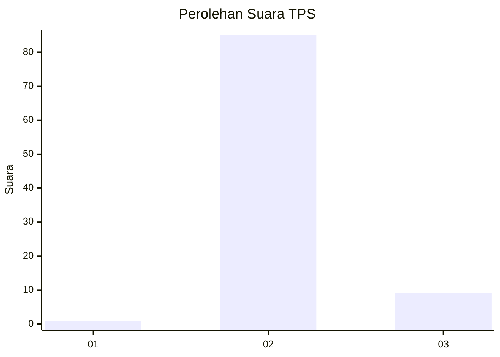
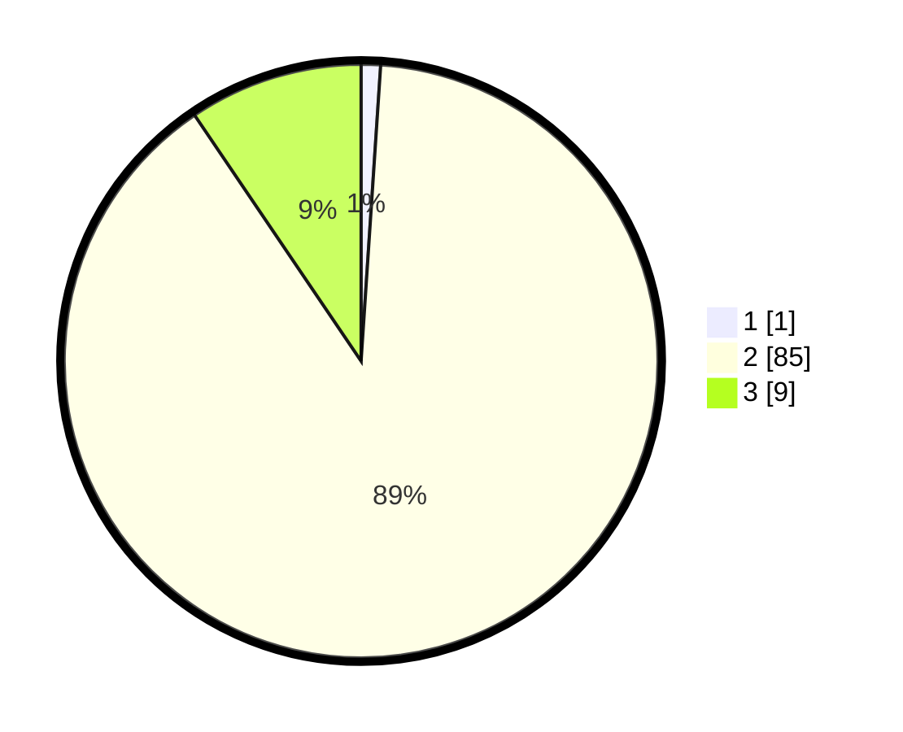

# Hasil

## Grafik

## Tabel

| No. | Nama Paslon    | Suara | Suara (raw) | Persentase |
|:--- |:-------------- | -----:| -----------:| ----------:|
| 1   | ANIES MUHAIMIN | 1     | [1][p-1]    | 1,05       |
| 2   | PRABOWO GIBRAN | 85    | [85][p-2]   | 89,47      |
| 3   | GANJAR MAHFUD  | 9     | [9][p-3]    | 9,47       |

[p-1]: https://github.com/gigit-pemilu/pemilu-2024-62-kalimantan-tengah/blob/main/pilpres/hitung-suara/sub/62-kalimantan-tengah/sub/10-gunung-mas/sub/09-miri-manasa/sub/2001-tumbang-siruk/sub/001-tps/sub/paslon-1.txt
[p-2]: https://github.com/gigit-pemilu/pemilu-2024-62-kalimantan-tengah/blob/main/pilpres/hitung-suara/sub/62-kalimantan-tengah/sub/10-gunung-mas/sub/09-miri-manasa/sub/2001-tumbang-siruk/sub/001-tps/sub/paslon-2.txt
[p-3]: https://github.com/gigit-pemilu/pemilu-2024-62-kalimantan-tengah/blob/main/pilpres/hitung-suara/sub/62-kalimantan-tengah/sub/10-gunung-mas/sub/09-miri-manasa/sub/2001-tumbang-siruk/sub/001-tps/sub/paslon-3.txt

## Foto C Plano

https://sirekap-obj-formc.kpu.go.id/0566/pemilu/ppwp/62/10/09/20/01/6210092001001-20240226-161642--56f320b3-36d2-4d5b-85eb-a83adb573eb1.jpg

https://sirekap-obj-formc.kpu.go.id/0566/pemilu/ppwp/62/10/09/20/01/6210092001001-20240226-161838--3235068d-9283-4181-849d-52e2ac50f5e6.jpg

https://sirekap-obj-formc.kpu.go.id/0566/pemilu/ppwp/62/10/09/20/01/6210092001001-20240226-162201--e61f6ae2-0149-4094-8290-96fcba9cea35.jpg

## Metadata

| Key        | Value               |
| ---------- | ------------------- |
| Time Stamp | 2024-02-29 14:00:00 |

