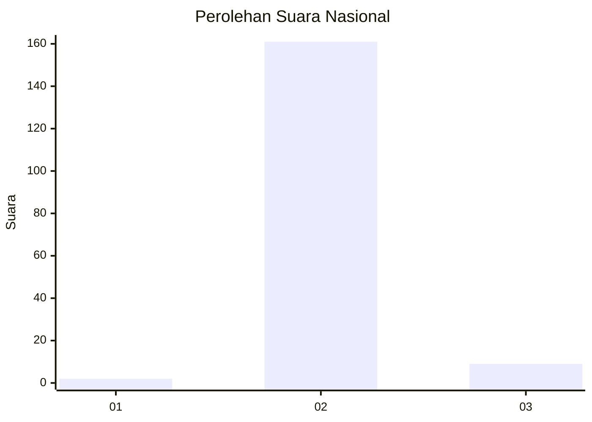
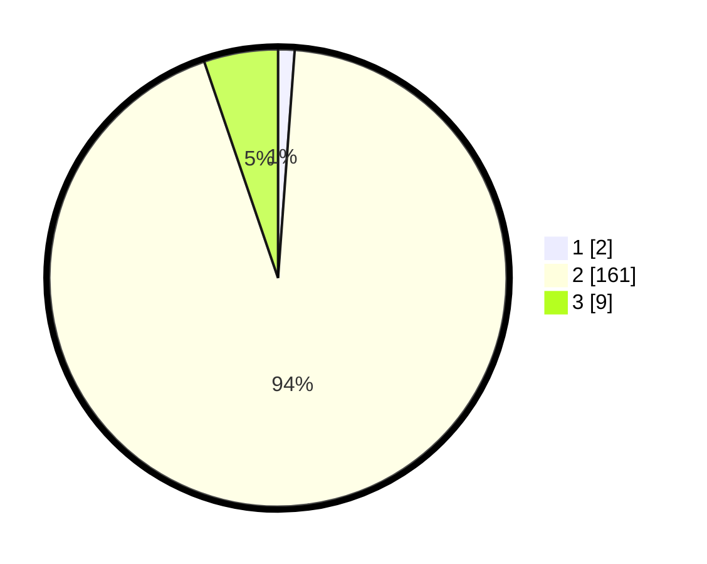

# Hasil

## Grafik

## Tabel

| No. | Nama Paslon    | Suara | Suara (raw) | Persentase |
|:--- |:-------------- | -----:| -----------:| ----------:|
| 1   | ANIES MUHAIMIN | 2     | [2][p-1]    | 1,16       |
| 2   | PRABOWO GIBRAN | 161   | [161][p-2]  | 93,60      |
| 3   | GANJAR MAHFUD  | 9     | [9][p-3]    | 5,23       |

[p-1]: https://github.com/gigit-pemilu/pemilu-2024/blob/main/pilpres/hitung-suara/sub/62-kalimantan-tengah/sub/10-gunung-mas/sub/09-miri-manasa/sub/2002-mangkuhung/sub/001-tps/sub/paslon-1.txt
[p-2]: https://github.com/gigit-pemilu/pemilu-2024/blob/main/pilpres/hitung-suara/sub/62-kalimantan-tengah/sub/10-gunung-mas/sub/09-miri-manasa/sub/2002-mangkuhung/sub/001-tps/sub/paslon-2.txt
[p-3]: https://github.com/gigit-pemilu/pemilu-2024/blob/main/pilpres/hitung-suara/sub/62-kalimantan-tengah/sub/10-gunung-mas/sub/09-miri-manasa/sub/2002-mangkuhung/sub/001-tps/sub/paslon-3.txt

## Foto C Plano

https://sirekap-obj-formc.kpu.go.id/98c2/pemilu/ppwp/62/10/09/20/02/6210092002001-20240226-195515--a48aaf0c-466c-4e78-8fbd-52838d5c494b.jpg

https://sirekap-obj-formc.kpu.go.id/98c2/pemilu/ppwp/62/10/09/20/02/6210092002001-20240226-195621--3d1101e7-53b7-4803-a265-254e052821cc.jpg

https://sirekap-obj-formc.kpu.go.id/98c2/pemilu/ppwp/62/10/09/20/02/6210092002001-20240226-195730--08e8f35c-9d7b-4faa-82d7-c4cbf5569136.jpg

## Metadata

| Key        | Value               |
| ---------- | ------------------- |
| Time Stamp | 2024-02-28 20:00:00 |

