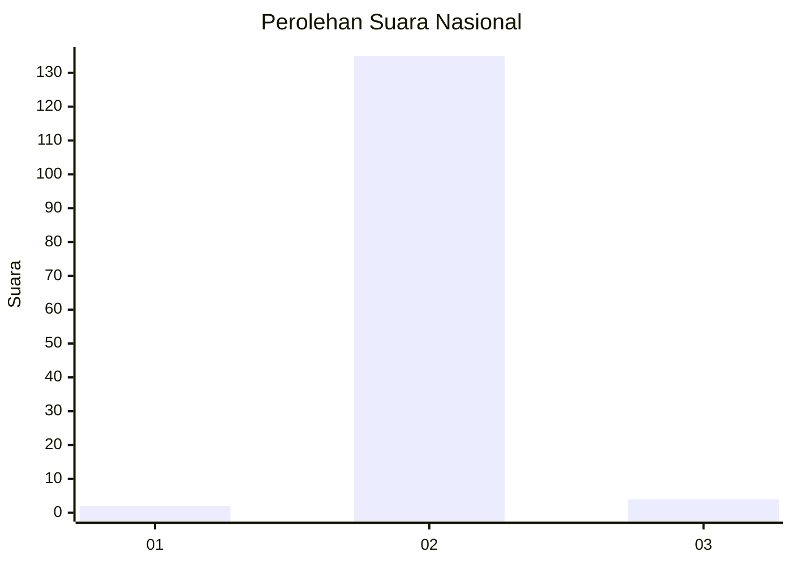
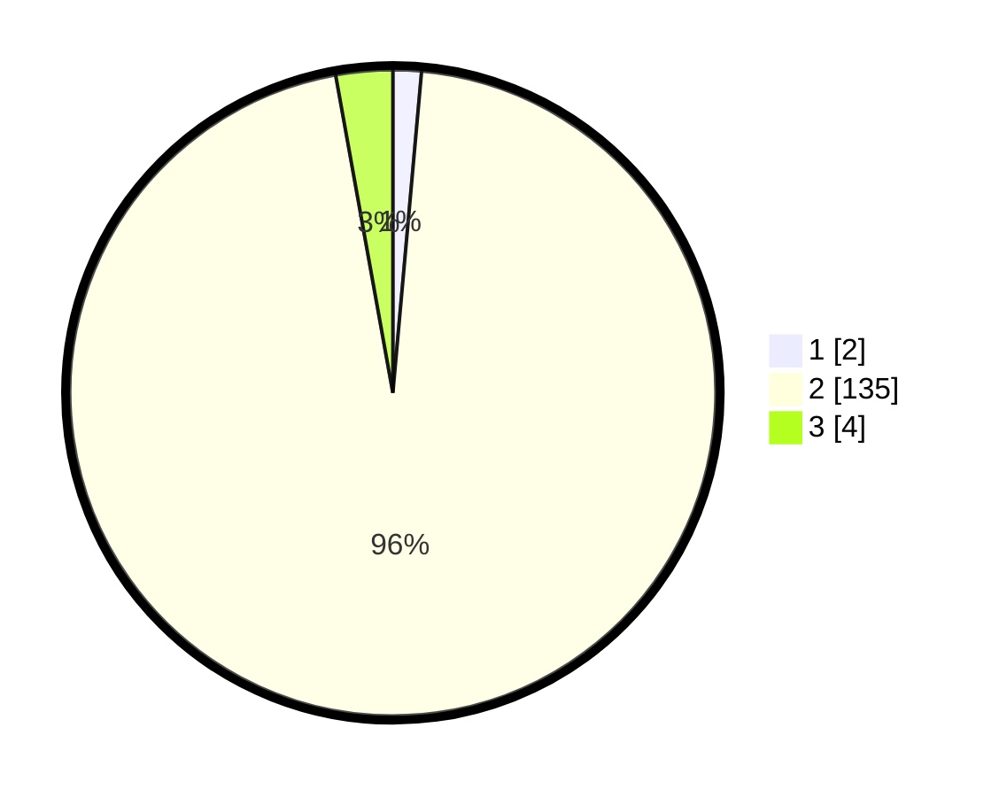

# Hasil

## Grafik

## Tabel

| No. | Nama Paslon    | Suara | Suara (raw) | Persentase |
|:--- |:-------------- | -----:| -----------:| ----------:|
| 1   | ANIES MUHAIMIN | 2     | [2][p-1]    | 1,42       |
| 2   | PRABOWO GIBRAN | 135   | [135][p-2]  | 95,74      |
| 3   | GANJAR MAHFUD  | 4     | [4][p-3]    | 2,84       |

[p-1]: https://github.com/gigit-pemilu/pemilu-2024/blob/main/pilpres/hitung-suara/sub/62-kalimantan-tengah/sub/10-gunung-mas/sub/09-miri-manasa/sub/2004-tumbang-masukih/sub/002-tps/sub/paslon-1.txt
[p-2]: https://github.com/gigit-pemilu/pemilu-2024/blob/main/pilpres/hitung-suara/sub/62-kalimantan-tengah/sub/10-gunung-mas/sub/09-miri-manasa/sub/2004-tumbang-masukih/sub/002-tps/sub/paslon-2.txt
[p-3]: https://github.com/gigit-pemilu/pemilu-2024/blob/main/pilpres/hitung-suara/sub/62-kalimantan-tengah/sub/10-gunung-mas/sub/09-miri-manasa/sub/2004-tumbang-masukih/sub/002-tps/sub/paslon-3.txt

## Foto C Plano

https://sirekap-obj-formc.kpu.go.id/563c/pemilu/ppwp/62/10/09/20/04/6210092004002-20240226-204802--c0558049-b82b-40e6-bc4a-a73d8604e709.jpg

https://sirekap-obj-formc.kpu.go.id/563c/pemilu/ppwp/62/10/09/20/04/6210092004002-20240226-204831--3f789500-cbc3-4e3e-808f-58653c0198fb.jpg

https://sirekap-obj-formc.kpu.go.id/563c/pemilu/ppwp/62/10/09/20/04/6210092004002-20240226-205119--d1de8f98-d733-4794-b82e-26c8e817715e.jpg

## Metadata

| Key        | Value               |
| ---------- | ------------------- |
| Time Stamp | 2024-02-28 22:00:00 |

