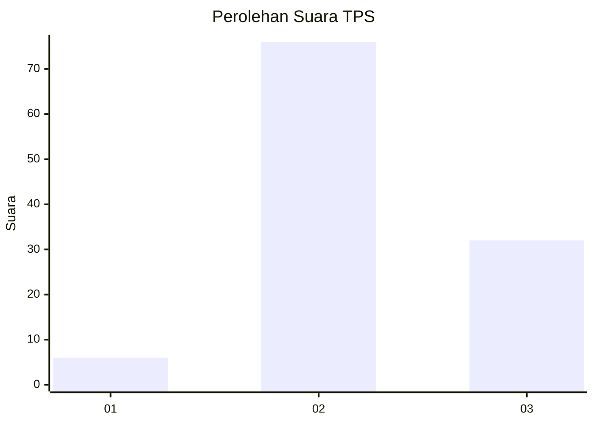
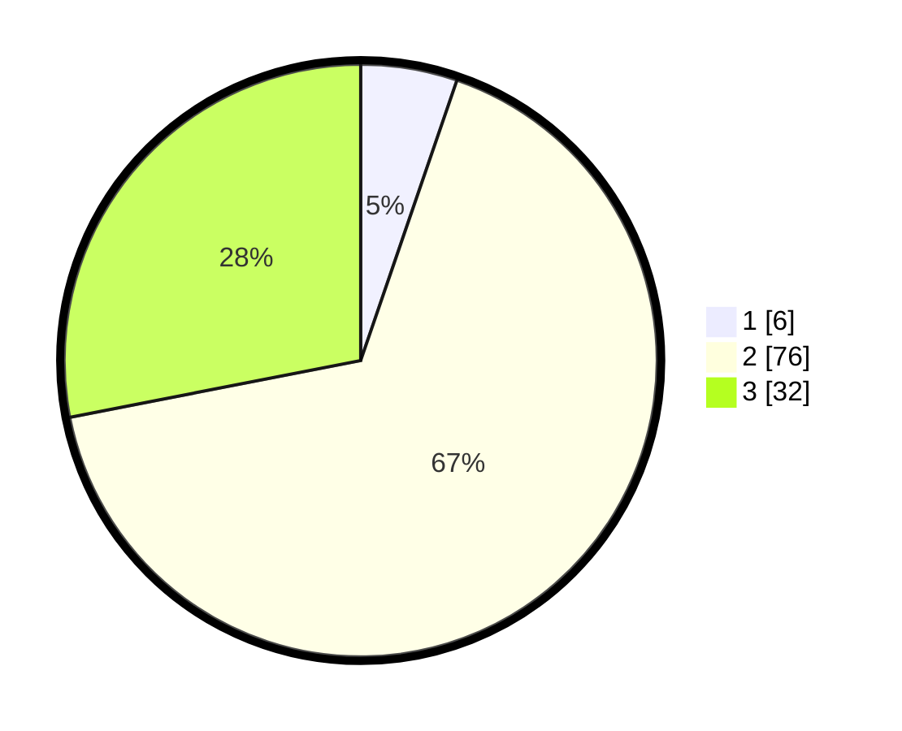

# Hasil

## Grafik

## Tabel

| No. | Nama Paslon    | Suara | Suara (raw) | Persentase |
|:--- |:-------------- | -----:| -----------:| ----------:|
| 1   | ANIES MUHAIMIN | 6     | [6][p-1]    | 5,26       |
| 2   | PRABOWO GIBRAN | 76    | [76][p-2]   | 66,67      |
| 3   | GANJAR MAHFUD  | 32    | [32][p-3]   | 28,07      |

[p-1]: https://github.com/gigit-pemilu/pemilu-2024-62-kalimantan-tengah/blob/main/pilpres/hitung-suara/sub/62-kalimantan-tengah/sub/10-gunung-mas/sub/09-miri-manasa/sub/2006-harowu/sub/001-tps/sub/paslon-1.txt
[p-2]: https://github.com/gigit-pemilu/pemilu-2024-62-kalimantan-tengah/blob/main/pilpres/hitung-suara/sub/62-kalimantan-tengah/sub/10-gunung-mas/sub/09-miri-manasa/sub/2006-harowu/sub/001-tps/sub/paslon-2.txt
[p-3]: https://github.com/gigit-pemilu/pemilu-2024-62-kalimantan-tengah/blob/main/pilpres/hitung-suara/sub/62-kalimantan-tengah/sub/10-gunung-mas/sub/09-miri-manasa/sub/2006-harowu/sub/001-tps/sub/paslon-3.txt

## Foto C Plano

https://sirekap-obj-formc.kpu.go.id/762c/pemilu/ppwp/62/10/09/20/06/6210092006001-20240226-164304--535cfc9d-77b7-4707-abba-2fdec4854d36.jpg

https://sirekap-obj-formc.kpu.go.id/762c/pemilu/ppwp/62/10/09/20/06/6210092006001-20240226-164353--b883a22c-ac66-4c1e-9609-8f7950333524.jpg

https://sirekap-obj-formc.kpu.go.id/762c/pemilu/ppwp/62/10/09/20/06/6210092006001-20240226-155237--ec937da3-478e-4849-9c67-afe0d02593b7.jpg

## Metadata

| Key        | Value               |
| ---------- | ------------------- |
| Time Stamp | 2024-02-28 19:00:00 |

