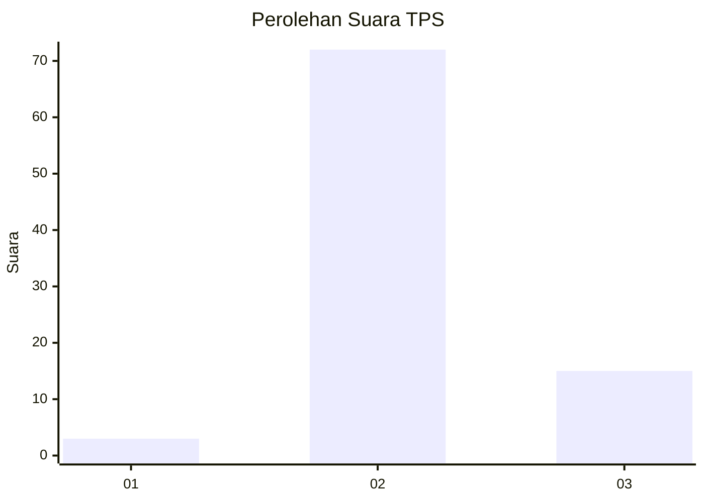
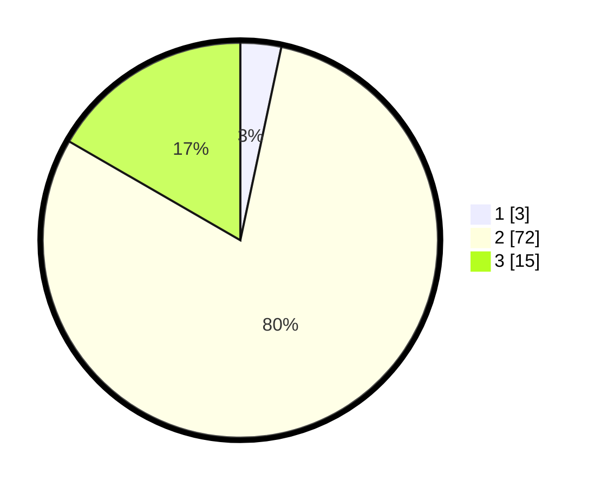

# Hasil

## Grafik

## Tabel

| No. | Nama Paslon    | Suara | Suara (raw) | Persentase |
|:--- |:-------------- | -----:| -----------:| ----------:|
| 1   | ANIES MUHAIMIN | 3     | [3][p-1]    | 3,33       |
| 2   | PRABOWO GIBRAN | 72    | [72][p-2]   | 80,00      |
| 3   | GANJAR MAHFUD  | 15    | [15][p-3]   | 16,67      |

[p-1]: https://github.com/gigit-pemilu/pemilu-2024-62-kalimantan-tengah/blob/main/pilpres/hitung-suara/sub/62-kalimantan-tengah/sub/10-gunung-mas/sub/09-miri-manasa/sub/2009-buntoi/sub/001-tps/sub/paslon-1.txt
[p-2]: https://github.com/gigit-pemilu/pemilu-2024-62-kalimantan-tengah/blob/main/pilpres/hitung-suara/sub/62-kalimantan-tengah/sub/10-gunung-mas/sub/09-miri-manasa/sub/2009-buntoi/sub/001-tps/sub/paslon-2.txt
[p-3]: https://github.com/gigit-pemilu/pemilu-2024-62-kalimantan-tengah/blob/main/pilpres/hitung-suara/sub/62-kalimantan-tengah/sub/10-gunung-mas/sub/09-miri-manasa/sub/2009-buntoi/sub/001-tps/sub/paslon-3.txt

## Foto C Plano

https://sirekap-obj-formc.kpu.go.id/7f39/pemilu/ppwp/62/10/09/20/09/6210092009001-20240224-194128--8000f15d-63cf-4cf5-a6ee-ae55c2801958.jpg

https://sirekap-obj-formc.kpu.go.id/7f39/pemilu/ppwp/62/10/09/20/09/6210092009001-20240224-194423--6e1f212a-6f4f-4521-bb36-00048840fb9c.jpg

https://sirekap-obj-formc.kpu.go.id/7f39/pemilu/ppwp/62/10/09/20/09/6210092009001-20240224-194329--26c45859-12ef-4788-91f3-da091cdc2ee5.jpg

## Metadata

| Key        | Value               |
| ---------- | ------------------- |
| Time Stamp | 2024-02-25 14:00:00 |

