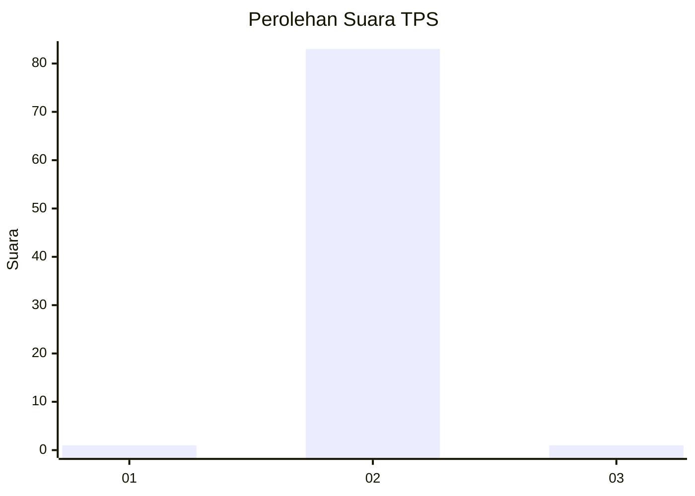
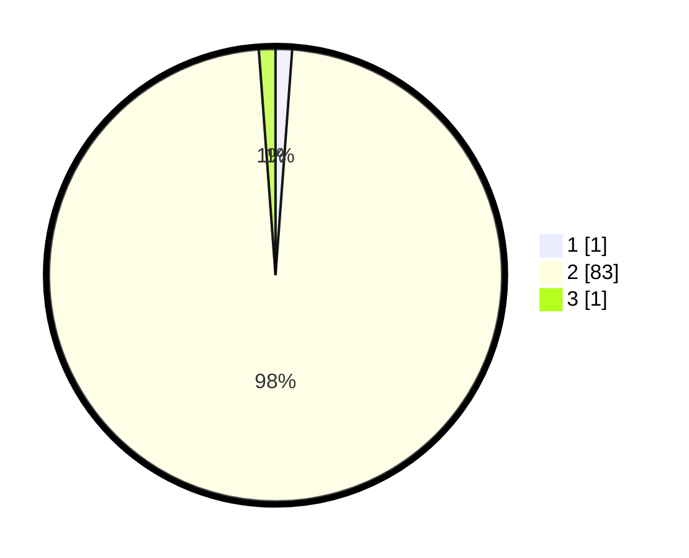

# Hasil

## Grafik

## Tabel

| No. | Nama Paslon    | Suara | Suara (raw) | Persentase |
|:--- |:-------------- | -----:| -----------:| ----------:|
| 1   | ANIES MUHAIMIN | 1     | [1][p-1]    | 1,18       |
| 2   | PRABOWO GIBRAN | 83    | [83][p-2]   | 97,65      |
| 3   | GANJAR MAHFUD  | 1     | [1][p-3]    | 1,18       |

[p-1]: https://github.com/gigit-pemilu/pemilu-2024-62-kalimantan-tengah/blob/main/pilpres/hitung-suara/sub/62-kalimantan-tengah/sub/10-gunung-mas/sub/09-miri-manasa/sub/2011-tumbang-hatung/sub/001-tps/sub/paslon-1.txt
[p-2]: https://github.com/gigit-pemilu/pemilu-2024-62-kalimantan-tengah/blob/main/pilpres/hitung-suara/sub/62-kalimantan-tengah/sub/10-gunung-mas/sub/09-miri-manasa/sub/2011-tumbang-hatung/sub/001-tps/sub/paslon-2.txt
[p-3]: https://github.com/gigit-pemilu/pemilu-2024-62-kalimantan-tengah/blob/main/pilpres/hitung-suara/sub/62-kalimantan-tengah/sub/10-gunung-mas/sub/09-miri-manasa/sub/2011-tumbang-hatung/sub/001-tps/sub/paslon-3.txt

## Foto C Plano

https://sirekap-obj-formc.kpu.go.id/1120/pemilu/ppwp/62/10/09/20/11/6210092011001-20240226-184153--69bf0863-c0ee-45f0-8f85-50157ecbea4b.jpg

https://sirekap-obj-formc.kpu.go.id/1120/pemilu/ppwp/62/10/09/20/11/6210092011001-20240226-184221--a2e449f1-97a6-4455-9b69-d3108fdd560f.jpg

https://sirekap-obj-formc.kpu.go.id/1120/pemilu/ppwp/62/10/09/20/11/6210092011001-20240226-184247--79af3377-bd46-4df1-9745-f7da0f34b8b7.jpg

## Metadata

| Key        | Value               |
| ---------- | ------------------- |
| Time Stamp | 2024-02-28 21:00:00 |

