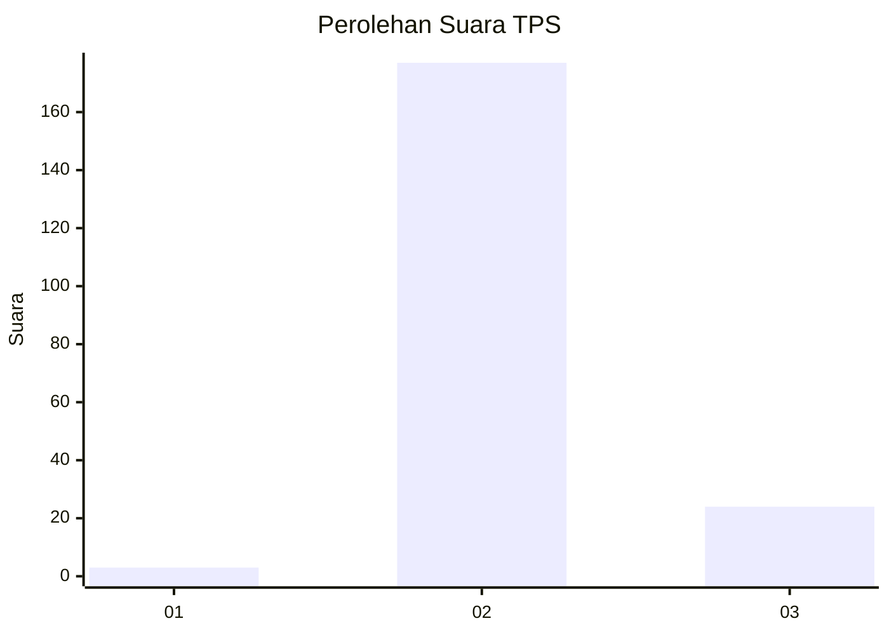
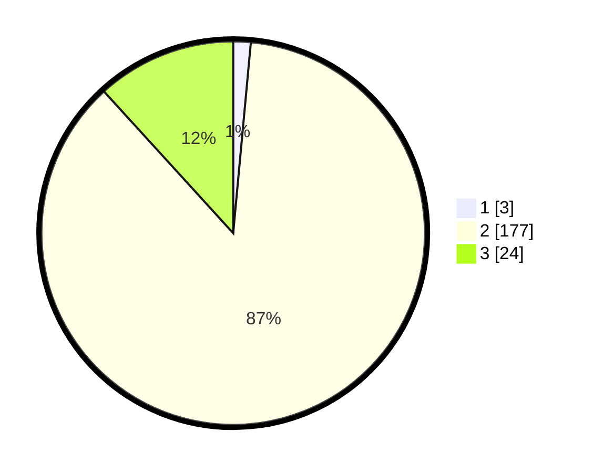

# Hasil

## Grafik

## Tabel

| No. | Nama Paslon    | Suara | Suara (raw) | Persentase |
|:--- |:-------------- | -----:| -----------:| ----------:|
| 1   | ANIES MUHAIMIN | 3     | [3][p-1]    | 1,47       |
| 2   | PRABOWO GIBRAN | 177   | [177][p-2]  | 86,76      |
| 3   | GANJAR MAHFUD  | 24    | [24][p-3]   | 11,76      |

[p-1]: https://github.com/gigit-pemilu/pemilu-2024-62-kalimantan-tengah/blob/main/pilpres/hitung-suara/sub/62-kalimantan-tengah/sub/10-gunung-mas/sub/10-rungan-hulu/sub/1004-tumbang-rahuyan/sub/003-tps/sub/paslon-1.txt
[p-2]: https://github.com/gigit-pemilu/pemilu-2024-62-kalimantan-tengah/blob/main/pilpres/hitung-suara/sub/62-kalimantan-tengah/sub/10-gunung-mas/sub/10-rungan-hulu/sub/1004-tumbang-rahuyan/sub/003-tps/sub/paslon-2.txt
[p-3]: https://github.com/gigit-pemilu/pemilu-2024-62-kalimantan-tengah/blob/main/pilpres/hitung-suara/sub/62-kalimantan-tengah/sub/10-gunung-mas/sub/10-rungan-hulu/sub/1004-tumbang-rahuyan/sub/003-tps/sub/paslon-3.txt

## Foto C Plano

https://sirekap-obj-formc.kpu.go.id/4131/pemilu/ppwp/62/10/10/10/04/6210101004003-20240216-151042--cd1505c8-41f3-400e-aeac-494a9fc9e212.jpg

https://sirekap-obj-formc.kpu.go.id/4131/pemilu/ppwp/62/10/10/10/04/6210101004003-20240216-151045--bc54282c-6a50-41db-a234-2c21c650e95b.jpg

https://sirekap-obj-formc.kpu.go.id/4131/pemilu/ppwp/62/10/10/10/04/6210101004003-20240216-151054--e0a7d212-d79d-444d-a232-a9b24cca90a7.jpg

## Metadata

| Key        | Value               |
| ---------- | ------------------- |
| Time Stamp | 2024-02-22 10:00:00 |

