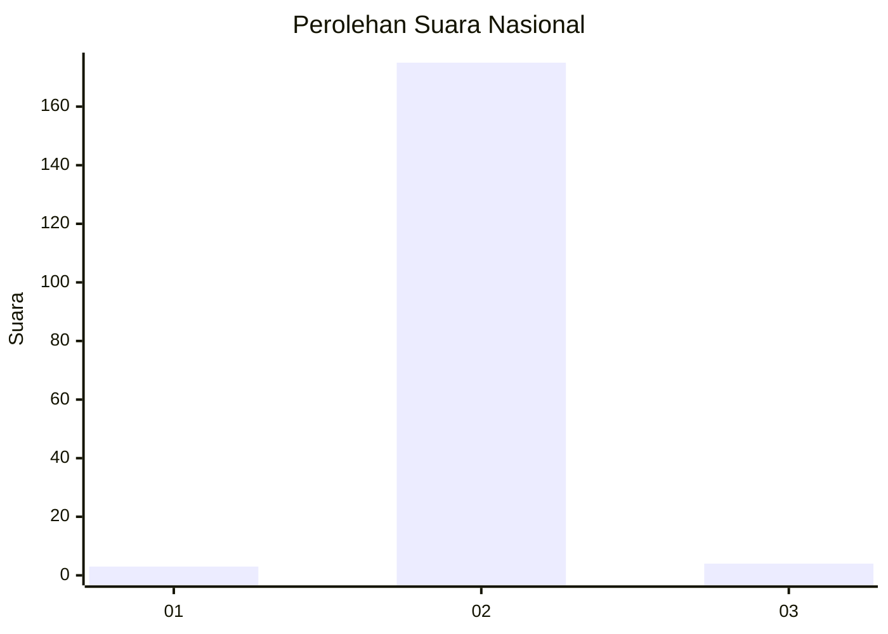
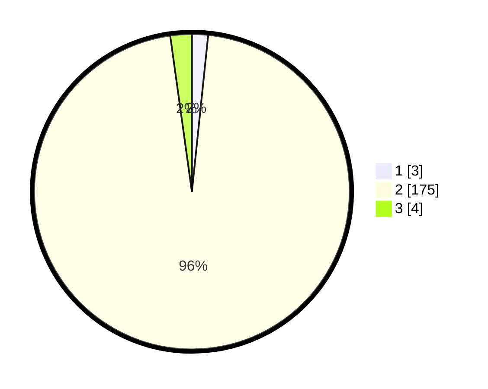

# Hasil

## Grafik

## Tabel

| No. | Nama Paslon    | Suara | Suara (raw) | Persentase |
|:--- |:-------------- | -----:| -----------:| ----------:|
| 1   | ANIES MUHAIMIN | 3     | [3][p-1]    | 1,65       |
| 2   | PRABOWO GIBRAN | 175   | [175][p-2]  | 96,15      |
| 3   | GANJAR MAHFUD  | 4     | [4][p-3]    | 2,20       |

[p-1]: https://github.com/gigit-pemilu/pemilu-2024/blob/main/pilpres/hitung-suara/sub/62-kalimantan-tengah/sub/10-gunung-mas/sub/12-rungan-barat/sub/2001-hujung-pata/sub/002-tps/sub/paslon-1.txt
[p-2]: https://github.com/gigit-pemilu/pemilu-2024/blob/main/pilpres/hitung-suara/sub/62-kalimantan-tengah/sub/10-gunung-mas/sub/12-rungan-barat/sub/2001-hujung-pata/sub/002-tps/sub/paslon-2.txt
[p-3]: https://github.com/gigit-pemilu/pemilu-2024/blob/main/pilpres/hitung-suara/sub/62-kalimantan-tengah/sub/10-gunung-mas/sub/12-rungan-barat/sub/2001-hujung-pata/sub/002-tps/sub/paslon-3.txt

## Foto C Plano

https://sirekap-obj-formc.kpu.go.id/4456/pemilu/ppwp/62/10/12/20/01/6210122001002-20240215-030511--93f6adf8-ce92-4453-82f4-58ccf3f4f515.jpg

https://sirekap-obj-formc.kpu.go.id/4456/pemilu/ppwp/62/10/12/20/01/6210122001002-20240215-023648--6a183610-d7c8-4445-a8f2-87d876c3fd18.jpg

https://sirekap-obj-formc.kpu.go.id/4456/pemilu/ppwp/62/10/12/20/01/6210122001002-20240215-210813--d742027e-8f7a-4cfd-9ad6-26e15dc94268.jpg

## Metadata

| Key        | Value               |
| ---------- | ------------------- |
| Time Stamp | 2024-02-25 14:00:00 |

