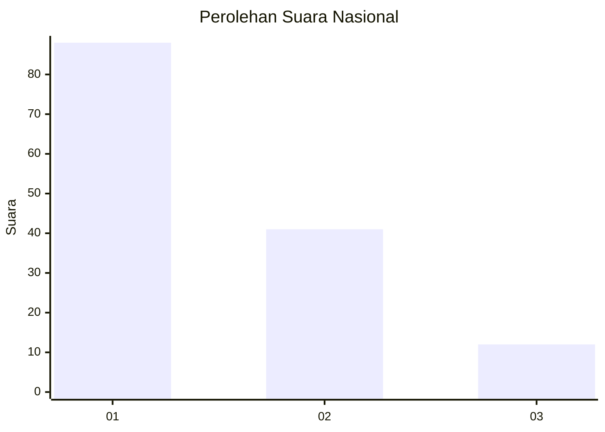
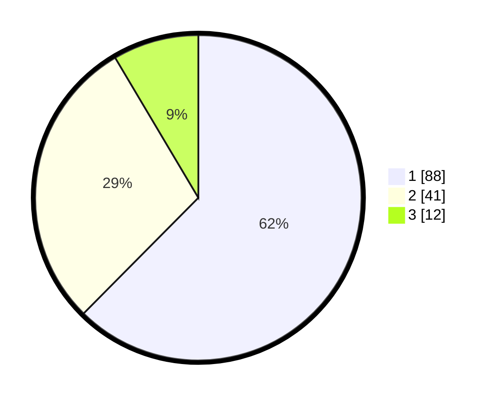

# Hasil

## Grafik

## Tabel

| No. | Nama Paslon    | Suara | Suara (raw) | Persentase |
|:--- |:-------------- | -----:| -----------:| ----------:|
| 1   | ANIES MUHAIMIN | 88    | [88][p-1]   | 62,41      |
| 2   | PRABOWO GIBRAN | 41    | [41][p-2]   | 29,08      |
| 3   | GANJAR MAHFUD  | 12    | [12][p-3]   | 8,51       |

[p-1]: https://github.com/gigit-pemilu/pemilu-2024/blob/main/pilpres/hitung-suara/sub/62-kalimantan-tengah/sub/11-pulang-pisau/sub/02-kahayan-kuala/sub/2002-papuyu-ii-sei-barunai/sub/003-tps/sub/paslon-1.txt
[p-2]: https://github.com/gigit-pemilu/pemilu-2024/blob/main/pilpres/hitung-suara/sub/62-kalimantan-tengah/sub/11-pulang-pisau/sub/02-kahayan-kuala/sub/2002-papuyu-ii-sei-barunai/sub/003-tps/sub/paslon-2.txt
[p-3]: https://github.com/gigit-pemilu/pemilu-2024/blob/main/pilpres/hitung-suara/sub/62-kalimantan-tengah/sub/11-pulang-pisau/sub/02-kahayan-kuala/sub/2002-papuyu-ii-sei-barunai/sub/003-tps/sub/paslon-3.txt

## Foto C Plano

https://sirekap-obj-formc.kpu.go.id/e6b6/pemilu/ppwp/62/11/02/20/02/6211022002003-20240215-093457--7dc6c76e-cd4a-430d-8d17-33a3e9af1143.jpg

https://sirekap-obj-formc.kpu.go.id/e6b6/pemilu/ppwp/62/11/02/20/02/6211022002003-20240215-094546--ce3051fd-fb5b-41dc-8f3f-53188a3223dd.jpg

https://sirekap-obj-formc.kpu.go.id/e6b6/pemilu/ppwp/62/11/02/20/02/6211022002003-20240215-095202--102fa06c-b928-41b5-aa0e-f771ecff685d.jpg

## Metadata

| Key        | Value               |
| ---------- | ------------------- |
| Time Stamp | 2024-02-15 23:29:50 |

