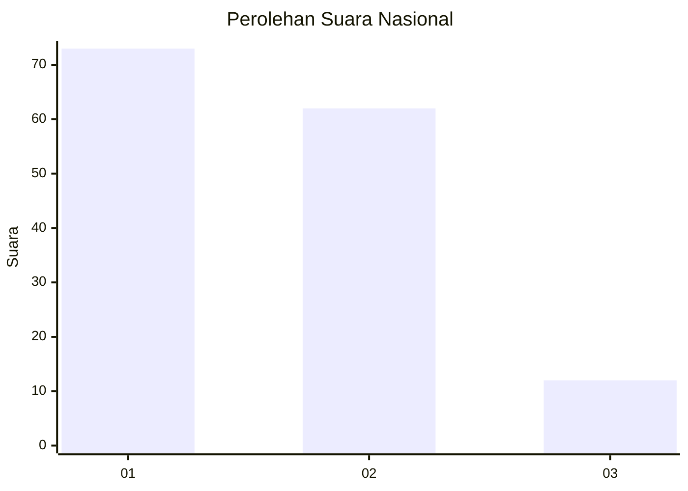
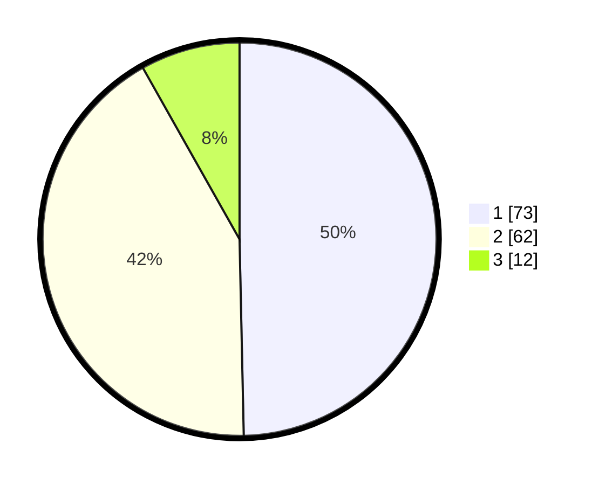

# Hasil

## Grafik

## Tabel

| No. | Nama Paslon    | Suara | Suara (raw) | Persentase |
|:--- |:-------------- | -----:| -----------:| ----------:|
| 1   | ANIES MUHAIMIN | 73    | [73][p-1]   | 49,66      |
| 2   | PRABOWO GIBRAN | 62    | [62][p-2]   | 42,18      |
| 3   | GANJAR MAHFUD  | 12    | [12][p-3]   | 8,16       |

[p-1]: https://github.com/gigit-pemilu/pemilu-2024/blob/main/pilpres/hitung-suara/sub/62-kalimantan-tengah/sub/11-pulang-pisau/sub/02-kahayan-kuala/sub/2005-papuyu-i-sei-pasanan/sub/006-tps/sub/paslon-1.txt
[p-2]: https://github.com/gigit-pemilu/pemilu-2024/blob/main/pilpres/hitung-suara/sub/62-kalimantan-tengah/sub/11-pulang-pisau/sub/02-kahayan-kuala/sub/2005-papuyu-i-sei-pasanan/sub/006-tps/sub/paslon-2.txt
[p-3]: https://github.com/gigit-pemilu/pemilu-2024/blob/main/pilpres/hitung-suara/sub/62-kalimantan-tengah/sub/11-pulang-pisau/sub/02-kahayan-kuala/sub/2005-papuyu-i-sei-pasanan/sub/006-tps/sub/paslon-3.txt

## Foto C Plano

https://sirekap-obj-formc.kpu.go.id/7700/pemilu/ppwp/62/11/02/20/05/6211022005006-20240215-035307--303fd7fe-126e-42e1-8632-a3c5bdffb66c.jpg

https://sirekap-obj-formc.kpu.go.id/7700/pemilu/ppwp/62/11/02/20/05/6211022005006-20240215-035329--67d814c2-dca1-4876-9ede-fe3da2dd987f.jpg

https://sirekap-obj-formc.kpu.go.id/7700/pemilu/ppwp/62/11/02/20/05/6211022005006-20240215-035335--4e1d8b40-5e96-443a-a6a0-a76f8cd2c5a8.jpg

## Metadata

| Key        | Value               |
| ---------- | ------------------- |
| Time Stamp | 2024-02-15 23:29:50 |

