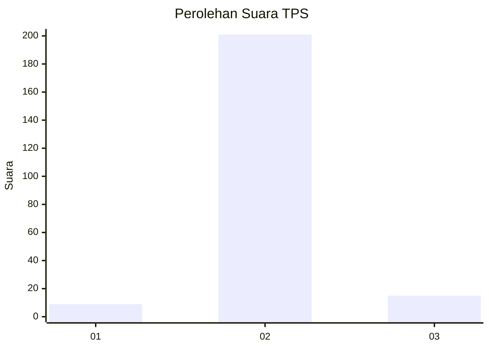
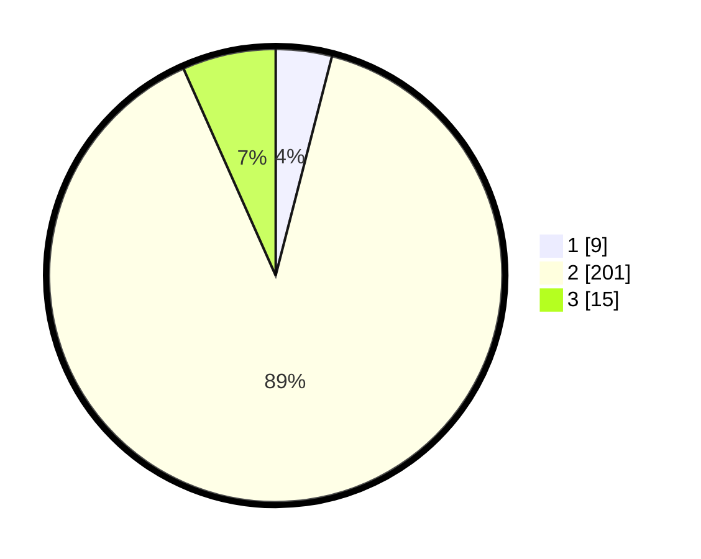

# Hasil

## Grafik

## Tabel

| No. | Nama Paslon    | Suara | Suara (raw) | Persentase |
|:--- |:-------------- | -----:| -----------:| ----------:|
| 1   | ANIES MUHAIMIN | 9     | [9][p-1]    | 4,00       |
| 2   | PRABOWO GIBRAN | 201   | [201][p-2]  | 89,33      |
| 3   | GANJAR MAHFUD  | 15    | [15][p-3]   | 6,67       |

[p-1]: https://github.com/gigit-pemilu/pemilu-2024-62-kalimantan-tengah/blob/main/pilpres/hitung-suara/sub/62-kalimantan-tengah/sub/11-pulang-pisau/sub/03-kahayan-tengah/sub/2001-tanjung-sangalang/sub/001-tps/sub/paslon-1.txt
[p-2]: https://github.com/gigit-pemilu/pemilu-2024-62-kalimantan-tengah/blob/main/pilpres/hitung-suara/sub/62-kalimantan-tengah/sub/11-pulang-pisau/sub/03-kahayan-tengah/sub/2001-tanjung-sangalang/sub/001-tps/sub/paslon-2.txt
[p-3]: https://github.com/gigit-pemilu/pemilu-2024-62-kalimantan-tengah/blob/main/pilpres/hitung-suara/sub/62-kalimantan-tengah/sub/11-pulang-pisau/sub/03-kahayan-tengah/sub/2001-tanjung-sangalang/sub/001-tps/sub/paslon-3.txt

## Foto C Plano

https://sirekap-obj-formc.kpu.go.id/1555/pemilu/ppwp/62/11/03/20/01/6211032001001-20240217-112503--2d2efc9a-616f-4d9a-aa58-3632687dc65a.jpg

https://sirekap-obj-formc.kpu.go.id/1555/pemilu/ppwp/62/11/03/20/01/6211032001001-20240217-093550--ecd7c8b1-1489-45c8-b933-e2c7d372f048.jpg

https://sirekap-obj-formc.kpu.go.id/1555/pemilu/ppwp/62/11/03/20/01/6211032001001-20240217-093914--bda36ff6-3dce-41d9-ad87-01961d182eb8.jpg

## Metadata

| Key        | Value               |
| ---------- | ------------------- |
| Time Stamp | 2024-02-17 14:45:18 |

