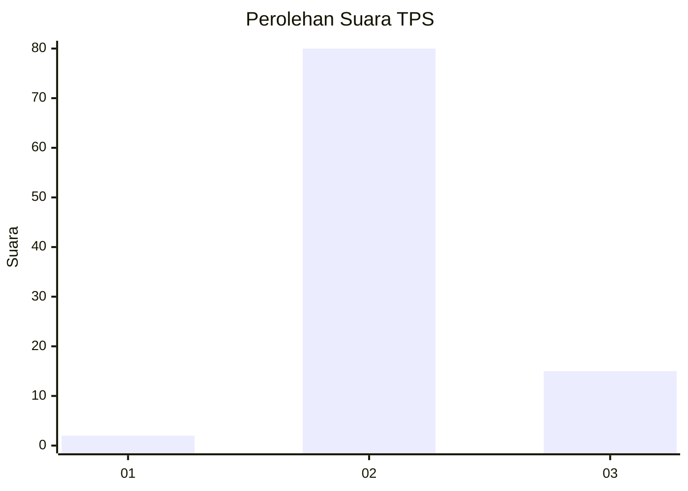
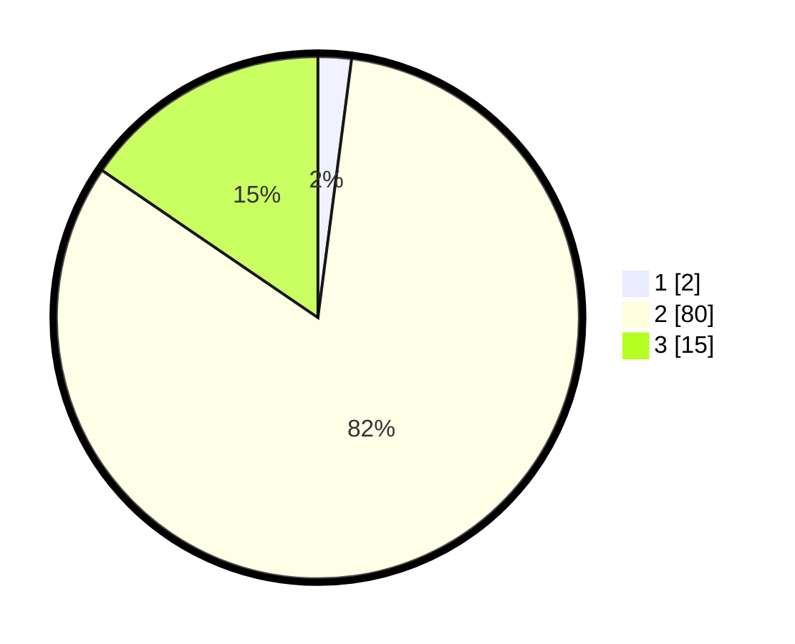

# Hasil

## Grafik

## Tabel

| No. | Nama Paslon    | Suara | Suara (raw) | Persentase |
|:--- |:-------------- | -----:| -----------:| ----------:|
| 1   | ANIES MUHAIMIN | 2     | [2][p-1]    | 2,06       |
| 2   | PRABOWO GIBRAN | 80    | [80][p-2]   | 82,47      |
| 3   | GANJAR MAHFUD  | 15    | [15][p-3]   | 15,46      |

[p-1]: https://github.com/gigit-pemilu/pemilu-2024-62-kalimantan-tengah/blob/main/pilpres/hitung-suara/sub/62-kalimantan-tengah/sub/11-pulang-pisau/sub/03-kahayan-tengah/sub/2002-penda-barania/sub/001-tps/sub/paslon-1.txt
[p-2]: https://github.com/gigit-pemilu/pemilu-2024-62-kalimantan-tengah/blob/main/pilpres/hitung-suara/sub/62-kalimantan-tengah/sub/11-pulang-pisau/sub/03-kahayan-tengah/sub/2002-penda-barania/sub/001-tps/sub/paslon-2.txt
[p-3]: https://github.com/gigit-pemilu/pemilu-2024-62-kalimantan-tengah/blob/main/pilpres/hitung-suara/sub/62-kalimantan-tengah/sub/11-pulang-pisau/sub/03-kahayan-tengah/sub/2002-penda-barania/sub/001-tps/sub/paslon-3.txt

## Foto C Plano

https://sirekap-obj-formc.kpu.go.id/f8ab/pemilu/ppwp/62/11/03/20/02/6211032002001-20240216-131529--c38910fe-61f7-49f6-9d97-10ec075f2320.jpg

https://sirekap-obj-formc.kpu.go.id/f8ab/pemilu/ppwp/62/11/03/20/02/6211032002001-20240216-135357--5b0df7df-b9a4-458b-a8c2-4bb7216ebb58.jpg

https://sirekap-obj-formc.kpu.go.id/f8ab/pemilu/ppwp/62/11/03/20/02/6211032002001-20240216-115212--abe0b31b-77d9-4803-98d0-46db292c679c.jpg

## Metadata

| Key        | Value               |
| ---------- | ------------------- |
| Time Stamp | 2024-02-17 16:00:02 |

