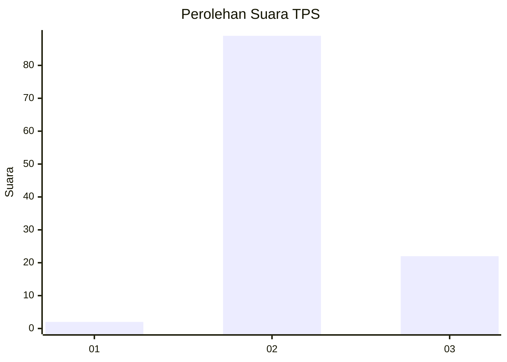
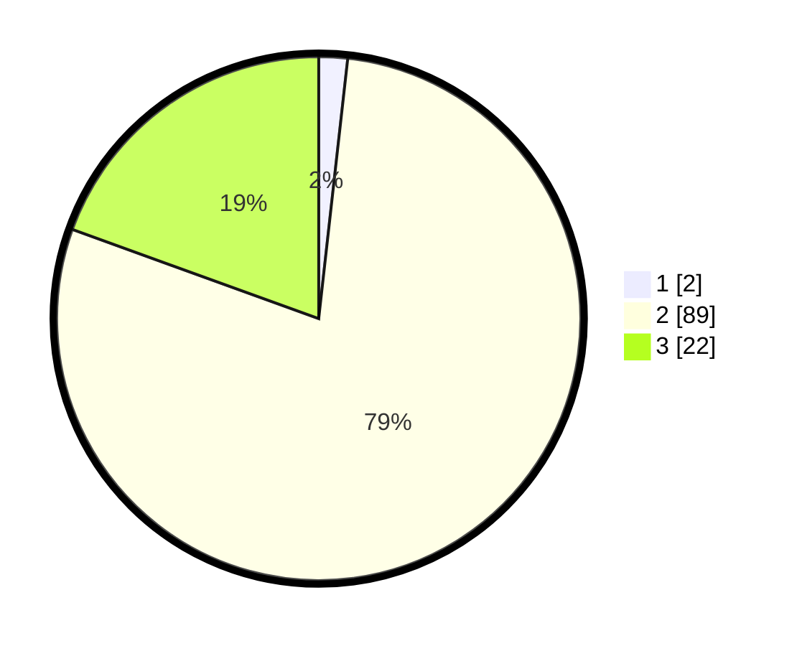

# Hasil

## Grafik

## Tabel

| No. | Nama Paslon    | Suara | Suara (raw) | Persentase |
|:--- |:-------------- | -----:| -----------:| ----------:|
| 1   | ANIES MUHAIMIN | 2     | [2][p-1]    | 1,77       |
| 2   | PRABOWO GIBRAN | 89    | [89][p-2]   | 78,76      |
| 3   | GANJAR MAHFUD  | 22    | [22][p-3]   | 19,47      |

[p-1]: https://github.com/gigit-pemilu/pemilu-2024-62-kalimantan-tengah/blob/main/pilpres/hitung-suara/sub/62-kalimantan-tengah/sub/11-pulang-pisau/sub/04-banama-tingang/sub/2001-manen-paduran/sub/001-tps/sub/paslon-1.txt
[p-2]: https://github.com/gigit-pemilu/pemilu-2024-62-kalimantan-tengah/blob/main/pilpres/hitung-suara/sub/62-kalimantan-tengah/sub/11-pulang-pisau/sub/04-banama-tingang/sub/2001-manen-paduran/sub/001-tps/sub/paslon-2.txt
[p-3]: https://github.com/gigit-pemilu/pemilu-2024-62-kalimantan-tengah/blob/main/pilpres/hitung-suara/sub/62-kalimantan-tengah/sub/11-pulang-pisau/sub/04-banama-tingang/sub/2001-manen-paduran/sub/001-tps/sub/paslon-3.txt

## Foto C Plano

https://sirekap-obj-formc.kpu.go.id/c2a4/pemilu/ppwp/62/11/04/20/01/6211042001001-20240218-133458--e0c3a3c0-f497-489c-9362-3874d08f348b.jpg

https://sirekap-obj-formc.kpu.go.id/c2a4/pemilu/ppwp/62/11/04/20/01/6211042001001-20240218-133545--cfbc89d9-d1db-4a7d-8e0e-26cfd92210dd.jpg

https://sirekap-obj-formc.kpu.go.id/c2a4/pemilu/ppwp/62/11/04/20/01/6211042001001-20240218-133625--4f398405-723c-4e39-aaf3-7c273cac9fd2.jpg

## Metadata

| Key        | Value               |
| ---------- | ------------------- |
| Time Stamp | 2024-02-19 06:16:00 |

