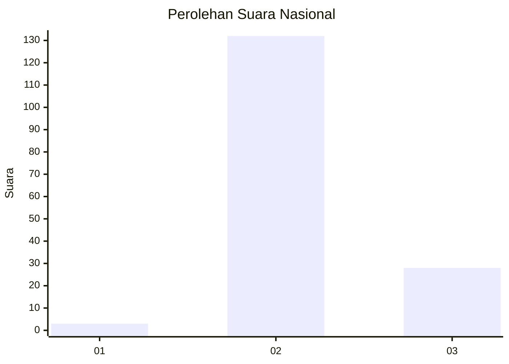
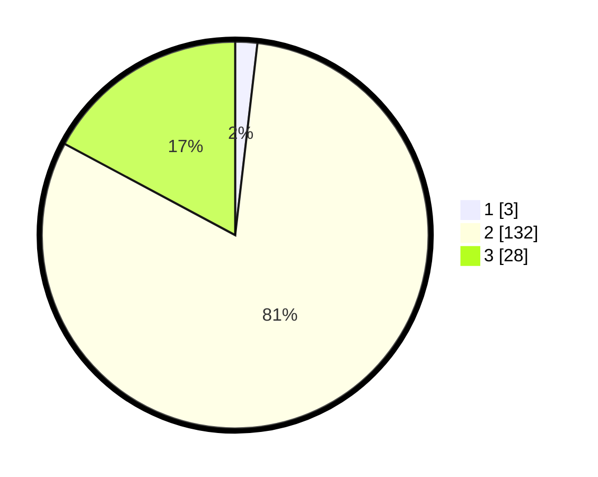

# Hasil

## Grafik

## Tabel

| No. | Nama Paslon    | Suara | Suara (raw) | Persentase |
|:--- |:-------------- | -----:| -----------:| ----------:|
| 1   | ANIES MUHAIMIN | 3     | [3][p-1]    | 1,84       |
| 2   | PRABOWO GIBRAN | 132   | [132][p-2]  | 80,98      |
| 3   | GANJAR MAHFUD  | 28    | [28][p-3]   | 17,18      |

[p-1]: https://github.com/gigit-pemilu/pemilu-2024/blob/main/pilpres/hitung-suara/sub/62-kalimantan-tengah/sub/11-pulang-pisau/sub/04-banama-tingang/sub/2001-manen-paduran/sub/002-tps/sub/paslon-1.txt
[p-2]: https://github.com/gigit-pemilu/pemilu-2024/blob/main/pilpres/hitung-suara/sub/62-kalimantan-tengah/sub/11-pulang-pisau/sub/04-banama-tingang/sub/2001-manen-paduran/sub/002-tps/sub/paslon-2.txt
[p-3]: https://github.com/gigit-pemilu/pemilu-2024/blob/main/pilpres/hitung-suara/sub/62-kalimantan-tengah/sub/11-pulang-pisau/sub/04-banama-tingang/sub/2001-manen-paduran/sub/002-tps/sub/paslon-3.txt

## Foto C Plano

https://sirekap-obj-formc.kpu.go.id/4a54/pemilu/ppwp/62/11/04/20/01/6211042001002-20240218-151738--ac021787-1787-4c3c-b890-bb8736c4367c.jpg

https://sirekap-obj-formc.kpu.go.id/4a54/pemilu/ppwp/62/11/04/20/01/6211042001002-20240218-151806--2d4cf5f3-86b4-442b-8d45-7213e4107d90.jpg

https://sirekap-obj-formc.kpu.go.id/4a54/pemilu/ppwp/62/11/04/20/01/6211042001002-20240218-151844--d97076e3-26d1-4bbe-bd1a-b0501b2e3cba.jpg

## Metadata

| Key        | Value               |
| ---------- | ------------------- |
| Time Stamp | 2024-02-19 06:16:00 |

