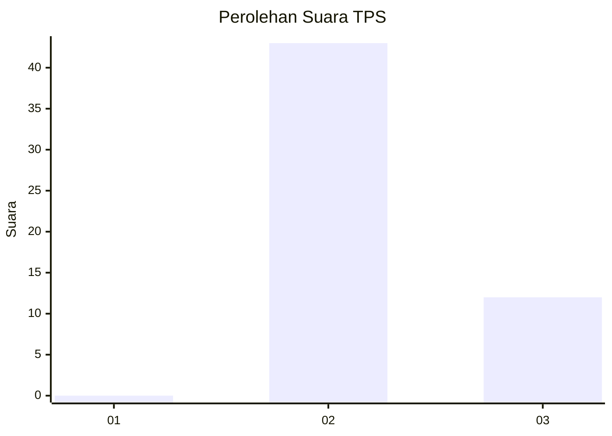
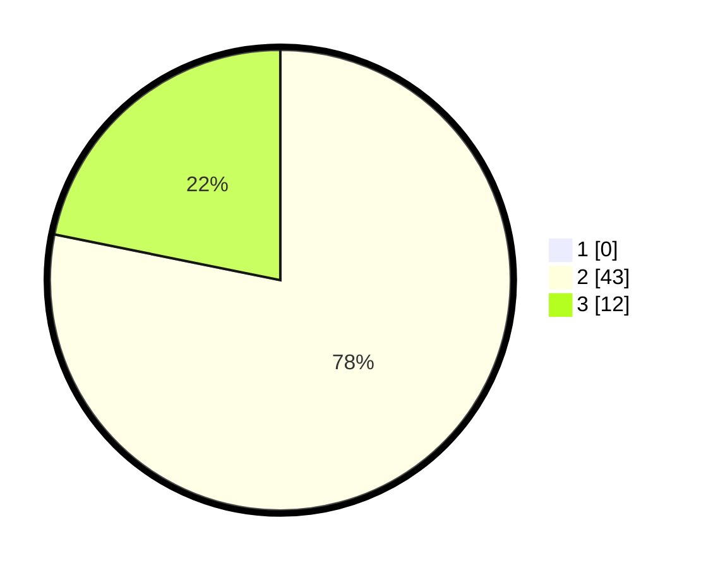

# Hasil

## Grafik

## Tabel

| No. | Nama Paslon    | Suara | Suara (raw) | Persentase |
|:--- |:-------------- | -----:| -----------:| ----------:|
| 1   | ANIES MUHAIMIN | 0     | [0][p-1]    | 0,00       |
| 2   | PRABOWO GIBRAN | 43    | [43][p-2]   | 78,18      |
| 3   | GANJAR MAHFUD  | 12    | [12][p-3]   | 21,82      |

[p-1]: https://github.com/gigit-pemilu/pemilu-2024-62-kalimantan-tengah/blob/main/pilpres/hitung-suara/sub/62-kalimantan-tengah/sub/11-pulang-pisau/sub/04-banama-tingang/sub/2002-manen-kaleka/sub/001-tps/sub/paslon-1.txt
[p-2]: https://github.com/gigit-pemilu/pemilu-2024-62-kalimantan-tengah/blob/main/pilpres/hitung-suara/sub/62-kalimantan-tengah/sub/11-pulang-pisau/sub/04-banama-tingang/sub/2002-manen-kaleka/sub/001-tps/sub/paslon-2.txt
[p-3]: https://github.com/gigit-pemilu/pemilu-2024-62-kalimantan-tengah/blob/main/pilpres/hitung-suara/sub/62-kalimantan-tengah/sub/11-pulang-pisau/sub/04-banama-tingang/sub/2002-manen-kaleka/sub/001-tps/sub/paslon-3.txt

## Foto C Plano

https://sirekap-obj-formc.kpu.go.id/0c1c/pemilu/ppwp/62/11/04/20/02/6211042002001-20240218-091011--b74a8e40-0be5-4c08-be4f-cd367d8c5719.jpg

https://sirekap-obj-formc.kpu.go.id/0c1c/pemilu/ppwp/62/11/04/20/02/6211042002001-20240218-091135--8d659030-1e88-4cb9-86bf-e4f9587ea834.jpg

https://sirekap-obj-formc.kpu.go.id/0c1c/pemilu/ppwp/62/11/04/20/02/6211042002001-20240218-091235--cf4ca4e2-6840-4937-8177-bbe244b9521e.jpg

## Metadata

| Key        | Value               |
| ---------- | ------------------- |
| Time Stamp | 2024-02-19 06:16:00 |

