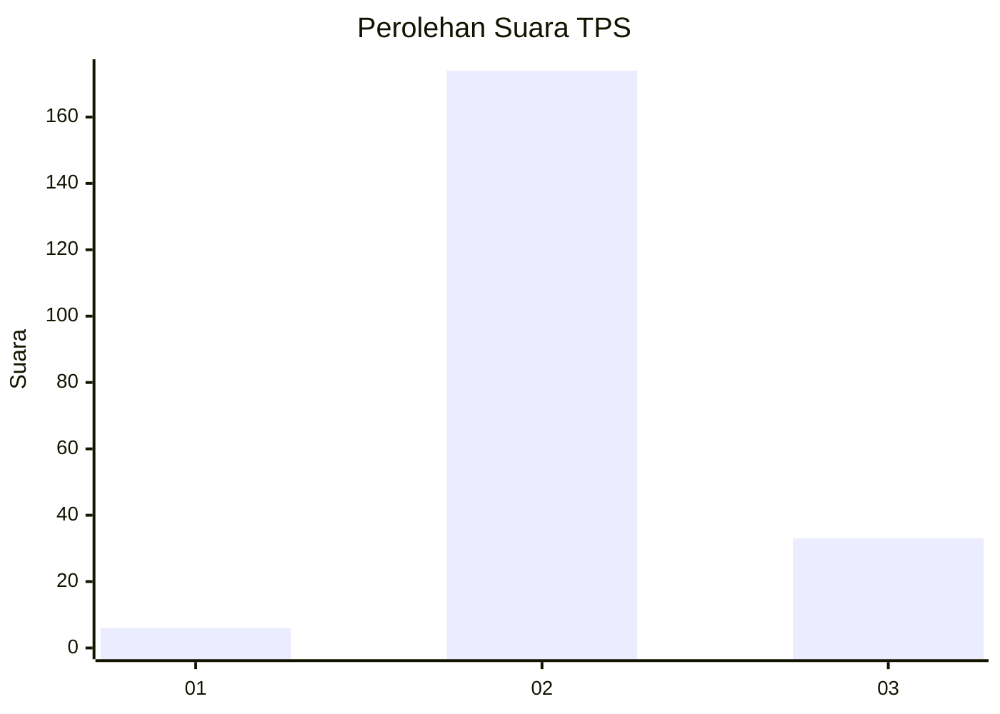
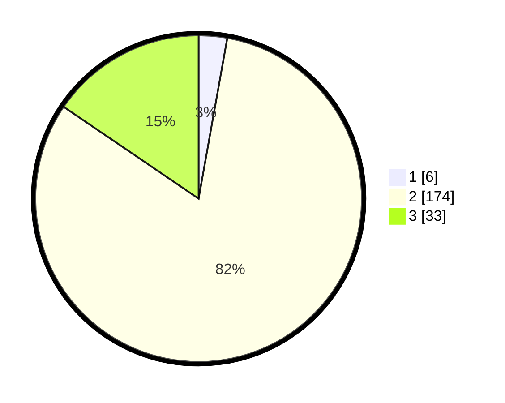

# Hasil

## Grafik

## Tabel

| No. | Nama Paslon    | Suara | Suara (raw) | Persentase |
|:--- |:-------------- | -----:| -----------:| ----------:|
| 1   | ANIES MUHAIMIN | 6     | [6][p-1]    | 2,82       |
| 2   | PRABOWO GIBRAN | 174   | [174][p-2]  | 81,69      |
| 3   | GANJAR MAHFUD  | 33    | [33][p-3]   | 15,49      |

[p-1]: https://github.com/gigit-pemilu/pemilu-2024-62-kalimantan-tengah/blob/main/pilpres/hitung-suara/sub/62-kalimantan-tengah/sub/11-pulang-pisau/sub/04-banama-tingang/sub/2002-manen-kaleka/sub/002-tps/sub/paslon-1.txt
[p-2]: https://github.com/gigit-pemilu/pemilu-2024-62-kalimantan-tengah/blob/main/pilpres/hitung-suara/sub/62-kalimantan-tengah/sub/11-pulang-pisau/sub/04-banama-tingang/sub/2002-manen-kaleka/sub/002-tps/sub/paslon-2.txt
[p-3]: https://github.com/gigit-pemilu/pemilu-2024-62-kalimantan-tengah/blob/main/pilpres/hitung-suara/sub/62-kalimantan-tengah/sub/11-pulang-pisau/sub/04-banama-tingang/sub/2002-manen-kaleka/sub/002-tps/sub/paslon-3.txt

## Foto C Plano

https://sirekap-obj-formc.kpu.go.id/e849/pemilu/ppwp/62/11/04/20/02/6211042002002-20240218-105630--4922ebab-6e12-453b-9a69-04c8fb242f90.jpg

https://sirekap-obj-formc.kpu.go.id/e849/pemilu/ppwp/62/11/04/20/02/6211042002002-20240218-105759--b61eb91f-e019-4177-bcdc-eaa203a56da0.jpg

https://sirekap-obj-formc.kpu.go.id/e849/pemilu/ppwp/62/11/04/20/02/6211042002002-20240218-105920--4a9a444c-672f-454e-b121-67465bd2f1e1.jpg

## Metadata

| Key        | Value               |
| ---------- | ------------------- |
| Time Stamp | 2024-02-19 06:16:00 |

