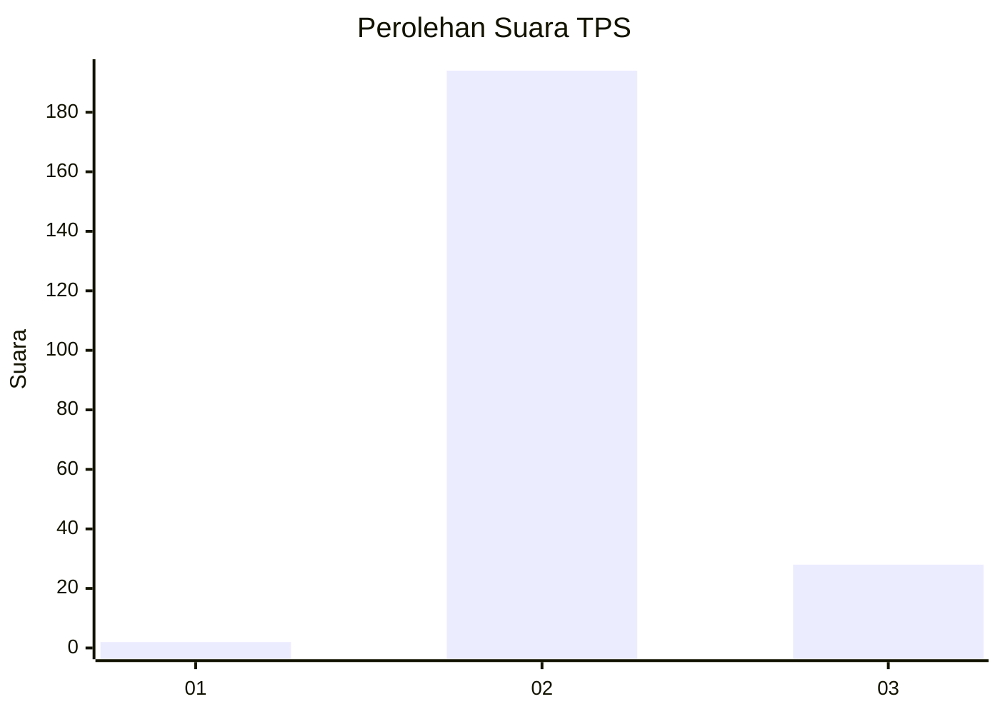
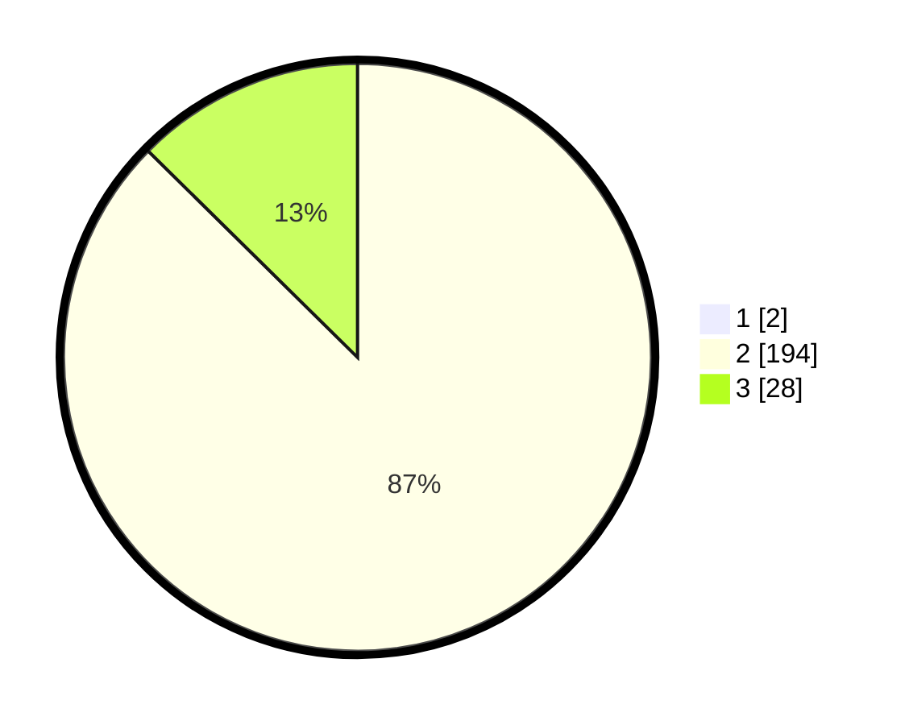

# Hasil

## Grafik

## Tabel

| No. | Nama Paslon    | Suara | Suara (raw) | Persentase |
|:--- |:-------------- | -----:| -----------:| ----------:|
| 1   | ANIES MUHAIMIN | 2     | [2][p-1]    | 0,89       |
| 2   | PRABOWO GIBRAN | 194   | [194][p-2]  | 86,61      |
| 3   | GANJAR MAHFUD  | 28    | [28][p-3]   | 12,50      |

[p-1]: https://github.com/gigit-pemilu/pemilu-2024-62-kalimantan-tengah/blob/main/pilpres/hitung-suara/sub/62-kalimantan-tengah/sub/11-pulang-pisau/sub/04-banama-tingang/sub/2003-lawang-uru/sub/001-tps/sub/paslon-1.txt
[p-2]: https://github.com/gigit-pemilu/pemilu-2024-62-kalimantan-tengah/blob/main/pilpres/hitung-suara/sub/62-kalimantan-tengah/sub/11-pulang-pisau/sub/04-banama-tingang/sub/2003-lawang-uru/sub/001-tps/sub/paslon-2.txt
[p-3]: https://github.com/gigit-pemilu/pemilu-2024-62-kalimantan-tengah/blob/main/pilpres/hitung-suara/sub/62-kalimantan-tengah/sub/11-pulang-pisau/sub/04-banama-tingang/sub/2003-lawang-uru/sub/001-tps/sub/paslon-3.txt

## Foto C Plano

https://sirekap-obj-formc.kpu.go.id/08de/pemilu/ppwp/62/11/04/20/03/6211042003001-20240218-090648--3a8474fb-0071-49b7-9f9c-99a32a28b94c.jpg

https://sirekap-obj-formc.kpu.go.id/08de/pemilu/ppwp/62/11/04/20/03/6211042003001-20240218-091338--72866bc6-7c96-4ac0-9bec-b1fffac88f7a.jpg

https://sirekap-obj-formc.kpu.go.id/08de/pemilu/ppwp/62/11/04/20/03/6211042003001-20240218-091221--77c13111-71c7-4dfa-9948-1ee0b229b866.jpg

## Metadata

| Key        | Value               |
| ---------- | ------------------- |
| Time Stamp | 2024-02-19 06:16:00 |

